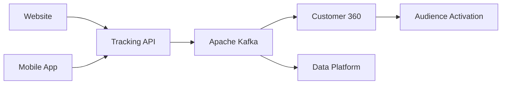

# Portfólio de Arquitetura Corporativa

Este portfólio reúne estudos de arquitetura corporativa construídos a partir de cenários realistas de transformação digital, cobrindo disciplinas como Arquitetura de Soluções, Dados, Analytics, Inteligência Artificial, Integração e Governança.

O objetivo é demonstrar a capacidade de traduzir estratégias de negócio em arquiteturas escaláveis, governáveis e orientadas à geração de valor, utilizando artefatos amplamente empregados em programas corporativos de transformação tecnológica.

---

# Perfil Arquitetural

Atuação orientada à evolução de plataformas corporativas, definição de arquiteturas de referência, governança tecnológica e alinhamento entre estratégia, produto e engenharia.

Os cenários deste portfólio simulam responsabilidades típicas de posições como:

* Enterprise Architect
* Solution Architect
* Data Architect
* AI Architect
* Lead Architect
* Principal Architect

Principais responsabilidades representadas nos cases:

* Evolução de arquiteturas corporativas;
* Definição de arquiteturas de referência;
* Governança arquitetural;
* Avaliação de fornecedores e plataformas;
* Alinhamento entre negócio, produto e engenharia;
* Estratégia de Dados, Analytics e Inteligência Artificial;
* Modernização de plataformas digitais.

---

# O Que Este Portfólio Demonstra

## Capacidades Estratégicas

* Definição de arquiteturas alvo (Target Architecture)
* Construção de roadmaps de transformação
* Avaliação de fornecedores e tecnologias
* Governança arquitetural
* Modelagem de capacidades (Capability Mapping)
* Arquiteturas de referência
* Gestão de decisões arquiteturais (ADR)
* Planejamento de evolução tecnológica

## Capacidades Técnicas

* Event-Driven Architecture
* API Design & Integration
* Cloud-Native Architecture
* Data Architecture
* Customer Data Platforms (CDP)
* Data Governance
* Analytics Platforms
* GenAI Platforms
* Retrieval-Augmented Generation (RAG)
* Agentic AI
* AI Governance

---

# Domínios de Atuação

### Marketing Technology (AdTech)

Customer 360, CDP, Tracking, Segmentação e Ativação Omnichannel.

### Dados & Analytics

Lakehouse, Data Products, Governança, BI e Analytics.

### Inteligência Artificial

GenAI, RAG, AI Agents, MLOps e AI Governance.

### Arquitetura Corporativa

Arquiteturas de Referência, Governança, Capacidades e Transformação Digital.

---

# Jornada de Construção

| Case | Tema | Status |
|--------|--------|--------|
| [Case 01](./case-01-adtech-omnichannel) | Plataforma AdTech Omnichannel | ✅ Concluído |
| [Case 02](./case-02-enterprise-data-ai-platform) | Plataforma Corporativa de Dados & IA | 🚧 Em Construção |
| [Case 03](./case-03-genai-agent-platform) | Plataforma de IA Generativa e Agentes | 📋 Planejado |
| [Case 04](./case-04-data-ai-governance) | Framework de Governança de Dados & IA | 📋 Planejado |
| [Case 05](./case-05-retail-media-network) | Retail Media Network | 📋 Planejado |

---

# Destaque Atual

## Case 01 — Plataforma AdTech Omnichannel

Transformação arquitetural de um ecossistema AdTech para uma varejista omnichannel fictícia chamada **ShopSphere**.

### Objetivos Estratégicos

* Construção de Customer 360;
* Segmentação em tempo quase real;
* Ativação omnichannel;
* Governança de dados;
* Conformidade com LGPD;
* Modernização das integrações;
* Arquitetura orientada a eventos.

---

# Arquitetura Executiva (Target State)



---

# Principais Entregáveis

## Arquitetura

* Arquitetura de Referência
* Arquitetura de Dados
* Arquitetura Alvo (Target State)
* Diagramas C4

## Governança

* Princípios Arquiteturais
* Architecture Review Board
* Processo de Onboarding de Vendors

## Decisões Arquiteturais

* ADR-001 — Arquitetura Orientada a Eventos
* ADR-002 — Kafka vs Kinesis
* ADR-003 — Buy vs Build para Customer Data Platform

## Integração e Dados

* OpenAPI 3.0
* Catálogo de Eventos
* Ownership de Eventos
* Modelo de Governança de Dados

---

# Estrutura do Repositório

```text
.
├── docs
├── architecture
├── adrs
├── api
├── events
├── governance
├── diagrams
```

---

# Próxima Evolução

O próximo case do portfólio abordará a evolução de uma Plataforma Corporativa de Dados & Inteligência Artificial, cobrindo:

* Data Lakehouse
* Data Mesh
* Data Governance
* Analytics Platform
* Data Products
* GenAI Platform
* Agentic AI
* AI Governance
* Roadmap de Transformação de Dados & IA

O objetivo será demonstrar como uma organização pode evoluir de um ambiente fragmentado de dados para uma plataforma corporativa moderna, preparada para Analytics Avançado, Machine Learning e Inteligência Artificial Generativa.
