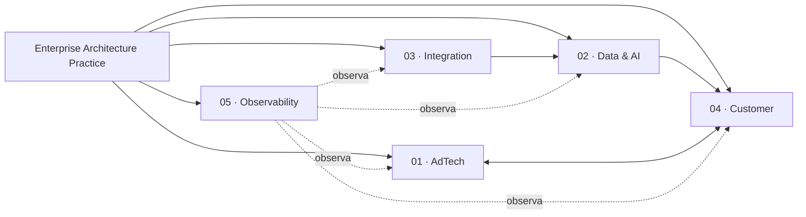

# Enterprise Architecture Practice

> Repositório oficial da prática de Arquitetura Corporativa da OmniRetail, reunindo princípios, governança, padrões e cinco Programas Estratégicos integrados para a transformação digital.

---

## Informações do Repositório

| Item | Valor |
| --- | --- |
| Identidade oficial | Enterprise Architecture Practice |
| Organização de referência | OmniRetail |
| Responsável | Enterprise Architecture Practice |
| Release | 1.0 |
| Status | Aprovado |

## Executive Summary

Este repositório representa uma **Enterprise Architecture Practice** em operação. Seu conteúdo conecta estratégia, capacidades de negócio, informação, aplicações, tecnologia, governança, roadmaps e decisões arquiteturais em um baseline corporativo coerente.

A Release 1.0 organiza a transformação em cinco Programas Estratégicos. Cada programa possui escopo, boundaries, artefatos executivos, arquitetura detalhada, governança, roadmap e Architecture Decision Records compatíveis com seu domínio.

## Propósito

- orientar decisões de investimento e transformação;
- estabelecer arquiteturas de referência e estados-alvo;
- promover coerência e reutilização entre domínios;
- controlar riscos, dependências e exceções;
- preservar rastreabilidade entre outcomes, capacidades e soluções;
- comunicar decisões arquiteturais a executivos, arquitetos e times de entrega.

## Programas Estratégicos

| Ordem | Programa Estratégico | Foco | Status |
| ---: | --- | --- | --- |
| 01 | [Enterprise AdTech Platform](./programs/01-enterprise-adtech-platform/) | AdTech, audiências e ativação omnichannel | Aprovado |
| 02 | [Enterprise Data & Artificial Intelligence Platform](./programs/02-enterprise-data-ai-platform/) | Dados, analytics e Inteligência Artificial | Aprovado |
| 03 | [Enterprise Integration Platform](./programs/03-enterprise-integration-platform/) | APIs, eventos, mensageria e contratos | Aprovado |
| 04 | [Enterprise Customer Platform](./programs/04-enterprise-customer-platform/) | Customer 360, identidade, consentimento e experiência | Aprovado |
| 05 | [Enterprise Observability Platform](./programs/05-enterprise-observability-platform/) | Telemetria, confiabilidade e inteligência operacional | Aprovado |

## Visão Integrada

```mermaid
flowchart LR
    EA[Enterprise Architecture Practice]
    P01[01 · AdTech]
    P02[02 · Data & AI]
    P03[03 · Integration]
    P04[04 · Customer]
    P05[05 · Observability]

    EA --> P01
    EA --> P02
    EA --> P03
    EA --> P04
    EA --> P05
    P03 --> P02
    P02 --> P04
    P01 <--> P04
    P05 -. observa .-> P01
    P05 -. observa .-> P02
    P05 -. observa .-> P03
    P05 -. observa .-> P04
```

## Modelo de Evolução dos Programas

1. Foundation;
2. Business Architecture;
3. Information Architecture;
4. Application Architecture;
5. Technology Architecture;
6. Governance;
7. Roadmap;
8. Architecture Decision Records.

Cada bloco somente integra o baseline após Architecture Review.

## Navegação Corporativa

| Área | Conteúdo |
| --- | --- |
| [Backlog](./backlog/) | Itens planejados e controlados por release |
| [Documentação Corporativa](./docs/) | Visão empresarial, capacidades, princípios e roadmap |
| [Governança](./governance/) | Modelo, papéis, processos e controles corporativos |
| [Programas Estratégicos](./programs/) | Arquiteturas completas dos cinco programas |
| [Padrões](./standards/) | Blueprint, templates e critérios documentais |
| [Automação](./tools/architecture/) | Validadores e inventário documental |

## Princípios Arquiteturais

- API First;
- Cloud Native;
- Data as a Product;
- Event-Driven Architecture;
- Metadata First;
- Observability by Design;
- Security & Privacy by Design;
- decisões orientadas a capacidades e outcomes;
- governança federada com guardrails corporativos.

Consulte os [Princípios de Arquitetura Corporativa](./docs/architecture-principles.md).

## Governança da Release

A Release 1.0 é composta pelos cinco Programas Estratégicos aprovados. Mudanças no baseline exigem rastreabilidade, revisão arquitetural e decisão compatível com o modelo de governança.

Consulte o [Modelo de Governança Corporativa](./governance/governance-model.md) e o [Enterprise Architecture Roadmap](./docs/enterprise-roadmap.md).

## Status da Release 1.0

**APPROVED** — os cinco Programas Estratégicos compõem o baseline arquitetural oficial da Enterprise Architecture Practice.
