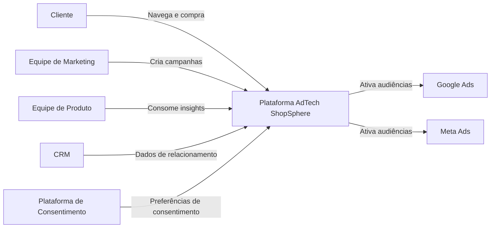

# C4 - Nível 1 (Contexto)

```mermaid
flowchart LR

    Customer["Cliente"]
    Marketing["Equipe de Marketing"]
    Product["Equipe de Produto"]

    AdTech["Plataforma AdTech ShopSphere"]

    GoogleAds["Google Ads"]
    MetaAds["Meta Ads"]
    CRM["CRM"]
    Consent["Plataforma de Consentimento"]

    Customer -->|Navega e compra| AdTech

    Marketing -->|Cria campanhas| AdTech
    Product -->|Consome insights| AdTech

    AdTech -->|Ativa audiências| GoogleAds
    AdTech -->|Ativa audiências| MetaAds

    CRM -->|Dados de relacionamento| AdTech

    Consent -->|Preferências de consentimento| AdTech
```