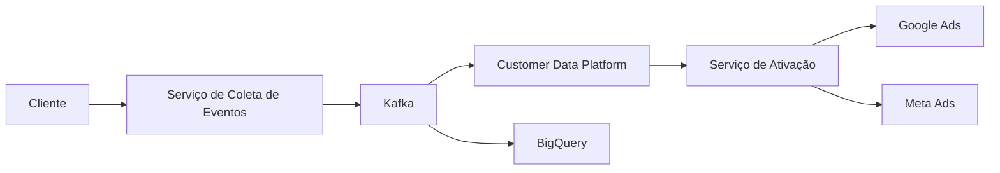

# C4 - Nível 2 (Containers)

```mermaid
flowchart LR

    Customer["Cliente"]

    Collection["Serviço de Coleta de Eventos"]

    Kafka["Kafka"]

    CDP["Customer Data Platform"]

    BigQuery["BigQuery"]

    Activation["Serviço de Ativação"]

    GoogleAds["Google Ads"]
    MetaAds["Meta Ads"]

    Customer --> Collection

    Collection --> Kafka

    Kafka --> CDP
    Kafka --> BigQuery

    CDP --> Activation

    Activation --> GoogleAds
    Activation --> MetaAds
```