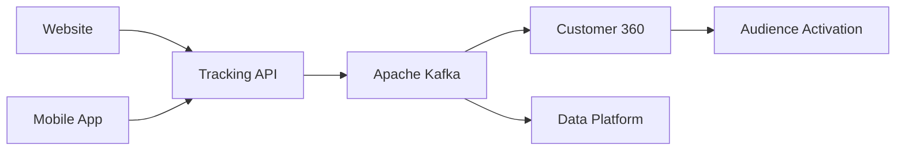

# Case 01 — Plataforma AdTech Omnichannel

## Visão Geral

Este case simula a modernização do ecossistema AdTech de uma grande varejista omnichannel fictícia chamada **ShopSphere**.

O objetivo da iniciativa é evoluir uma arquitetura fragmentada, baseada em integrações batch e múltiplos silos de dados, para uma plataforma moderna orientada a eventos, capaz de suportar estratégias avançadas de marketing, personalização e mensuração.

---

## Contexto de Negócio

A ShopSphere opera através de múltiplos canais:

- E-commerce
- Aplicativo Mobile
- Marketplace
- Programa de Fidelidade
- 120 lojas físicas

Atualmente a organização possui:

- 12 milhões de clientes cadastrados
- 3 milhões de usuários ativos por mês
- 850 mil pedidos mensais
- R$ 40 milhões/ano investidos em mídia digital

Ao longo dos anos, diferentes plataformas foram incorporadas para atender necessidades específicas de CRM, Analytics e Marketing, resultando em um ambiente altamente fragmentado.

---

## Principais Desafios

- Dados de clientes distribuídos entre múltiplas plataformas
- Integrações fortemente dependentes de processos batch
- Dificuldade para ativação rápida de audiências
- Baixa rastreabilidade dos dados
- Atribuição limitada de campanhas
- Crescente complexidade operacional
- Necessidade de adequação contínua à LGPD

---

## Objetivos Estratégicos

A transformação arquitetural proposta busca habilitar:

- Customer 360
- Segmentação dinâmica de audiências
- Ativação omnichannel
- Mensuração de campanhas em tempo quase real
- Governança de dados
- Compliance com LGPD
- Arquitetura orientada a eventos

---

# Arquitetura Executiva (Target State)



---

## Arquitetura Proposta

A arquitetura foi desenhada com base em quatro princípios fundamentais:

### Event-Driven Architecture

Eventos tornam-se o mecanismo principal de integração entre plataformas, reduzindo dependências ponto a ponto e aumentando escalabilidade.

### API First

Todas as integrações devem ser expostas através de APIs padronizadas e versionadas.

### Privacy by Design

O consentimento do cliente é tratado como requisito obrigatório em todos os fluxos de ativação.

### Domain Ownership

Cada domínio é responsável pelos seus dados, APIs e eventos.

---

## Principais Componentes

### Tracking API

Camada responsável pela coleta e validação dos eventos digitais.

### Apache Kafka

Backbone de eventos responsável pela distribuição e persistência dos eventos corporativos.

### Customer Data Platform (CDP)

Responsável por:

- Identity Resolution
- Customer 360
- Gestão de Audiências

### Data Platform

Responsável por:

- Armazenamento histórico
- Analytics
- Data Products
- Machine Learning

### Audience Activation

Responsável pela sincronização de audiências com plataformas externas.

Integrações previstas:

- Google Ads
- Meta Ads
- CRM

---

## Artefatos Produzidos

### Arquitetura

- Arquitetura de Referência
- Arquitetura de Dados
- Arquitetura Alvo (Target State)
- Diagramas C4

### Governança

- Princípios Arquiteturais
- Architecture Review Board
- Vendor Onboarding Process

### Decisões Arquiteturais

- ADR-001 — Arquitetura Orientada a Eventos
- ADR-002 — Kafka vs Kinesis
- ADR-003 — Buy vs Build para CDP

### Integração e Dados

- OpenAPI 3.0 (Tracking API)
- Taxonomia de Eventos
- Ownership de Eventos
- Modelo de Governança

---

## Estrutura do Case

```text
case-01-adtech-omnichannel
├── docs
├── architecture
├── adrs
├── api
├── events
├── governance
└── diagrams
```

---

## Competências Demonstradas

Este case demonstra conhecimentos práticos em:

- Solution Architecture
- Enterprise Architecture
- AdTech Architecture
- Event-Driven Architecture
- API Design
- Data Architecture
- Data Governance
- Vendor Assessment
- Architecture Governance
- Customer Data Platforms
- Technology Roadmapping

---

## Próximos Passos

As próximas evoluções previstas para este cenário incluem:

- Retail Media
- Marketing Mix Modeling
- IA para otimização de campanhas
- Customer Journey Orchestration
- Personalização em tempo real
- Marketing Agents

---

## Status

✅ Concluído

Este case representa a primeira iniciativa do Portfólio de Arquitetura Corporativa e servirá como base para os próximos cenários de Dados, Analytics e Inteligência Artificial.