````markdown
# Arquitetura Executiva - Estado Futuro (TO-BE)

## Visão Geral

Arquitetura alvo para suportar Customer 360, segmentação em tempo quase real, ativação omnichannel e governança de dados na ShopSphere.

```mermaid
flowchart LR

    subgraph Canais
        WEB[Website]
        APP[Aplicativo Mobile]
        CRM[CRM]
        LOJAS[Lojas Físicas]
    end

    subgraph Coleta
        TRACK[Tracking API]
    end

    subgraph Streaming
        KAFKA[Apache Kafka]
        REGISTRY[Schema Registry]
    end

    subgraph Customer_Platform
        CDP[Customer Data Platform]
        IDENTITY[Identity Resolution]
        C360[Customer 360]
    end

    subgraph Data_Platform
        BQ[BigQuery]
        LAKE[Data Lake]
        FEATURES[Feature Store]
    end

    subgraph Activation
        GOOGLE[Google Ads]
        META[Meta Ads]
        EMAIL[CRM Marketing]
        PUSH[Push Notifications]
    end

    subgraph Governance
        CONSENT[OneTrust]
        CATALOG[Data Catalog]
        OBS[Observability]
    end

    WEB --> TRACK
    APP --> TRACK
    CRM --> TRACK
    LOJAS --> TRACK

    TRACK --> KAFKA

    KAFKA --> CDP
    KAFKA --> BQ

    REGISTRY --> KAFKA

    CDP --> IDENTITY
    IDENTITY --> C360

    C360 --> GOOGLE
    C360 --> META
    C360 --> EMAIL
    C360 --> PUSH

    BQ --> FEATURES

    CONSENT --> CDP

    CATALOG --> BQ
    OBS --> KAFKA
```



---

## Benefícios Esperados

### Customer 360

Visão unificada dos clientes em todos os canais.

### Segmentação Dinâmica

Atualização contínua de audiências baseada em eventos.

### Ativação Omnichannel

Distribuição consistente de segmentos entre canais pagos e proprietários.

### Governança

Maior controle sobre consentimento, qualidade e rastreabilidade dos dados.

### Escalabilidade

Arquitetura preparada para crescimento do negócio e futuras iniciativas de IA.
````
