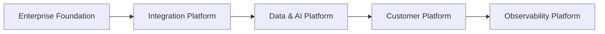

# Enterprise Architecture Roadmap

> Define a evolução planejada da arquitetura corporativa da OmniRetail, estabelecendo os marcos estratégicos que orientarão os Programas Estratégicos do Enterprise Architecture Office.

---

## Informações do Documento

| Item | Valor |
|------|-------|
| Documento | Enterprise Architecture Roadmap |
| Área Responsável | Enterprise Architecture Office |
| Público-alvo | Board, CIO, CTO, CDO, Enterprise Architects |
| Versão | 1.0 |
| Última atualização | Julho/2026 |

---

# Executive Summary

A transformação digital da OmniRetail é conduzida por um conjunto integrado de Programas Estratégicos que evoluem continuamente as capacidades corporativas.

Este roadmap apresenta a visão de evolução da arquitetura empresarial para os próximos três anos, priorizando capacidades de negócio, plataformas compartilhadas e governança tecnológica.

Seu objetivo não é representar projetos individuais, mas orientar a evolução arquitetural da organização.

---

## Visão Executiva do Roadmap

---

# 1. Objetivo

Estabelecer a sequência evolutiva da arquitetura corporativa da OmniRetail, alinhando capacidades de negócio, plataformas tecnológicas e Programas Estratégicos.

O roadmap orienta decisões de investimento, priorização de iniciativas e evolução da arquitetura empresarial.

---

# 2. Princípios do Roadmap

A evolução arquitetural da OmniRetail segue os seguintes princípios.

- desenvolver capacidades antes de expandir funcionalidades;
- construir plataformas reutilizáveis;
- reduzir dependências entre programas;
- maximizar reutilização de ativos corporativos;
- priorizar valor de negócio sobre adoção tecnológica.

---

# 3. Horizonte Estratégico

## Fase 1 — Enterprise Foundation

### Objetivo

Estabelecer os padrões corporativos que servirão como base para todos os Programas Estratégicos.

### Capacidades Evoluídas

- Enterprise Architecture
- Governance
- Business Capabilities
- Technology Standards

### Principais Entregáveis

- Enterprise Architecture Framework
- Architecture Principles
- Technology Radar
- Enterprise Roadmap

---

## Fase 2 — Digital Integration

### Objetivo

Modernizar o ecossistema de integração corporativa.

### Capacidades Evoluídas

- API Management
- Event Streaming
- Integration Platform
- Identity Integration

### Programas Relacionados

- Enterprise Integration Platform
- Enterprise AdTech Platform

---

## Fase 3 — Data & Artificial Intelligence

### Objetivo

Transformar dados corporativos em ativos estratégicos para Analytics e Inteligência Artificial.

### Capacidades Evoluídas

- Data Platform
- Data Governance
- Machine Learning
- Generative AI
- AI Governance

### Programas Relacionados

- Enterprise Data & AI Platform

---

## Fase 4 — Customer Experience

### Objetivo

Construir uma visão unificada do cliente e ampliar capacidades de personalização.

### Capacidades Evoluídas

- Customer 360
- Personalization
- Loyalty
- Retail Media

### Programas Relacionados

- Enterprise Customer Platform
- Enterprise AdTech Platform

---

## Fase 5 — Autonomous Enterprise

### Objetivo

Evoluir a organização para um modelo operacional orientado por Inteligência Artificial.

### Capacidades Evoluídas

- AI Agents
- Autonomous Operations
- Predictive Decision Making
- Enterprise Observability

### Programas Relacionados

- Enterprise Observability Platform
- Enterprise Data & AI Platform

---

# 4. Evolução das Capacidades

| Horizonte | Foco Arquitetural | Resultado Esperado |
|------------|-------------------|--------------------|
| Foundation | Governança e Padronização | Base arquitetural corporativa |
| Integration | Integração Corporativa | Ecossistema desacoplado |
| Data & AI | Dados e Inteligência Artificial | Plataforma analítica corporativa |
| Customer | Experiência Omnichannel | Customer 360 e personalização |
| Autonomous Enterprise | Automação Inteligente | Operações orientadas por IA |

---

# 5. Dependências Estratégicas

A evolução da arquitetura segue uma ordem lógica de maturidade.

| Programa Estratégico | Dependência |
|----------------------|-------------|
| Enterprise Integration Platform | Enterprise Foundation |
| Enterprise Data & AI Platform | Enterprise Integration Platform |
| Enterprise Customer Platform | Enterprise Data & AI Platform |
| Enterprise Observability Platform | Todos os programas anteriores |

Essa abordagem reduz riscos, promove reutilização e evita duplicidade de investimentos.

---

# 6. Critérios de Sucesso

O roadmap será considerado bem-sucedido quando atingir os seguintes objetivos.

- plataformas corporativas reutilizadas entre diferentes programas;
- redução significativa de integrações ponto a ponto;
- arquitetura orientada por eventos consolidada;
- governança de dados institucionalizada;
- adoção corporativa de Inteligência Artificial de forma segura e escalável.

---

# 7. Indicadores Estratégicos

O Enterprise Architecture Office acompanhará indicadores relacionados à evolução da arquitetura.

| Indicador | Objetivo |
|-----------|----------|
| APIs Padronizadas | Maximizar reutilização |
| Eventos Corporativos | Reduzir acoplamento |
| Capacidades Evoluídas | Medir maturidade arquitetural |
| ADRs Publicados | Garantir rastreabilidade |
| Programas Integrados | Aumentar sinergia entre plataformas |

---

# 8. Benefícios Esperados

A execução deste roadmap permitirá:

- acelerar iniciativas digitais;
- reduzir custos de integração;
- ampliar reutilização de plataformas;
- fortalecer governança tecnológica;
- preparar a organização para adoção de IA em larga escala.

---

# 9. Documentos Relacionados

Este documento complementa:

- Enterprise Architecture Overview;
- Architecture Documentation Guide;
- Architecture Principles;
- Business Capability Model;
- Technology Radar.

O Enterprise Roadmap consolida a visão estratégica da evolução arquitetural da OmniRetail e orienta todos os Programas Estratégicos do portfólio.