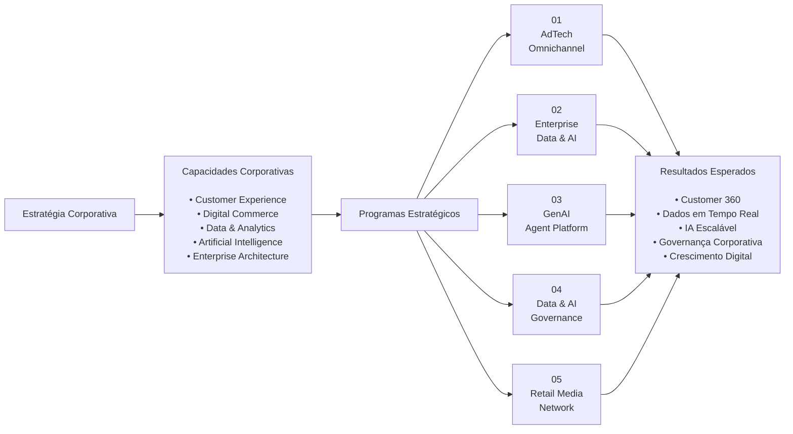

# Arquitetura Corporativa da OmniRetail

> Documento que estabelece a visão corporativa da organização, seus direcionadores estratégicos e a estrutura dos programas de transformação conduzidos pelo Enterprise Architecture Office.

---

## Informações do Documento

| Item | Valor |
|------|-------|
| Documento | Enterprise Architecture Overview |
| Área Responsável | Enterprise Architecture Office |
| Público-alvo | CIO, CTO, CDO, Enterprise Architects |
| Status | 🟢 Congelado (v1.0) |
| Versão | 1.0 |
| Última atualização | Julho/2026 |

---

# Executive Summary

A OmniRetail é uma empresa fictícia criada para representar um ambiente corporativo de grande porte, permitindo demonstrar a atuação de um Enterprise Architect em cenários reais de transformação digital.

Sua estratégia tecnológica está organizada em programas corporativos independentes, porém conectados por uma visão única de arquitetura empresarial. Essa abordagem permite evoluir capacidades de negócio, plataformas tecnológicas e práticas de governança de forma incremental, reduzindo riscos e acelerando a entrega de valor.

Este documento apresenta a visão corporativa que orienta todos os demais artefatos deste portfólio.

---

## Visão Executiva da Arquitetura Corporativa

---

# 1. A OmniRetail

A OmniRetail é uma varejista omnichannel fictícia de grande porte, criada para representar um ambiente corporativo complexo, com desafios semelhantes aos encontrados em organizações líderes dos setores de varejo, tecnologia e mídia.

Sua operação contempla:

- Plataforma de e-commerce;
- Aplicativos móveis;
- Marketplace;
- Programa de fidelidade;
- Mais de 120 lojas físicas;
- Ecossistema de parceiros logísticos e comerciais.

Milhões de interações são processadas diariamente, exigindo uma arquitetura corporativa capaz de suportar crescimento contínuo, inovação e elevada disponibilidade.

---

# 2. Estratégia Corporativa

A estratégia tecnológica da OmniRetail está fundamentada na transformação dos dados em um ativo corporativo estratégico.

Os principais direcionadores da organização são:

- oferecer uma visão unificada do cliente (Customer 360);
- acelerar decisões orientadas por dados;
- modernizar integrações corporativas;
- ampliar capacidades analíticas;
- incorporar Inteligência Artificial de forma responsável;
- fortalecer a governança de tecnologia e dados;
- reduzir complexidade arquitetural.

Todos os programas apresentados neste portfólio contribuem diretamente para esses objetivos.

---

# 3. Capacidades Estratégicas

A arquitetura corporativa está organizada em capacidades que representam competências permanentes da organização.

As principais capacidades estratégicas são:

- Customer Experience
- Digital Commerce
- Marketing & Retail Media
- Data & Analytics
- Artificial Intelligence
- Enterprise Integration
- Data Governance
- Cyber Security
- Enterprise Architecture

Cada programa estratégico evolui uma ou mais dessas capacidades.

---

# 4. Princípios Arquiteturais

A evolução da arquitetura corporativa é guiada por princípios comuns a todos os programas.

- Domain Ownership
- API First
- Event First
- Cloud Native
- Data as a Product
- Security by Design
- Privacy by Design
- AI Ready

Esses princípios garantem consistência entre iniciativas independentes e reduzem a complexidade da plataforma ao longo do tempo.

---

# 5. Programas Estratégicos

O roadmap corporativo está estruturado em cinco programas complementares.

| Programa | Objetivo Estratégico |
|-----------|----------------------|
| Programa Estratégico 01 | Modernizar o ecossistema AdTech e implantar uma arquitetura orientada a eventos. |
| Programa Estratégico 02 | Construir a Plataforma Corporativa de Dados & Inteligência Artificial. |
| Programa Estratégico 03 | Implantar uma plataforma corporativa para GenAI, RAG e Agentes Inteligentes. |
| Programa Estratégico 04 | Consolidar o modelo corporativo de Governança de Dados & IA. |
| Programa Estratégico 05 | Estruturar a plataforma de Retail Media da OmniRetail. |

Cada programa possui escopo, entregáveis e roadmap próprios, mas todos compartilham a mesma visão arquitetural.

---

# 6. Como os Programas se Conectam

Os programas foram planejados para evoluir a arquitetura corporativa de forma incremental.

O Programa Estratégico 01 estabelece a fundação de integração baseada em eventos.

Sobre essa base, o Programa Estratégico 02 consolida a plataforma corporativa de dados e analytics.

O Programa Estratégico 03 utiliza essa plataforma para disponibilizar capacidades avançadas de Inteligência Artificial.

Na sequência, o Programa Estratégico 04 estabelece os mecanismos corporativos de governança para dados, modelos e ativos de IA.

Por fim, o Programa Estratégico 05 utiliza todas essas capacidades para suportar uma plataforma moderna de Retail Media.

Essa evolução reduz riscos de implementação, promove reutilização de capacidades e acelera a geração de valor para o negócio.

---

# 7. Próximos Passos

Os documentos complementares deste portfólio detalham os princípios arquiteturais, o modelo corporativo de capacidades, o roadmap estratégico e os padrões adotados pelo Enterprise Architecture Office.

Em conjunto, esses artefatos estabelecem uma visão integrada da evolução tecnológica da OmniRetail e demonstram como decisões arquiteturais são tomadas, documentadas e governadas ao longo do tempo.