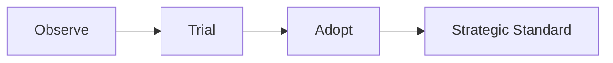
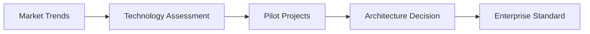

# Technology Radar

> Apresenta a visão estratégica do Enterprise Architecture Office sobre tecnologias relevantes para a evolução da arquitetura corporativa da OmniRetail.

---

## Informações do Documento

| Item | Valor |
|------|-------|
| Documento | Technology Radar |
| Área Responsável | Enterprise Architecture Office |
| Público-alvo | CIO, CTO, CDO, Enterprise Architects, Solution Architects |
| Versão | 1.0 |
| Última atualização | Julho/2026 |

---

# Executive Summary

O Technology Radar consolida a visão do Enterprise Architecture Office sobre tecnologias, plataformas e práticas arquiteturais.

Seu objetivo é orientar decisões de investimento, reduzir riscos tecnológicos e promover padronização entre os Programas Estratégicos da OmniRetail.

As recomendações são revisadas periodicamente considerando maturidade de mercado, aderência à estratégia corporativa e experiências internas.

---

## Visão Executiva do Radar

---

# 1. Objetivo

Estabelecer uma referência corporativa para adoção, evolução e descontinuação de tecnologias utilizadas pela OmniRetail.

Este documento apoia decisões relacionadas à arquitetura de soluções, plataformas corporativas e seleção de fornecedores.

---

# 2. Modelo de Classificação

As tecnologias são classificadas conforme seu nível de adoção esperado.

| Categoria | Descrição |
|-----------|-----------|
| Observe | Tecnologias promissoras ainda em avaliação. |
| Trial | Tecnologias recomendadas para provas de conceito e projetos piloto. |
| Adopt | Tecnologias aprovadas para novos projetos. |
| Strategic Standard | Tecnologias oficialmente padronizadas pela organização. |

---

# 3. Radar Tecnológico

## 3.1 Data Platforms

| Tecnologia | Status | Justificativa |
|------------|--------|---------------|
| BigQuery | Strategic Standard | Plataforma analítica corporativa escalável e gerenciada. |
| Apache Iceberg | Trial | Potencial para evolução da estratégia Lakehouse. |
| Databricks | Observe | Avaliação para workloads avançados de engenharia de dados e IA. |

---

## 3.2 Event Streaming

| Tecnologia | Status | Justificativa |
|------------|--------|---------------|
| Apache Kafka | Strategic Standard | Backbone corporativo para integração orientada a eventos. |
| Apache Pulsar | Observe | Avaliação para cenários multi-tenant e geo-replicação. |

---

## 3.3 API Platform

| Tecnologia | Status | Justificativa |
|------------|--------|---------------|
| OpenAPI | Strategic Standard | Padronização dos contratos REST corporativos. |
| AsyncAPI | Adopt | Padronização da documentação de eventos assíncronos. |

---

## 3.4 Artificial Intelligence

| Tecnologia | Status | Justificativa |
|------------|--------|---------------|
| OpenAI Platform | Adopt | Casos de uso de IA Generativa e assistentes corporativos. |
| Google Gemini | Trial | Avaliação para workloads multimodais. |
| Anthropic Claude | Trial | Avaliação para cenários de raciocínio complexo e segurança. |

---

## 3.5 Observability

| Tecnologia | Status | Justificativa |
|------------|--------|---------------|
| OpenTelemetry | Adopt | Padronização da instrumentação das aplicações. |
| Datadog | Strategic Standard | Observabilidade corporativa e monitoramento centralizado. |

---

## 3.6 Cloud Platform

| Tecnologia | Status | Justificativa |
|------------|--------|---------------|
| Google Cloud Platform | Strategic Standard | Plataforma principal para soluções analíticas e serviços gerenciados. |
| Kubernetes | Strategic Standard | Orquestração padrão para aplicações containerizadas. |
| Terraform | Adopt | Provisionamento padronizado por Infrastructure as Code. |

---

# 4. Critérios de Avaliação

As tecnologias são avaliadas considerando:

- alinhamento estratégico;
- maturidade de mercado;
- escalabilidade;
- interoperabilidade;
- segurança;
- governança;
- custo total de propriedade (TCO);
- aderência aos princípios arquiteturais.

---

# 5. Processo de Evolução

O Technology Radar é revisado periodicamente pelo Enterprise Architecture Office.

Uma tecnologia pode evoluir entre categorias conforme:

- resultados de projetos piloto;
- benchmarks de mercado;
- feedback das equipes técnicas;
- mudanças estratégicas da organização;
- evolução do ecossistema tecnológico.

---

## Visão do Processo de Evolução

---

# 6. Benefícios Esperados

A utilização do Technology Radar proporciona:

- padronização tecnológica;
- redução de riscos de adoção;
- maior previsibilidade dos investimentos;
- alinhamento entre programas estratégicos;
- aceleração da tomada de decisão arquitetural.

---

# 7. Documentos Relacionados

Este documento complementa:

- Enterprise Architecture Overview;
- Architecture Principles;
- Business Capability Model;
- Enterprise Roadmap.

O Technology Radar deve ser utilizado como referência em avaliações de arquitetura, processos de Vendor Assessment e Architecture Decision Records (ADR).