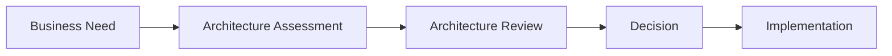

# Architecture Review Process

> Define o processo utilizado para avaliar novas soluções, tecnologias e iniciativas de arquitetura.

---

# Informações do Documento

| Item | Valor |
|------|-------|
| Documento | Architecture Review Process |
| Área Responsável | Enterprise Architecture Practice |
| Versão | 1.0 |

---

# Executive Summary

Todo novo componente arquitetural deve passar por um processo estruturado de revisão para garantir aderência aos princípios corporativos e aos objetivos estratégicos.

---

# Diagrama Executivo

---

# Quando uma revisão é necessária

- Novas plataformas.
- Novos fornecedores.
- APIs corporativas.
- Compartilhamento de dados.
- Tecnologias estratégicas.
- Exceções arquiteturais.

---

# Critérios de Avaliação

| Critério | Objetivo |
|----------|----------|
| Alinhamento Estratégico | Suporte aos objetivos do negócio. |
| Arquitetura | Aderência aos princípios definidos. |
| Integração | Reutilização e interoperabilidade. |
| Dados | Ownership e governança. |
| Segurança | Conformidade e proteção dos dados. |
| Operação | Observabilidade e suporte. |

---

# Possíveis Resultados

- Approved
- Approved with Recommendations
- Rejected

---

# Documentos Relacionados

- Governance Model
- Architecture Principles
- Architecture Decision Records