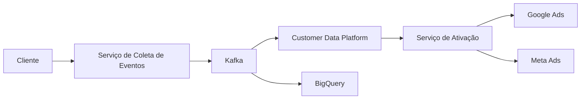

# C4 - Nível 2 (Containers)

## Contexto

Este diagrama apresenta os containers lógicos da Enterprise AdTech Platform e suas principais interações.

## Relação com Outros Artefatos

- [Landing Page do Programa Estratégico 01](../../README.md)
