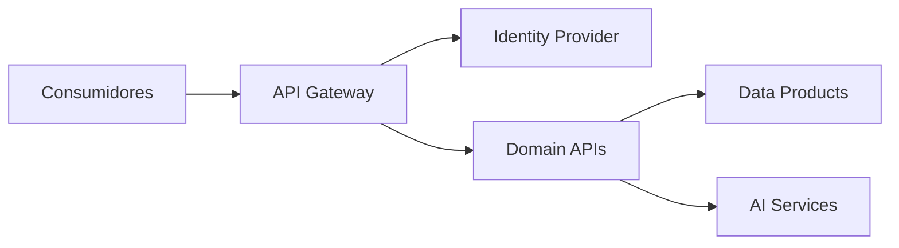

# API Strategy

> Define a estratégia corporativa para exposição, gerenciamento e governança de APIs da Enterprise Data & Artificial Intelligence Platform.

---

## Contexto

Este documento integra a Arquitetura de Aplicações do Programa 02 – Enterprise Data & AI Platform.

Seu objetivo é estabelecer as diretrizes arquiteturais referentes a estratégia de APIs, assegurando alinhamento com os princípios corporativos da plataforma, os Architecture Decision Records (ADRs) aprovados e a arquitetura alvo do programa.

As definições aqui apresentadas devem ser utilizadas como referência para decisões de arquitetura, evolução da plataforma e revisão técnica das soluções implementadas.

---

# Informações do Documento

| Item | Valor |
|------|-------|
| Documento | API Strategy |
| Programa | Enterprise Data & Artificial Intelligence Platform |
| Domínio | Application Architecture |
| Tipo | Architecture Definition |
| Responsável | Enterprise Architecture Practice |
| Versão | 1.0 |
| Status | Approved |

---

# Executive Summary

A estratégia de APIs estabelece diretrizes para publicação, consumo e governança dos serviços da plataforma, garantindo interoperabilidade, reutilização e segurança.

---

# Objetivos

- Padronizar APIs corporativas.
- Promover reutilização de serviços.
- Garantir segurança e versionamento.
- Facilitar integração entre domínios.
- Reduzir acoplamento.

---

# Princípios

- API First
- Contract First
- Security by Design
- Consumer Driven
- Versionamento Semântico
- Reutilização

---

# Modelo Arquitetural

---

# Tipos de APIs

| Tipo | Finalidade |
|------|------------|
| Experience APIs | Consumo por canais digitais |
| Domain APIs | Exposição de capacidades de negócio |
| Platform APIs | Serviços compartilhados da plataforma |

---

# Diretrizes

- APIs REST como padrão corporativo.
- OpenAPI obrigatório.
- Versionamento via URI.
- OAuth2/OpenID Connect para autenticação.
- Documentação publicada no catálogo corporativo.
- Observabilidade em todas as APIs.

---

# Benefícios Esperados

- Padronização das integrações.
- Redução de duplicidade.
- Maior governança.
- Facilidade de evolução.

---

# Relação com Outros Artefatos

- Application Landscape
- Integration Patterns
- Event-Driven Architecture
- Technology Architecture

---

# Decisões Arquiteturais

## DA-01 — API Gateway obrigatório

**Motivação**

Centralizar políticas de segurança, roteamento e monitoramento.

---

## DA-02 — OpenAPI como padrão

**Motivação**

Padronizar documentação e contratos.

---

## DA-03 — Versionamento semântico

**Motivação**

Garantir evolução sem quebra de compatibilidade.

---

# Conclusão

A estratégia de APIs estabelece um modelo corporativo consistente para exposição de capacidades de negócio, promovendo interoperabilidade, governança e evolução sustentável da plataforma.
