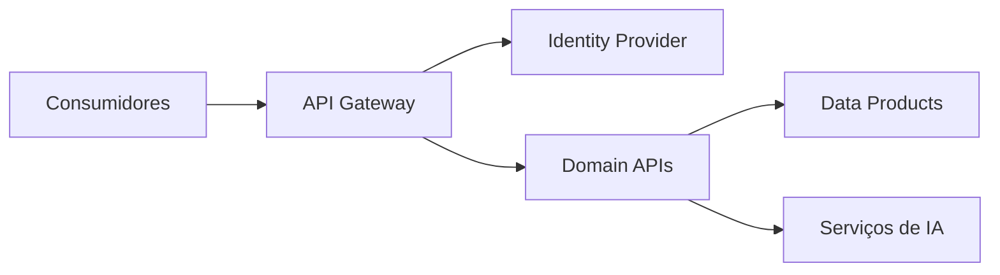

# API Strategy

> Define a estratégia corporativa para exposição, gerenciamento e governança de APIs da Enterprise Data & Artificial Intelligence Platform.

---

## Contexto

Este documento integra a Arquitetura de Aplicações do Programa 02 – Enterprise Data & AI Platform.

Seu objetivo é estabelecer as diretrizes arquiteturais referentes a estratégia de APIs, assegurando alinhamento com os princípios corporativos da plataforma, os Architecture Decision Records (ADRs) aprovados e a arquitetura alvo do programa.

As definições aqui apresentadas devem ser utilizadas como referência para decisões de arquitetura, evolução da plataforma e revisão técnica das soluções implementadas.

---

# Informações do Documento

| Item | Valor |
|------|-------|
| Documento | API Strategy |
| Programa Estratégico | Enterprise Data & Artificial Intelligence Platform |
| Domínio Arquitetural | Application Architecture |
| Tipo | Definição Arquitetural |
| Responsável | Enterprise Architecture Practice |
| Versão | 1.0 |
| Status | Aprovado |

---

# Executive Summary

A estratégia de APIs estabelece diretrizes para publicação, consumo e governança dos serviços da plataforma, garantindo interoperabilidade, reutilização e segurança.

---

# Objetivos

- Padronizar APIs corporativas.
- Promover reutilização de serviços.
- Garantir segurança e versionamento.
- Facilitar integração entre domínios.
- Reduzir acoplamento.

---

# Princípios

- API First
- Contract First
- Security by Design
- Consumer Driven
- Versionamento Semântico
- Reutilização

---

# Modelo Arquitetural

---

# Tipos de APIs

| Tipo | Finalidade |
|------|------------|
| Experience APIs | Consumo por canais digitais |
| Domain APIs | Exposição de capacidades de negócio |
| Platform APIs | Serviços compartilhados da plataforma |

---

# Diretrizes

- APIs REST como padrão corporativo.
- OpenAPI obrigatório.
- Versionamento via URI.
- OAuth2/OpenID Connect para autenticação.
- Documentação publicada no catálogo corporativo.
- Observabilidade em todas as APIs.

---

# Benefícios Esperados

- Padronização das integrações.
- Redução de duplicidade.
- Maior governança.
- Facilidade de evolução.

---

# Limites e Dependências

O Programa 02 define os requisitos das APIs de dados e IA e utiliza a capacidade corporativa de API Management provida pelo **Programa Estratégico 03 — Enterprise Integration Platform**. A propriedade da plataforma de integração, das políticas corporativas de exposição e do runtime do API Gateway permanece no Programa 03.

---

# Relação com Outros Artefatos

- [Application Architecture Principles](./application-architecture-principles.md)
- [Application Interaction Model](./application-interaction-model.md)
- [Application Landscape](./application-landscape.md)
- [Event-Driven Architecture](./event-driven-architecture.md)
- [Integration Patterns](./integration-patterns.md)
- [Enterprise Information Model](../information-architecture/enterprise-information-model.md)

---

# Decisões Arquiteturais

## DA-01 — API Gateway obrigatório

**Decisão**

Toda API exposta para consumo externo ao domínio deverá utilizar a capacidade corporativa de API Management provida pelo Programa Estratégico 03.

**Motivação**

Centralizar políticas de segurança, roteamento e monitoramento.

---

## DA-02 — OpenAPI como padrão

**Decisão**

Contratos de APIs REST deverão utilizar OpenAPI como especificação oficial e versionada.

**Motivação**

Padronizar documentação e contratos.

---

## DA-03 — Versionamento semântico

**Decisão**

APIs deverão adotar versionamento semântico e política explícita de compatibilidade e descontinuação.

**Motivação**

Garantir evolução sem quebra de compatibilidade.
