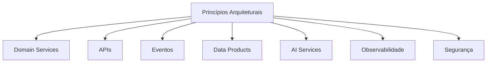

# Application Architecture Principles

> Define os princípios arquiteturais que orientam o desenvolvimento, evolução e integração das aplicações da Enterprise Data & Artificial Intelligence Platform.

---

# Informações do Documento

| Item | Valor |
|------|-------|
| Documento | Application Architecture Principles |
| Programa | Enterprise Data & Artificial Intelligence Platform |
| Domínio Arquitetural | Application Architecture |
| Tipo | Architecture Principles |
| Responsável | Enterprise Architecture Practice |
| Versão | 1.0 |
| Status | Approved |

---

# Executive Summary

Os princípios apresentados neste documento estabelecem as diretrizes para construção das aplicações que compõem a Enterprise Data & Artificial Intelligence Platform.

Seu objetivo é garantir consistência arquitetural, interoperabilidade, escalabilidade e evolução contínua da plataforma, reduzindo complexidade técnica e promovendo reutilização de capacidades corporativas.

Todos os componentes desenvolvidos para este programa deverão respeitar estes princípios.

---

# Objetivos

- Padronizar decisões arquiteturais.
- Reduzir acoplamento entre aplicações.
- Favorecer reutilização.
- Aumentar escalabilidade.
- Garantir governança arquitetural.
- Suportar evolução tecnológica contínua.

---

# Princípios Arquiteturais

## AP-01 — Domain-Driven Design

As aplicações deverão ser organizadas em torno de domínios de negócio claramente definidos.

**Objetivo**

Garantir alinhamento entre tecnologia e capacidades de negócio.

---

## AP-02 — API First

Toda funcionalidade reutilizável deverá ser disponibilizada por meio de APIs bem definidas.

**Objetivo**

Promover interoperabilidade e reutilização.

---

## AP-03 — Event-Driven by Default

Sempre que possível, integrações deverão utilizar comunicação orientada a eventos.

**Objetivo**

Reduzir acoplamento e aumentar escalabilidade.

---

## AP-04 — Loose Coupling

Nenhuma aplicação poderá depender diretamente da implementação interna de outra.

**Objetivo**

Permitir evolução independente dos componentes.

---

## AP-05 — Single Responsibility

Cada aplicação deverá possuir responsabilidade única e claramente definida.

**Objetivo**

Reduzir complexidade e facilitar manutenção.

---

## AP-06 — Stateless Services

Serviços deverão ser preferencialmente stateless.

**Objetivo**

Facilitar escalabilidade horizontal.

---

## AP-07 — Externalized Configuration

Configurações deverão permanecer externas ao código da aplicação.

**Objetivo**

Facilitar implantação em diferentes ambientes.

---

## AP-08 — Observability by Default

Toda aplicação deverá fornecer métricas, logs e traces.

**Objetivo**

Garantir monitoramento e diagnóstico.

---

## AP-09 — Security by Design

Requisitos de segurança deverão ser considerados desde o início do desenvolvimento.

**Objetivo**

Reduzir riscos operacionais e de conformidade.

---

## AP-10 — AI Ready

Aplicações deverão ser preparadas para consumir serviços corporativos de Inteligência Artificial sem acoplamento ao fornecedor da tecnologia.

**Objetivo**

Preservar a independência arquitetural e permitir evolução da plataforma de IA.

---

# Aplicação dos Princípios

---

# Benefícios Esperados

## Negócio

- Maior velocidade na entrega de novas capacidades.
- Redução do impacto de mudanças.
- Melhor alinhamento entre tecnologia e negócio.

---

## Tecnologia

- Arquitetura consistente.
- Evolução incremental.
- Reutilização de componentes.
- Redução da dívida técnica.

---

## Operação

- Melhor monitoramento.
- Maior confiabilidade.
- Facilidade para troubleshooting.

---

# Governança

Todos os novos componentes deverão ser avaliados quanto à aderência aos princípios definidos neste documento durante Architecture Reviews.

Os desvios deverão ser formalmente registrados por meio de Architecture Decision Records (ADR).

---

# Relação com Outros Artefatos

Este documento complementa:

- Application Landscape
- Integration Patterns
- API Strategy
- Event-Driven Architecture
- Application Interaction Model
- Technology Architecture
- Architecture Principles (Governança Corporativa)

---

# Decisões Arquiteturais

## DA-01 — Princípios como Critério de Aprovação

**Decisão**

Todo novo componente deverá demonstrar aderência aos princípios definidos neste documento.

**Motivação**

Garantir consistência arquitetural entre todas as soluções da plataforma.

---

## DA-02 — Arquitetura Orientada a Capacidades

**Decisão**

As aplicações deverão ser estruturadas por capacidades de negócio e não por tecnologias.

**Motivação**

Facilitar evolução da arquitetura e reduzir dependências técnicas.

---

## DA-03 — Independência Tecnológica

**Decisão**

Nenhuma aplicação deverá depender diretamente de tecnologias proprietárias que comprometam a portabilidade da solução.

**Motivação**

Preservar flexibilidade arquitetural e aderência ao ADR-004 (independência de fornecedor de IA).

---

# Conclusão

Os princípios definidos neste documento representam a base arquitetural para o desenvolvimento das aplicações da Enterprise Data & Artificial Intelligence Platform, assegurando consistência, interoperabilidade, escalabilidade e alinhamento com a estratégia corporativa de Dados e Inteligência Artificial.