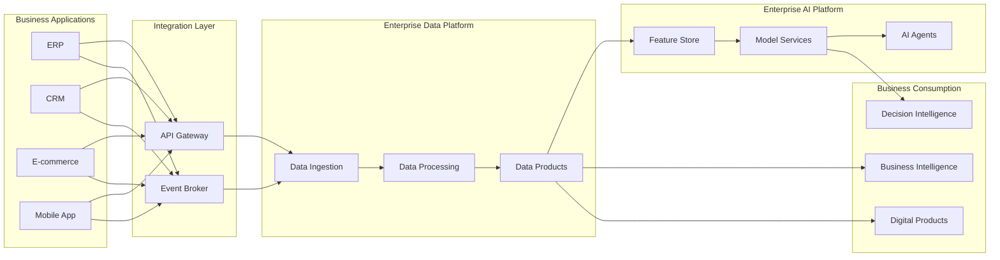

# Application Interaction Model

> Define o modelo de interação entre aplicações da Enterprise Data & Artificial Intelligence Platform, estabelecendo responsabilidades, padrões de comunicação e fluxo de integração entre os principais componentes da solução.

---

# Informações do Documento

| Item | Valor |
|------|-------|
| Documento | Application Interaction Model |
| Programa | Enterprise Data & Artificial Intelligence Platform |
| Domínio Arquitetural | Application Architecture |
| Tipo | Architecture Definition |
| Responsável | Enterprise Architecture Practice |
| Versão | 1.0 |
| Status | Approved |

---

# Executive Summary

O modelo de interação entre aplicações define como os componentes da plataforma colaboram para suportar processos corporativos orientados a dados.

A arquitetura privilegia baixo acoplamento, comunicação orientada a eventos, APIs padronizadas e serviços reutilizáveis, garantindo evolução independente dos domínios e alta capacidade de escalabilidade.

Cada aplicação possui responsabilidades claramente definidas e interage por meio de contratos explícitos, eliminando dependências diretas entre consumidores e produtores de informação.

---

# Objetivos

- Definir responsabilidades entre aplicações.
- Padronizar a comunicação entre componentes.
- Reduzir acoplamento.
- Aumentar reutilização de capacidades.
- Garantir interoperabilidade.
- Facilitar evolução da plataforma.

---

# Princípios Arquiteturais

- API First
- Event-Driven Architecture
- Loose Coupling
- Domain-Driven Design
- Consumer Independence
- Reusable Services
- Security by Design
- Observability by Default

---

# Modelo de Interação

---

# Modelo de Comunicação

## Comunicação Síncrona

Utilizada quando há necessidade de resposta imediata.

Aplicações:

- Consultas transacionais.
- Operações críticas.
- Validações.
- Serviços corporativos.

Padrão:

- REST APIs.

---

## Comunicação Assíncrona

Utilizada para propagação de eventos de negócio.

Aplicações:

- Atualização de Data Products.
- Integração entre domínios.
- Processamento analítico.
- Inteligência Artificial.

Padrão:

- Publish / Subscribe.

---

# Responsabilidades por Camada

## Business Applications

Responsáveis pelos processos operacionais e geração dos eventos de negócio.

---

## Integration Layer

Responsável pela mediação da comunicação entre aplicações.

Capacidades:

- API Management.
- Event Routing.
- Security.
- Rate Limiting.
- Monitoring.

---

## Enterprise Data Platform

Responsável pelo processamento e disponibilização dos ativos de dados.

Capacidades:

- Ingestão.
- Transformação.
- Qualidade.
- Governança.
- Produtos de Dados.

---

## Enterprise AI Platform

Responsável pelas capacidades compartilhadas de Inteligência Artificial.

Capacidades:

- Machine Learning.
- IA Generativa.
- Feature Store.
- Model Serving.
- AI Agents.

---

## Business Consumption

Representa os consumidores das capacidades da plataforma.

Exemplos:

- Dashboards.
- Aplicações Digitais.
- Analytics.
- Decision Intelligence.

---

# Fluxo de Interação

1. Uma aplicação executa uma operação de negócio.
2. O domínio publica um evento corporativo.
3. O broker distribui o evento aos consumidores.
4. A plataforma atualiza os pipelines de dados.
5. Os Data Products são atualizados.
6. Modelos de IA consomem novos dados.
7. Aplicações consumidoras recebem informações atualizadas.

---

# Regras Arquiteturais

- Aplicações não acessam diretamente bancos de dados de outros domínios.
- Toda integração síncrona deve utilizar APIs corporativas.
- Toda integração assíncrona deve utilizar eventos.
- Produtos de Dados representam a interface oficial para consumo analítico.
- Serviços de IA devem ser reutilizáveis por múltiplos domínios.

---

# Benefícios Esperados

## Negócio

- Maior velocidade para integração de novos produtos.
- Redução do tempo de entrega de capacidades digitais.
- Melhor experiência para áreas consumidoras.

---

## Tecnologia

- Baixo acoplamento.
- Escalabilidade.
- Reutilização.
- Evolução independente.
- Maior resiliência.

---

## Dados

- Atualização contínua.
- Maior qualidade.
- Melhor governança.
- Reutilização dos ativos corporativos.

---

# Relação com Outros Artefatos

Este documento complementa:

- Application Landscape
- Integration Patterns
- API Strategy
- Event-Driven Architecture
- Technology Architecture

---

# Decisões Arquiteturais

## DA-01 — APIs como Interface Oficial

**Decisão**

Toda comunicação síncrona ocorrerá por APIs corporativas.

**Motivação**

Padronizar integrações e reduzir dependências.

---

## DA-02 — Eventos como Mecanismo de Integração

**Decisão**

Toda comunicação assíncrona utilizará eventos corporativos.

**Motivação**

Garantir escalabilidade e desacoplamento.

---

## DA-03 — Data Products como Camada de Consumo

**Decisão**

Consumidores analíticos deverão acessar exclusivamente Produtos de Dados.

**Motivação**

Fortalecer governança e reutilização.

---

## DA-04 — Serviços Compartilhados de IA

**Decisão**

Capacidades de Inteligência Artificial serão disponibilizadas como serviços reutilizáveis.

**Motivação**

Evitar duplicidade de soluções e acelerar inovação.

---

# Conclusão

O modelo de interação entre aplicações estabelece uma arquitetura consistente para comunicação entre sistemas corporativos, plataforma de dados e serviços de Inteligência Artificial. Ao combinar APIs, eventos e Produtos de Dados, a solução promove escalabilidade, interoperabilidade e evolução sustentável da Enterprise Data & Artificial Intelligence Platform.