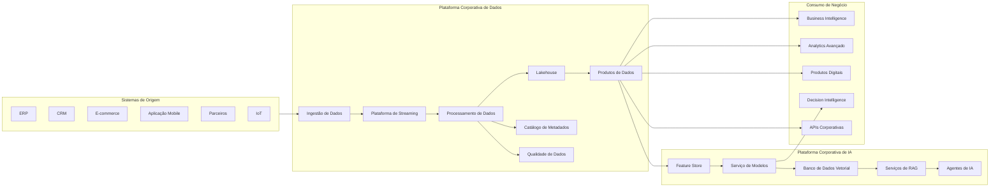

# Application Landscape

> Define a arquitetura lógica das aplicações que compõem a Enterprise Data & Artificial Intelligence Platform, estabelecendo responsabilidades, interações e princípios de integração entre os componentes da solução.

---

## Contexto

Este documento integra a Arquitetura de Aplicações do Programa 02 – Enterprise Data & AI Platform.

Seu objetivo é estabelecer as diretrizes arquiteturais referentes a arquitetura de aplicações, assegurando alinhamento com os princípios corporativos da plataforma, os Architecture Decision Records (ADRs) aprovados e a arquitetura alvo do programa.

As definições aqui apresentadas devem ser utilizadas como referência para decisões de arquitetura, evolução da plataforma e revisão técnica das soluções implementadas.

---

# Informações do Documento

| Item | Valor |
|------|-------|
| Documento | Application Landscape |
| Programa Estratégico | Enterprise Data & Artificial Intelligence Platform |
| Domínio Arquitetural | Application Architecture |
| Tipo | Definição Arquitetural |
| Responsável | Enterprise Architecture Practice |
| Versão | 1.0 |
| Status | Aprovado |

---

# Executive Summary

A Enterprise Data & Artificial Intelligence Platform é composta por um conjunto de aplicações especializadas que atuam de forma integrada para suportar todo o ciclo de vida dos dados corporativos, desde sua ingestão até o consumo por aplicações analíticas, operacionais e serviços de Inteligência Artificial.

O landscape de aplicações foi estruturado segundo princípios de modularidade, desacoplamento e reutilização, permitindo que cada componente evolua de forma independente sem comprometer a estabilidade da plataforma.

A separação clara de responsabilidades reduz a complexidade arquitetural, favorece a governança dos ativos de dados e acelera a entrega de novas capacidades para o negócio.

---

# Objetivos

- Definir os principais componentes da plataforma.
- Delimitar responsabilidades entre aplicações.
- Padronizar a interação entre serviços.
- Promover reutilização de capacidades corporativas.
- Garantir escalabilidade e evolução independente dos componentes.

---

# Princípios Arquiteturais

- Domain-Driven Design.
- API First.
- Event-Driven Architecture.
- Loose Coupling.
- High Cohesion.
- Reusable Services.
- Cloud Native.
- Security by Design.
- Data as a Product.
- AI by Design.

---

# Visão Geral da Arquitetura

---

# Camadas da Arquitetura

## Sistemas de Origem

Representam as aplicações corporativas responsáveis pela geração dos dados operacionais da organização.

Exemplos:

- ERP
- CRM
- Plataformas Digitais
- Sistemas Legados
- Parceiros
- Dispositivos IoT

Esses sistemas permanecem responsáveis pelas regras transacionais do negócio.

---

## Enterprise Data Platform

Responsável por consolidar, processar e disponibilizar informações corporativas.

### Data Ingestion

Centraliza os mecanismos de captura de dados provenientes de diferentes fontes.

Responsabilidades:

- Ingestão Batch.
- Streaming.
- APIs.
- CDC.
- Integrações com terceiros.

---

### Streaming Platform

Responsável pela distribuição de eventos corporativos em tempo real.

Responsabilidades:

- Publicação de eventos.
- Consumo assíncrono.
- Escalabilidade.
- Baixo acoplamento.

---

### Data Processing

Executa transformações, enriquecimentos e padronizações dos dados.

Responsabilidades:

- ETL.
- ELT.
- Data Cleansing.
- Normalização.
- Enriquecimento.

---

### Lakehouse

Repositório corporativo para armazenamento de dados estruturados e não estruturados.

Responsabilidades:

- Persistência.
- Histórico.
- Analytics.
- Machine Learning.

---

### Metadata Catalog

Centraliza os metadados corporativos.

Responsabilidades:

- Catálogo.
- Descoberta.
- Classificação.
- Lineage.
- Glossário.

---

### Data Quality

Executa validações automáticas de qualidade.

Responsabilidades:

- Completude.
- Consistência.
- Unicidade.
- Integridade.
- Confiabilidade.

---

### Data Products

Representam os ativos de dados disponibilizados para consumo corporativo.

Exemplos:

- Customer 360.
- Sales Analytics.
- Marketing Intelligence.
- Financial Analytics.
- Supply Chain Analytics.

---

## Enterprise AI Platform

Disponibiliza capacidades compartilhadas para desenvolvimento e operação de Inteligência Artificial.

---

### Feature Store

Repositório central de atributos reutilizáveis para modelos de Machine Learning.

Benefícios:

- Reutilização.
- Padronização.
- Consistência.

---

### Model Serving

Responsável pela publicação e execução de modelos.

Capacidades:

- Versionamento.
- Deploy.
- Inferência.
- Monitoramento.

---

### Vector Database

Armazena embeddings utilizados por soluções de IA Generativa.

Suporta:

- Similaridade semântica.
- Busca vetorial.
- Recuperação contextual.

---

### RAG Services

Implementa o padrão Retrieval-Augmented Generation.

Responsabilidades:

- Recuperação de conhecimento.
- Contextualização.
- Orquestração de prompts.

---

### AI Agents

Automatizam processos corporativos utilizando modelos de IA.

Exemplos:

- Assistentes internos.
- Atendimento inteligente.
- Apoio à decisão.
- Automação operacional.

---

# Camada de Consumo

Disponibiliza as capacidades da plataforma para diferentes perfis de consumidores.

## Business Intelligence

Consumo de indicadores corporativos.

---

## Advanced Analytics

Exploração avançada dos dados por cientistas e analistas.

---

## Digital Products

Aplicações digitais que utilizam produtos de dados e serviços de IA.

---

## Decision Intelligence

Sistemas de apoio à decisão baseados em modelos analíticos.

---

## Corporate APIs

Exposição controlada de capacidades da plataforma para aplicações internas e externas.

---

# Integrações

A comunicação entre componentes deverá seguir os seguintes padrões:

| Cenário | Padrão |
|----------|---------|
| Comunicação síncrona | REST APIs |
| Comunicação assíncrona | Eventos |
| Processamento em tempo real | Streaming |
| Processamento analítico | Batch |
| Consumo de dados | Data Products |

A capacidade corporativa de API Management e Event Streaming é provida pelo **Programa Estratégico 03 — Enterprise Integration Platform**. Os componentes de streaming representados neste landscape correspondem ao processamento de dados do Programa 02 e não substituem o broker corporativo de integração.

---

# Benefícios Esperados

## Negócio

- Aceleração da transformação digital.
- Redução do tempo para disponibilização de novos produtos de dados.
- Maior confiabilidade das informações corporativas.
- Democratização do uso de Inteligência Artificial.

---

## Tecnologia

- Redução do acoplamento entre aplicações.
- Evolução independente dos componentes.
- Maior reutilização de capacidades.
- Simplificação das integrações corporativas.

---

## Dados

- Padronização dos ativos de informação.
- Maior governança.
- Melhor rastreabilidade.
- Maior qualidade dos dados.

---

# Relação com Outros Artefatos

Este documento complementa:

- [Executive Target State](../diagrams/executive-target-state.md)
- [Architecture Vision](../docs/architecture-vision.md)
- [Business Capability Map](../business-architecture/capability-map.md)
- [Business Domains](../business-architecture/business-domains.md)
- [Data Ownership Model](../business-architecture/data-ownership-model.md)
- [Enterprise Information Model](../information-architecture/enterprise-information-model.md)
- [Data Product Model](../information-architecture/data-product-model.md)
- [Application Interaction Model](./application-interaction-model.md)
- Integration Patterns
- API Strategy
- Event-Driven Architecture
- Technology Architecture

---

# Decisões Arquiteturais

## DA-01 — Arquitetura Baseada em Capacidades

**Decisão**

A plataforma será composta por componentes especializados, organizados por responsabilidade funcional.

**Motivação**

Promover evolução independente, maior reutilização e redução do acoplamento.

---

## DA-02 — Data Products como Interface Oficial de Consumo

**Decisão**

Aplicações consumidoras deverão acessar dados exclusivamente por meio de Produtos de Dados.

**Motivação**

Fortalecer a governança, padronizar o consumo e reduzir dependências diretas das estruturas físicas de armazenamento.

---

## DA-03 — Serviços Compartilhados de Inteligência Artificial

**Decisão**

As capacidades de IA serão disponibilizadas como serviços corporativos reutilizáveis.

**Motivação**

Evitar duplicidade de soluções, reduzir custos operacionais e acelerar a adoção de Inteligência Artificial em diferentes domínios de negócio.

---

## DA-04 — Comunicação Baseada em APIs e Eventos

**Decisão**

As integrações entre aplicações deverão priorizar APIs para comunicações síncronas e eventos para cenários assíncronos.

**Motivação**

Garantir baixo acoplamento, escalabilidade e maior resiliência da plataforma.
