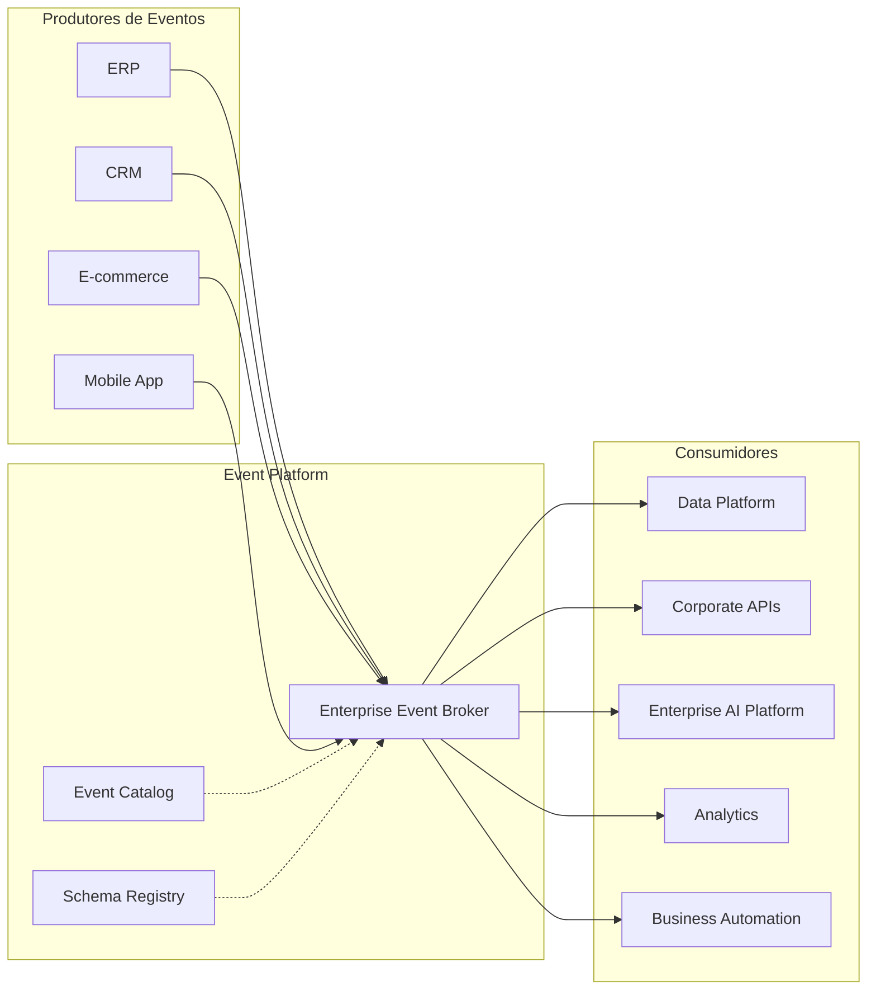

# Event-Driven Architecture

> Define a arquitetura orientada a eventos da Enterprise Data & Artificial Intelligence Platform, estabelecendo os princípios, padrões e responsabilidades para comunicação assíncrona entre aplicações, produtos de dados e serviços corporativos.

---

## Contexto

Este documento integra a Arquitetura de Aplicações do Programa 02 – Enterprise Data & AI Platform.

Seu objetivo é estabelecer as diretrizes arquiteturais referentes a arquitetura orientada a eventos, assegurando alinhamento com os princípios corporativos da plataforma, os Architecture Decision Records (ADRs) aprovados e a arquitetura alvo do programa.

As definições aqui apresentadas devem ser utilizadas como referência para decisões de arquitetura, evolução da plataforma e revisão técnica das soluções implementadas.

---

# Informações do Documento

| Item | Valor |
|------|-------|
| Documento | Event-Driven Architecture |
| Programa | Enterprise Data & Artificial Intelligence Platform |
| Domínio Arquitetural | Application Architecture |
| Tipo | Architecture Definition |
| Responsável | Enterprise Architecture Practice |
| Versão | 1.0 |
| Status | Approved |

---

# Executive Summary

A arquitetura orientada a eventos constitui o principal mecanismo de integração assíncrona da Enterprise Data & Artificial Intelligence Platform.

Esse modelo permite que aplicações publiquem fatos relevantes do negócio sem conhecer seus consumidores, reduzindo acoplamento, aumentando a escalabilidade da plataforma e permitindo a evolução independente dos domínios corporativos.

Os eventos representam mudanças de estado do negócio e constituem ativos corporativos reutilizáveis por aplicações operacionais, produtos de dados, pipelines analíticos e serviços de Inteligência Artificial.

---

# Objetivos

- Padronizar a comunicação assíncrona entre aplicações.
- Reduzir dependências entre domínios de negócio.
- Promover integração baseada em eventos corporativos.
- Suportar processamento em tempo real.
- Facilitar reutilização de informações por múltiplos consumidores.
- Garantir escalabilidade e resiliência da plataforma.

---

# Princípios Arquiteturais

- Event-Driven Architecture
- Publish / Subscribe
- Domain Events
- Eventual Consistency
- Consumer Independence
- Loose Coupling
- Immutable Events
- Event Versioning
- Observability by Default

---

# Arquitetura de Referência

---

# Modelo de Publicação

Cada evento deverá representar um fato de negócio ocorrido dentro de um domínio específico.

Características obrigatórias:

- Imutável.
- Identificado por versão.
- Contendo data e hora do evento.
- Associado a um domínio de negócio.
- Independente da tecnologia utilizada pelo produtor.

---

# Modelo de Consumo

Os consumidores deverão processar eventos de forma independente.

Não será permitido:

- dependência entre consumidores;
- chamadas síncronas para confirmação de processamento;
- compartilhamento de estado entre consumidores.

Cada consumidor deverá ser responsável pelo tratamento de falhas, reprocessamento e idempotência.

---

# Categorias de Eventos

| Categoria | Descrição |
|------------|-----------|
| Domain Events | Representam mudanças de estado do negócio. |
| Integration Events | Compartilham informações entre domínios distintos. |
| Platform Events | Eventos técnicos relacionados à operação da plataforma. |
| AI Events | Eventos produzidos por modelos e agentes de Inteligência Artificial. |

---

# Versionamento

Todo evento deverá possuir versionamento explícito.

Estratégia adotada:

- Inclusão de novos atributos sem quebra de compatibilidade.
- Eventos incompatíveis deverão originar uma nova versão.
- Consumidores deverão suportar coexistência temporária de versões.

---

# Tratamento de Falhas

A plataforma deverá suportar mecanismos para garantir confiabilidade no processamento.

Capacidades mínimas:

- Retry automático.
- Dead Letter Queue.
- Monitoramento de falhas.
- Alertas operacionais.
- Reprocessamento controlado.

---

# Observabilidade

Todos os eventos deverão possuir rastreabilidade ponta a ponta.

Informações mínimas:

- Event ID.
- Correlation ID.
- Timestamp.
- Domínio de origem.
- Produtor.
- Consumidor.
- Status de processamento.
- Tempo de processamento.

---

# Segurança

A plataforma deverá garantir:

- autenticação dos produtores;
- autorização para publicação;
- autorização para consumo;
- criptografia em trânsito;
- auditoria completa dos eventos.

---

# Integração com Data Products

Os eventos corporativos representam uma das principais fontes para construção dos Data Products.

Os pipelines de dados deverão consumir eventos publicados no broker para atualização contínua dos produtos de dados, reduzindo latência entre geração e disponibilização da informação.

---

# Integração com Inteligência Artificial

Os serviços de Inteligência Artificial poderão atuar tanto como produtores quanto como consumidores de eventos.

Exemplos:

- atualização automática de features;
- inferência em tempo real;
- detecção de anomalias;
- automação de processos;
- agentes inteligentes.

---

# Benefícios Esperados

## Negócio

- Maior agilidade na integração de novos sistemas.
- Redução do tempo de disponibilização de informações.
- Melhor capacidade de reação a eventos do negócio.

---

## Tecnologia

- Baixo acoplamento.
- Escalabilidade horizontal.
- Evolução independente dos serviços.
- Maior resiliência operacional.

---

## Dados

- Atualização contínua dos produtos de dados.
- Redução da latência.
- Melhor rastreabilidade das informações.

---

# Relação com Outros Artefatos

Este documento complementa:

- Application Landscape
- Integration Patterns
- API Strategy
- Enterprise Information Model
- Data Product Model
- Technology Architecture

---

# Decisões Arquiteturais

## DA-01 — Event Broker Corporativo

**Decisão**

Toda comunicação assíncrona deverá ocorrer por meio de um broker corporativo de eventos.

**Motivação**

Centralizar distribuição, monitoramento e governança dos eventos.

---

## DA-02 — Eventos Representam Fatos de Negócio

**Decisão**

Eventos deverão representar exclusivamente mudanças de estado do negócio.

**Motivação**

Evitar eventos técnicos acoplados à implementação das aplicações.

---

## DA-03 — Consumidores Independentes

**Decisão**

Consumidores deverão processar eventos sem dependência entre si.

**Motivação**

Garantir escalabilidade e evolução independente dos serviços.

---

## DA-04 — Governança de Contratos

**Decisão**

Todos os eventos deverão possuir contrato versionado e registrado em catálogo corporativo.

**Motivação**

Assegurar interoperabilidade e reduzir impactos de evolução.

---

# Conclusão

A arquitetura orientada a eventos estabelece um modelo corporativo para integração assíncrona entre aplicações, produtos de dados e serviços de Inteligência Artificial. Ao adotar eventos como mecanismo padrão de comunicação, a plataforma reduz acoplamento, aumenta escalabilidade e cria uma base sólida para processamento em tempo real, analytics e automação inteligente.