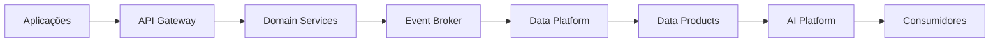

# Integration Patterns

> Define os padrões de integração adotados pela Enterprise Data & Artificial Intelligence Platform para garantir interoperabilidade, baixo acoplamento, escalabilidade e reutilização.

---

# Informações do Documento

| Item | Valor |
|------|-------|
| Documento | Integration Patterns |
| Programa | Enterprise Data & Artificial Intelligence Platform |
| Domínio | Application Architecture |
| Tipo | Architecture Definition |
| Responsável | Enterprise Architecture Practice |
| Versão | 1.0 |
| Status | Approved |

---

# Executive Summary

Este documento estabelece os padrões arquiteturais para integração entre aplicações, serviços, produtos de dados e capacidades de Inteligência Artificial da plataforma corporativa.

As integrações priorizam comunicação desacoplada, APIs padronizadas e arquitetura orientada a eventos, reduzindo dependências entre sistemas e aumentando a escalabilidade da solução.

---

# Objetivos

- Padronizar integrações corporativas.
- Reduzir acoplamento entre aplicações.
- Incentivar reutilização de serviços.
- Garantir interoperabilidade.
- Suportar processamento síncrono e assíncrono.

---

# Princípios Arquiteturais

- API First
- Event-Driven Architecture
- Loose Coupling
- Consumer Driven
- Reusable Services
- Security by Design

---

# Padrões de Integração

| Cenário | Padrão |
|---------|---------|
| Consulta síncrona | REST API |
| Integração assíncrona | Eventos |
| Processamento em tempo real | Streaming |
| Carga massiva | Batch |
| Consumo analítico | Data Products |

---

# Arquitetura de Integração

---

# Diretrizes

- APIs para operações transacionais.
- Eventos para propagação de mudanças de estado.
- Comunicação assíncrona sempre que possível.
- Versionamento de APIs obrigatório.
- Contratos publicados antes da implementação.

---

# Benefícios Esperados

- Escalabilidade.
- Resiliência.
- Evolução independente.
- Reutilização.
- Padronização das integrações.

---

# Relação com Outros Artefatos

- Application Landscape
- API Strategy
- Event-Driven Architecture
- Enterprise Information Model
- Technology Architecture

---

# Decisões Arquiteturais

## DA-01 — APIs para comunicação síncrona

**Motivação**

Padronizar integrações transacionais.

---

## DA-02 — Eventos para comunicação assíncrona

**Motivação**

Reduzir acoplamento e aumentar escalabilidade.

---

## DA-03 — Contratos versionados

**Motivação**

Garantir compatibilidade entre consumidores e provedores.

---

# Conclusão

Os padrões definidos neste documento estabelecem uma arquitetura de integração consistente, resiliente e preparada para suportar a evolução contínua da Enterprise Data & Artificial Intelligence Platform.
