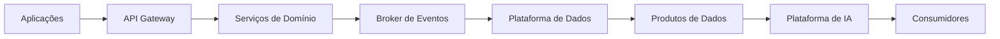

# Integration Patterns

> Define os padrões de integração adotados pela Enterprise Data & Artificial Intelligence Platform para garantir interoperabilidade, baixo acoplamento, escalabilidade e reutilização.

---

## Contexto

Este documento integra a Arquitetura de Aplicações do Programa 02 – Enterprise Data & AI Platform.

Seu objetivo é estabelecer as diretrizes arquiteturais referentes a padrões de integração, assegurando alinhamento com os princípios corporativos da plataforma, os Architecture Decision Records (ADRs) aprovados e a arquitetura alvo do programa.

As definições aqui apresentadas devem ser utilizadas como referência para decisões de arquitetura, evolução da plataforma e revisão técnica das soluções implementadas.

---

# Informações do Documento

| Item | Valor |
|------|-------|
| Documento | Integration Patterns |
| Programa Estratégico | Enterprise Data & Artificial Intelligence Platform |
| Domínio Arquitetural | Application Architecture |
| Tipo | Definição Arquitetural |
| Responsável | Enterprise Architecture Practice |
| Versão | 1.0 |
| Status | Aprovado |

---

# Executive Summary

Este documento estabelece os padrões arquiteturais para integração entre aplicações, serviços, produtos de dados e capacidades de Inteligência Artificial da plataforma corporativa.

As integrações priorizam comunicação desacoplada, APIs padronizadas e arquitetura orientada a eventos, reduzindo dependências entre sistemas e aumentando a escalabilidade da solução.

---

# Objetivos

- Padronizar integrações corporativas.
- Reduzir acoplamento entre aplicações.
- Incentivar reutilização de serviços.
- Garantir interoperabilidade.
- Suportar processamento síncrono e assíncrono.

---

# Princípios Arquiteturais

- API First
- Event-Driven Architecture
- Loose Coupling
- Consumer Driven
- Reusable Services
- Security by Design

---

# Padrões de Integração

| Cenário | Padrão |
|---------|---------|
| Consulta síncrona | REST API |
| Integração assíncrona | Eventos |
| Processamento em tempo real | Streaming |
| Carga massiva | Batch |
| Consumo analítico | Data Products |

---

# Arquitetura de Integração

---

# Diretrizes

- APIs para operações transacionais.
- Eventos para propagação de mudanças de estado.
- Comunicação assíncrona sempre que possível.
- Versionamento de APIs obrigatório.
- Contratos publicados antes da implementação.

---

# Benefícios Esperados

- Escalabilidade.
- Resiliência.
- Evolução independente.
- Reutilização.
- Padronização das integrações.

---

# Limites e Dependências

Os padrões deste documento especificam como as aplicações do Programa 02 integram dados e serviços de IA. API Management, mensageria e distribuição corporativa de eventos são capacidades compartilhadas providas e governadas pelo **Programa Estratégico 03 — Enterprise Integration Platform**.

---

# Relação com Outros Artefatos

- [API Strategy](./api-strategy.md)
- [Application Architecture Principles](./application-architecture-principles.md)
- [Application Interaction Model](./application-interaction-model.md)
- [Application Landscape](./application-landscape.md)
- [Event-Driven Architecture](./event-driven-architecture.md)
- [Enterprise Information Model](../information-architecture/enterprise-information-model.md)

---

# Decisões Arquiteturais

## DA-01 — APIs para comunicação síncrona

**Decisão**

Interações síncronas entre domínios deverão utilizar APIs com contratos governados.

**Motivação**

Padronizar integrações transacionais.

---

## DA-02 — Eventos para comunicação assíncrona

**Decisão**

Interações assíncronas e propagação de fatos de negócio deverão utilizar eventos corporativos.

**Motivação**

Reduzir acoplamento e aumentar escalabilidade.

---

## DA-03 — Contratos versionados

**Decisão**

APIs, eventos e schemas compartilhados deverão possuir contratos versionados e política de compatibilidade.

**Motivação**

Garantir compatibilidade entre consumidores e provedores.
