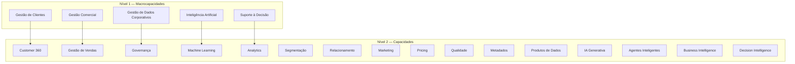

# Business Capability Map

## Informações do Documento

| Item | Valor |
|---|---|
| Documento | Business Capability Map |
| Programa Estratégico | Enterprise Data & Artificial Intelligence Platform |
| Domínio Arquitetural | Business Architecture |
| Tipo | Modelo de Capacidades de Negócio |
| Responsável | Enterprise Architecture Practice |
| Versão | 1.0 |
| Status | Em evolução |

---

# Resumo Executivo

O **Business Capability Map** representa as capacidades de negócio necessárias para suportar a estratégia de transformação orientada por dados e Inteligência Artificial da organização.

Diferentemente da estrutura organizacional, que pode variar ao longo do tempo, as capacidades representam aquilo que a organização precisa ser capaz de executar para atingir seus objetivos estratégicos.

Este modelo estabelece uma visão corporativa das capacidades relacionadas ao programa **Enterprise Data & Artificial Intelligence Platform**, servindo como referência para a evolução da Arquitetura da Informação, Arquitetura de Aplicações e Arquitetura Tecnológica.

---

# Objetivos

Este documento possui os seguintes objetivos:

- Identificar as capacidades de negócio suportadas pelo programa;
- Estabelecer uma visão comum entre negócio e arquitetura;
- Orientar a evolução das capacidades organizacionais;
- Servir como referência para os próximos domínios arquiteturais;
- Demonstrar o alinhamento entre estratégia e arquitetura.

---

# Modelo de Organização

As capacidades estão organizadas em três níveis hierárquicos.

| Nível | Objetivo |
|---|---|
| Nível 1 | Macrocapacidades de negócio. |
| Nível 2 | Capacidades organizacionais. |
| Nível 3 | Capacidades especializadas que suportam as capacidades do nível anterior. |

Essa estrutura permite que diferentes públicos naveguem pelo modelo conforme o nível de detalhamento desejado.

---

# Business Capability Map



---

# Descrição das Macrocapacidades

## Gestão de Clientes

Conjunto de capacidades responsáveis por compreender, acompanhar e fortalecer o relacionamento com clientes ao longo de toda sua jornada.

Principais objetivos:

- Construção de visão integrada do cliente;
- Segmentação de públicos;
- Personalização de experiências.

---

## Gestão Comercial

Capacidades responsáveis por apoiar decisões relacionadas a vendas, campanhas, produtos e estratégias comerciais.

Principais objetivos:

- Melhorar desempenho comercial;
- Apoiar decisões de marketing;
- Otimizar resultados financeiros.

---

## Gestão de Dados Corporativos

Capacidade responsável por garantir que informações sejam tratadas como ativos organizacionais.

Inclui:

- Governança;
- Qualidade;
- Metadados;
- Gestão de Produtos de Dados.

Esta é considerada uma das capacidades centrais do programa.

---

## Inteligência Artificial

Conjunto de capacidades voltadas para criação e disponibilização de recursos inteligentes reutilizáveis por diferentes áreas da organização.

Inclui:

- Modelos analíticos;
- IA Generativa;
- Agentes Inteligentes.

---

## Suporte à Decisão

Capacidade responsável por transformar informação em conhecimento para apoiar decisões estratégicas, táticas e operacionais.

Inclui:

- Analytics;
- Business Intelligence;
- Decision Intelligence.

---

# Relação com os Objetivos Estratégicos

| Objetivo Estratégico | Capacidades Relacionadas |
|---|---|
| Organização orientada por dados | Gestão de Dados Corporativos |
| Melhorar experiência do cliente | Gestão de Clientes |
| Aumentar eficiência operacional | Gestão Comercial |
| Democratizar Inteligência Artificial | Inteligência Artificial |
| Apoiar decisões corporativas | Suporte à Decisão |

---

# Relação entre as Capacidades

As macrocapacidades não operam de forma isolada.

A evolução do programa pressupõe uma relação contínua entre elas.

```text
Gestão de Clientes
        │
        ▼
Gestão Comercial
        │
        ▼
Gestão de Dados Corporativos
        │
        ├─────────────┐
        ▼             ▼
Inteligência Artificial
        │             │
        └──────┬──────┘
               ▼
      Suporte à Decisão
```

A Gestão de Dados Corporativos atua como elemento integrador do modelo, disponibilizando informações confiáveis para as capacidades analíticas e inteligentes.

---

# Alinhamento com os Próximos Domínios Arquiteturais

Este modelo orientará diretamente os próximos blocos do programa.

## Information Architecture

Cada macrocapacidade será desdobrada em:

- Domínios de Dados;
- Produtos de Dados;
- Modelo Corporativo de Informação;
- Estratégia de Metadados.

---

## Application Architecture

As capacidades de negócio serão suportadas por aplicações e serviços corporativos.

---

## Technology Architecture

A infraestrutura será definida para habilitar as capacidades identificadas neste documento.

---

# Benefícios Esperados

A adoção deste modelo proporciona:

- Alinhamento entre estratégia e arquitetura;
- Redução de sobreposição de responsabilidades;
- Maior clareza sobre capacidades organizacionais;
- Evolução arquitetural orientada ao negócio;
- Base consistente para transformação digital.

---

# Considerações Arquiteturais

É importante destacar que o mapa de capacidades representa **o que a organização precisa ser capaz de fazer**, e não **como essas capacidades serão implementadas**.

Essa separação reduz o acoplamento entre estratégia e tecnologia, permitindo que plataformas e soluções evoluam ao longo do tempo sem alterar o modelo de negócio.

---

# Relação com os Próximos Artefatos

Este documento servirá como base para:

- Business Value Streams;
- Business Domains;
- Data Ownership Model;
- Enterprise Information Model;
- Data Domain Model.

---

# Decisões Arquiteturais

## DA-01 — Capacidades Independentes da Estrutura Organizacional

**Decisão**

O modelo de capacidades deve permanecer estável independentemente da estrutura hierárquica da organização.

**Motivação**

Capacidades representam aquilo que o negócio precisa executar, enquanto estruturas organizacionais podem mudar ao longo do tempo.

---

## DA-02 — Organização por Macrocapacidades

**Decisão**

As capacidades serão organizadas em níveis hierárquicos para facilitar comunicação entre diferentes públicos.

**Motivação**

Executivos necessitam de uma visão simplificada, enquanto arquitetos demandam maior detalhamento.

---

## DA-03 — Arquitetura Orientada por Capacidades

**Decisão**

Os próximos domínios arquiteturais deverão utilizar este modelo como referência para definição de informações, aplicações e tecnologias.

**Motivação**

Garantir rastreabilidade entre estratégia, negócio e implementação.

---

# Próximos Passos

Os próximos artefatos da Business Architecture serão:

- Business Value Streams;
- Business Domains;
- Data Ownership Model.

Ao final da Business Architecture, o programa possuirá uma visão completa das capacidades organizacionais que sustentarão toda a evolução da plataforma corporativa de dados e Inteligência Artificial.