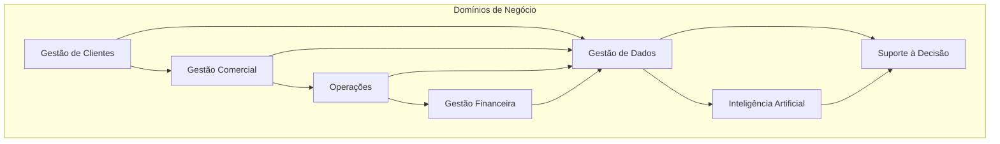

# Business Domains

## Informações do Documento

| Item | Valor |
|---|---|
| Documento | Business Domains |
| Programa Estratégico | Enterprise Data & Artificial Intelligence Platform |
| Domínio Arquitetural | Business Architecture |
| Tipo | Modelo de Domínios de Negócio |
| Responsável | Enterprise Architecture Practice |
| Versão | 1.0 |
| Status | Em evolução |

---

# Resumo Executivo

A transformação para uma organização orientada por dados exige que a arquitetura esteja estruturada em torno dos domínios de negócio, e não apenas de sistemas, departamentos ou projetos.

Os **Business Domains** representam agrupamentos de capacidades com objetivos comuns, responsabilidades bem definidas e geração de valor específica para a organização.

Este documento estabelece os domínios de negócio que servirão como referência para toda a arquitetura corporativa da **Enterprise Data & Artificial Intelligence Platform**, orientando a futura definição dos Domínios de Dados, Produtos de Dados e responsabilidades de governança.

---

# Objetivos

Este documento possui os seguintes objetivos:

- Identificar os principais domínios de negócio da organização;
- Organizar as capacidades corporativas em contextos coerentes;
- Estabelecer limites claros de responsabilidade;
- Servir como base para a Arquitetura da Informação;
- Facilitar a evolução da plataforma por domínio de negócio.

---

# Conceitos Fundamentais

Um **Business Domain** representa um conjunto de capacidades que compartilham um mesmo propósito de negócio.

Sua definição independe da estrutura organizacional, permitindo que a arquitetura permaneça estável mesmo diante de mudanças administrativas ou operacionais.

Cada domínio possui responsabilidades próprias, produz informações relevantes para a organização e colabora com os demais domínios na geração de valor.

---

# Modelo de Domínios de Negócio

---

# Descrição dos Domínios

## Gestão de Clientes

Responsável por compreender, acompanhar e fortalecer o relacionamento com clientes durante toda a sua jornada.

### Principais responsabilidades

- Cadastro e perfil de clientes;
- Segmentação;
- Experiência do cliente;
- Relacionamento.

### Valor gerado

Disponibilizar uma visão integrada do cliente para toda a organização.

---

## Gestão Comercial

Responsável pela definição, execução e acompanhamento das estratégias comerciais.

### Principais responsabilidades

- Gestão de campanhas;
- Gestão de ofertas;
- Precificação;
- Acompanhamento de resultados comerciais.

### Valor gerado

Maximizar receitas e fortalecer o relacionamento comercial.

---

## Operações

Responsável pela execução das atividades essenciais para entrega dos produtos e serviços da organização.

### Principais responsabilidades

- Execução operacional;
- Monitoramento das operações;
- Eficiência operacional;
- Continuidade dos serviços.

### Valor gerado

Garantir eficiência, qualidade e escalabilidade operacional.

---

## Gestão Financeira

Responsável pelo acompanhamento financeiro e pela sustentabilidade econômica da organização.

### Principais responsabilidades

- Planejamento financeiro;
- Indicadores financeiros;
- Custos;
- Rentabilidade.

### Valor gerado

Suportar decisões estratégicas relacionadas ao desempenho financeiro.

---

## Gestão de Dados

Responsável por tratar dados como ativos corporativos.

### Principais responsabilidades

- Governança;
- Qualidade;
- Metadados;
- Produtos de Dados;
- Compartilhamento de informações.

### Valor gerado

Disponibilizar dados confiáveis e reutilizáveis para toda a organização.

---

## Inteligência Artificial

Responsável pela criação e disponibilização de capacidades inteligentes para diferentes áreas de negócio.

### Principais responsabilidades

- Modelos analíticos;
- IA Generativa;
- Agentes Inteligentes;
- Automação baseada em IA.

### Valor gerado

Aumentar produtividade, inovação e inteligência organizacional.

---

## Suporte à Decisão

Responsável por transformar informações em conhecimento acionável.

### Principais responsabilidades

- Analytics;
- Business Intelligence;
- Indicadores;
- Decision Intelligence.

### Valor gerado

Apoiar decisões estratégicas, táticas e operacionais.

---

# Relação entre os Domínios

Embora cada domínio possua responsabilidades próprias, todos colaboram continuamente para geração de valor.

A Gestão de Dados atua como elemento integrador da arquitetura, enquanto o domínio de Inteligência Artificial amplia a capacidade analítica da organização.

O domínio de Suporte à Decisão representa o principal consumidor das informações produzidas pelos demais domínios.

Essa organização reduz dependências excessivas, promove maior autonomia entre áreas e favorece a evolução incremental da arquitetura.

---

# Alinhamento com a Arquitetura Corporativa

Os domínios definidos neste documento servirão como referência para os próximos níveis arquiteturais.

| Próximo Domínio Arquitetural | Utilização |
|---|---|
| Information Architecture | Definição dos Data Domains e Information Model |
| Application Architecture | Organização dos serviços e aplicações por domínio |
| Technology Architecture | Definição das plataformas que suportam cada domínio |
| Governance | Definição de ownership e responsabilidades corporativas |

---

# Benefícios Esperados

A adoção de uma arquitetura orientada por domínios proporciona:

- Clareza de responsabilidades;
- Redução de sobreposição entre iniciativas;
- Melhor alinhamento entre negócio e tecnologia;
- Evolução incremental da arquitetura;
- Maior escalabilidade organizacional.

---

# Considerações Arquiteturais

Os domínios apresentados representam uma visão corporativa do negócio e não correspondem necessariamente aos departamentos existentes na organização.

Essa separação permite que mudanças organizacionais ocorram sem comprometer a estabilidade da arquitetura corporativa.

Além disso, os Business Domains estabelecem a base conceitual para a futura definição dos **Data Domains**, garantindo rastreabilidade entre negócio, informação e tecnologia.

---

# Relação com os Próximos Artefatos

Este documento estabelece a transição final da Business Architecture para a Information Architecture.

Os domínios definidos servirão como insumo para:

- Data Ownership Model;
- Enterprise Information Model;
- Data Domain Model;
- Data Product Model.

---

# Decisões Arquiteturais

## DA-01 — Arquitetura Orientada por Domínios

**Decisão**

A arquitetura corporativa será estruturada a partir de domínios de negócio estáveis.

**Motivação**

Garantir alinhamento entre estratégia organizacional e evolução arquitetural.

---

## DA-02 — Independência Organizacional

**Decisão**

Os domínios de negócio não deverão refletir diretamente a estrutura organizacional.

**Motivação**

Preservar a estabilidade do modelo arquitetural diante de mudanças administrativas.

---

## DA-03 — Domínios como Base para a Arquitetura da Informação

**Decisão**

Os Data Domains deverão ser derivados dos Business Domains definidos neste documento.

**Motivação**

Assegurar rastreabilidade entre negócio, informação e tecnologia ao longo de todo o programa.

---

# Conclusão

A definição dos Business Domains consolida a visão organizacional da **Enterprise Data & Artificial Intelligence Platform**, estabelecendo os limites funcionais que orientarão toda a evolução arquitetural.

Ao organizar a arquitetura em torno de domínios de negócio, a organização fortalece o alinhamento entre estratégia, capacidades e informação, criando uma fundação sólida para os próximos domínios arquiteturais e para a evolução contínua da plataforma corporativa de dados e Inteligência Artificial.