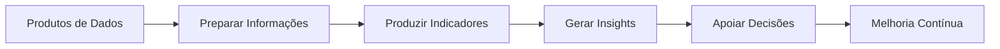
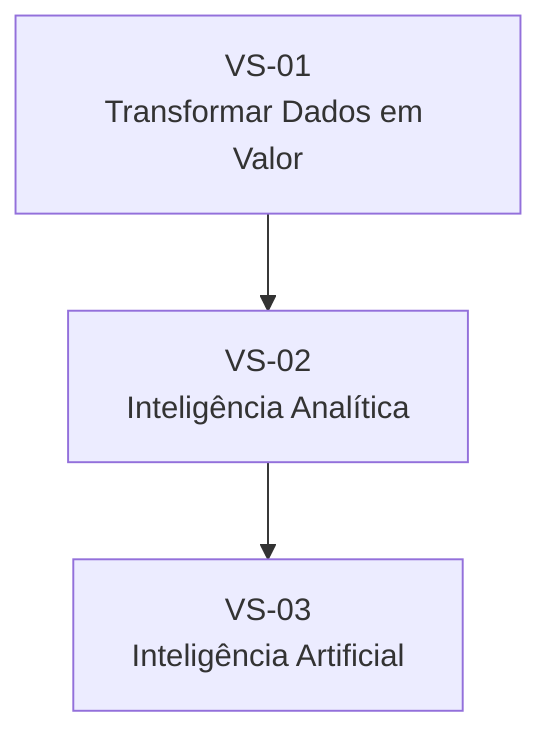

# Business Value Streams

## Informações do Documento

| Item | Valor |
|---|---|
| Documento | Business Value Streams |
| Programa Estratégico | Enterprise Data & Artificial Intelligence Platform |
| Domínio Arquitetural | Business Architecture |
| Tipo | Modelo de Fluxos de Valor |
| Responsável | Enterprise Architecture Practice |
| Versão | 1.0 |
| Status | Em evolução |

---

# Resumo Executivo

A transformação para uma organização orientada por dados exige compreender não apenas as capacidades necessárias ao negócio, mas também como essas capacidades se conectam para gerar valor.

Os **Business Value Streams** representam a sequência de atividades pelas quais informações são capturadas, tratadas, transformadas e consumidas para apoiar decisões, impulsionar inovação e criar vantagem competitiva.

Este documento descreve os principais fluxos de valor sustentados pela **Enterprise Data & Artificial Intelligence Platform**, estabelecendo a ligação entre estratégia, capacidades de negócio e os futuros domínios de Arquitetura da Informação.

---

# Objetivos

Este documento possui os seguintes objetivos:

- Representar como o negócio gera valor por meio dos dados;
- Demonstrar a relação entre capacidades organizacionais;
- Identificar pontos de geração de valor ao longo da cadeia de informação;
- Orientar a evolução da Arquitetura da Informação;
- Servir como referência para definição de Data Domains, Data Products e Information Model.

---

# Conceitos Fundamentais

Um **Value Stream** representa a sequência de atividades que transforma uma necessidade de negócio em um resultado de valor para clientes, colaboradores ou parceiros.

Ao contrário dos processos operacionais, os Value Streams descrevem **o fluxo de geração de valor**, independentemente da estrutura organizacional ou das soluções tecnológicas utilizadas.

Neste programa, os Value Streams demonstram como os dados percorrem a organização até se transformarem em conhecimento, inteligência e decisões.

---

# Value Stream Corporativo 01 — Transformar Dados em Valor

## Objetivo

Estabelecer um fluxo corporativo para transformar dados operacionais em ativos estratégicos reutilizáveis.

### Capacidades Relacionadas

- Gestão de Dados Corporativos
- Governança de Dados
- Gestão de Produtos de Dados
- Gestão de Metadados

### Resultado Esperado

Disponibilizar ativos de informação confiáveis, reutilizáveis e preparados para consumo corporativo.

---

# Value Stream Corporativo 02 — Inteligência Analítica

## Objetivo

Transformar dados governados em conhecimento para apoiar decisões estratégicas e operacionais.

### Capacidades Relacionadas

- Analytics Corporativo
- Business Intelligence
- Decision Intelligence

### Resultado Esperado

Ampliar a capacidade analítica da organização e reduzir o tempo necessário para tomada de decisão.

---

# Value Stream Corporativo 03 — Inteligência Artificial Corporativa

## Objetivo

Converter dados confiáveis em capacidades inteligentes reutilizáveis por diferentes domínios de negócio.

### Capacidades Relacionadas

- Inteligência Artificial
- Machine Learning
- IA Generativa
- Agentes Inteligentes

### Resultado Esperado

Disponibilizar serviços inteligentes capazes de acelerar decisões, automatizar atividades e impulsionar inovação.

---

# Visão Integrada dos Fluxos de Valor

Os três Value Streams representam diferentes perspectivas da mesma jornada de transformação.

A transformação dos dados constitui a fundação da plataforma.

A inteligência analítica amplia a capacidade de compreensão do negócio.

A Inteligência Artificial potencializa esse conhecimento por meio de automação, previsões e geração de novas capacidades digitais.

---

# Relação com o Business Capability Map

Os Value Streams materializam as capacidades identificadas no **Business Capability Map**, demonstrando como elas colaboram para produzir valor organizacional.

| Value Stream | Capacidades Envolvidas |
|---|---|
| Transformar Dados em Valor | Gestão de Dados Corporativos, Governança, Produtos de Dados, Metadados |
| Inteligência Analítica | Analytics, Business Intelligence, Decision Intelligence |
| Inteligência Artificial Corporativa | Inteligência Artificial, Machine Learning, IA Generativa, Agentes Inteligentes |

---

# Alinhamento com os Objetivos Estratégicos

| Objetivo Estratégico | Value Stream |
|---|---|
| Organização orientada por dados | Transformar Dados em Valor |
| Democratizar Analytics | Inteligência Analítica |
| Escalar Inteligência Artificial | Inteligência Artificial Corporativa |
| Melhorar decisões | Todos os Value Streams |
| Impulsionar inovação | Inteligência Artificial Corporativa |

---

# Benefícios Esperados

## Para o Negócio

- Maior capacidade de tomada de decisão;
- Redução do tempo entre geração e utilização da informação;
- Maior alinhamento entre áreas de negócio;
- Ampliação da cultura orientada por dados.

---

## Para Arquitetura Corporativa

- Maior rastreabilidade entre estratégia e capacidades;
- Organização da evolução arquitetural por fluxos de valor;
- Melhor priorização de iniciativas;
- Redução de redundâncias entre domínios.

---

# Considerações Arquiteturais

Os Value Streams representam uma visão corporativa da geração de valor e não devem ser interpretados como processos operacionais ou fluxos de sistemas.

Cada fluxo evidencia como diferentes capacidades colaboram para produzir resultados de negócio, mantendo independência em relação à estrutura organizacional, aplicações ou tecnologias específicas.

Essa abordagem garante maior estabilidade do modelo arquitetural e facilita sua evolução ao longo do tempo.

---

# Relação com os Próximos Artefatos

Este documento estabelece a transição entre Business Architecture e Information Architecture.

Os próximos artefatos utilizarão estes fluxos como referência para identificar:

- Domínios de Negócio;
- Responsabilidades sobre os dados;
- Domínios de Informação;
- Produtos de Dados;
- Modelo Corporativo de Informação.

---

# Decisões Arquiteturais

## DA-01 — Fluxos de Valor Orientam a Arquitetura

**Decisão**

A evolução da plataforma deverá ser organizada em torno dos fluxos de geração de valor para o negócio.

**Motivação**

Garantir que iniciativas arquiteturais permaneçam alinhadas aos objetivos estratégicos da organização.

---

## DA-02 — Independência de Implementação

**Decisão**

Os Value Streams não representarão processos operacionais, aplicações ou tecnologias.

**Motivação**

Preservar uma visão arquitetural estável, independente das soluções adotadas ao longo da evolução da plataforma.

---

## DA-03 — Valor Antes da Tecnologia

**Decisão**

Toda iniciativa relacionada ao programa deverá demonstrar claramente qual fluxo de valor será impactado.

**Motivação**

Priorizar investimentos capazes de gerar benefícios mensuráveis para o negócio e fortalecer o alinhamento entre estratégia e arquitetura.

---

# Conclusão

Os Business Value Streams consolidam a visão de como a organização transforma dados em valor de negócio.

Ao conectar capacidades organizacionais, governança da informação, analytics e Inteligência Artificial, este documento estabelece uma narrativa arquitetural contínua entre a estratégia corporativa e os futuros domínios de arquitetura.

Sua principal contribuição é demonstrar que a **Enterprise Data & Artificial Intelligence Platform** não é apenas uma iniciativa tecnológica, mas um habilitador estratégico para uma organização verdadeiramente orientada por dados e Inteligência Artificial.