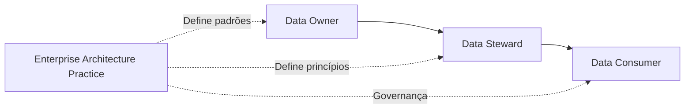

# Data Ownership Model

## Informações do Documento

| Item | Valor |
|---|---|
| Documento | Data Ownership Model |
| Programa Estratégico | Enterprise Data & Artificial Intelligence Platform |
| Domínio Arquitetural | Business Architecture |
| Tipo | Modelo de Responsabilidade sobre Dados |
| Responsável | Enterprise Architecture Practice |
| Versão | 1.0 |
| Status | Em evolução |

---

# Resumo Executivo

Os dados representam um dos principais ativos estratégicos da organização. Entretanto, seu valor somente pode ser plenamente explorado quando existem responsabilidades claramente definidas sobre sua criação, manutenção, qualidade, compartilhamento e utilização.

O **Data Ownership Model** estabelece o modelo corporativo de responsabilidades para os principais domínios de negócio da **Enterprise Data & Artificial Intelligence Platform**, definindo papéis, responsabilidades e princípios que orientarão a governança dos ativos de informação ao longo de todo o seu ciclo de vida.

Este documento cria a base necessária para a futura implementação da Arquitetura da Informação, da Governança de Dados e da gestão de Produtos de Dados.

---

# Objetivos

Este documento possui os seguintes objetivos:

- Definir responsabilidades sobre os ativos de informação;
- Estabelecer um modelo corporativo de ownership;
- Promover accountability na gestão dos dados;
- Reduzir ambiguidades sobre responsabilidades;
- Sustentar a futura Governança de Dados.

---

# Princípios do Modelo

O modelo de ownership é fundamentado nos seguintes princípios:

## Dados possuem responsáveis de negócio

Todo ativo de informação deve possuir um responsável claramente identificado no contexto do negócio.

---

## Responsabilidade é diferente de custódia

O responsável pelo dado responde por sua qualidade, significado e utilização.

A custódia técnica dos dados será tratada posteriormente na Arquitetura de Aplicações e na Arquitetura Tecnológica.

---

## Ownership acompanha o domínio de negócio

A responsabilidade sobre um dado pertence ao domínio que melhor compreende seu significado e sua evolução.

---

## Compartilhamento é responsabilidade corporativa

Os dados devem ser compartilhados de forma segura e governada entre domínios, preservando qualidade, privacidade e conformidade.

---

# Papéis e Responsabilidades

O modelo adota quatro papéis principais.

| Papel | Responsabilidade |
|---|---|
| Data Owner | Responsável pela definição, qualidade e utilização estratégica dos dados do domínio. |
| Data Steward | Responsável pela gestão operacional da qualidade, catálogo e conformidade dos dados. |
| Data Consumer | Responsável pela utilização dos dados conforme políticas corporativas. |
| Enterprise Architecture Practice | Responsável por definir padrões, princípios e direcionamento arquitetural relacionados aos dados. |

---

# Modelo de Ownership por Domínio

| Domínio de Negócio | Data Owner | Principais Ativos de Informação |
|---|---|---|
| Gestão de Clientes | Liderança do domínio de Clientes | Perfil do Cliente, Customer 360, Segmentação |
| Gestão Comercial | Liderança Comercial | Campanhas, Ofertas, Vendas, Pricing |
| Operações | Liderança Operacional | Processos Operacionais, Indicadores Operacionais |
| Gestão Financeira | Liderança Financeira | Custos, Receitas, Indicadores Financeiros |
| Gestão de Dados | Chief Data Office / Data Office | Catálogo, Metadados, Produtos de Dados |
| Inteligência Artificial | Centro de Excelência em IA | Modelos Analíticos, Features, Capacidades Inteligentes |
| Suporte à Decisão | Liderança de Analytics | Indicadores Corporativos e Dashboards Executivos |

---

# Modelo Conceitual de Responsabilidades

---

# Responsabilidades ao Longo do Ciclo de Vida

| Etapa | Data Owner | Data Steward | Data Consumer |
|---|:---:|:---:|:---:|
| Definição do dado | ✔ | | |
| Regras de negócio | ✔ | ✔ | |
| Qualidade | ✔ | ✔ | |
| Catálogo | | ✔ | |
| Compartilhamento | ✔ | ✔ | |
| Consumo | | | ✔ |
| Conformidade | ✔ | ✔ | ✔ |

---

# Relação com os Business Domains

Cada domínio de negócio é responsável pelos dados que representam seu contexto funcional.

Essa organização fortalece a autonomia dos domínios, reduz conflitos de responsabilidade e promove maior clareza na gestão dos ativos corporativos.

A definição de ownership acompanha os limites estabelecidos no documento **Business Domains**, garantindo alinhamento entre estratégia, capacidades e informação.

---

# Relação com os Próximos Domínios Arquiteturais

O modelo apresentado servirá como referência para:

| Próximo Artefato | Contribuição |
|---|---|
| Enterprise Information Model | Definição das entidades corporativas |
| Data Domain Model | Organização dos domínios de informação |
| Data Product Model | Definição de ownership dos produtos de dados |
| Data Governance | Papéis e responsabilidades corporativas |
| Metadata Strategy | Definição dos responsáveis pelo catálogo corporativo |

---

# Benefícios Esperados

A adoção deste modelo proporciona:

- Clareza sobre responsabilidades;
- Maior accountability na gestão dos dados;
- Melhoria da qualidade das informações;
- Redução de conflitos entre áreas;
- Fortalecimento da Governança de Dados;
- Base para uma organização Data-Driven.

---

# Considerações Arquiteturais

O modelo de ownership não substitui estruturas organizacionais nem processos operacionais.

Seu propósito é estabelecer uma visão corporativa de responsabilidade sobre os ativos de informação, permitindo que diferentes áreas compartilhem dados de forma segura, padronizada e orientada ao negócio.

Essa separação entre ownership de negócio e custódia tecnológica favorece a evolução da arquitetura e reduz o acoplamento entre processos, aplicações e plataformas.

---

# Decisões Arquiteturais

## DA-01 — Ownership Definido pelo Negócio

**Decisão**

A responsabilidade sobre os dados será atribuída ao domínio de negócio que possui maior conhecimento sobre seu significado e utilização.

**Motivação**

Garantir que decisões relacionadas aos dados permaneçam próximas ao contexto de negócio.

---

## DA-02 — Separação entre Ownership e Custódia

**Decisão**

A responsabilidade pelo significado e qualidade dos dados será distinta da responsabilidade pela infraestrutura tecnológica.

**Motivação**

Evitar sobreposição de responsabilidades e fortalecer a Governança Corporativa.

---

## DA-03 — Responsabilidade Compartilhada

**Decisão**

A gestão dos dados será baseada em colaboração entre Data Owners, Data Stewards, consumidores e a Enterprise Architecture Practice.

**Motivação**

Promover governança distribuída sem comprometer autonomia dos domínios.

---

# Conclusão

O **Data Ownership Model** conclui a Business Architecture da **Enterprise Data & Artificial Intelligence Platform**, estabelecendo uma estrutura clara de responsabilidades sobre os ativos de informação.

Ao definir papéis, responsabilidades e princípios de ownership, a organização cria uma base sólida para a evolução da Arquitetura da Informação, da Governança de Dados e da Inteligência Artificial Corporativa.

Mais do que distribuir responsabilidades, este modelo reforça a visão de que os dados são ativos estratégicos cuja gestão deve permanecer alinhada aos objetivos de negócio e sustentada por uma arquitetura corporativa consistente.