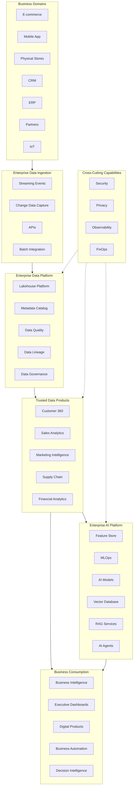

# Executive Target State

> Visão executiva da arquitetura alvo para a **Enterprise Data & Artificial Intelligence Platform**, demonstrando como a organização transforma dados em ativos estratégicos para Analytics, Inteligência Artificial e tomada de decisão orientada por dados.

---

# Informações do Documento

| Item | Valor |
|------|-------|
| Documento | Executive Target State |
| Programa | Enterprise Data & Artificial Intelligence Platform |
| Tipo | Executive Architecture Diagram |
| Responsável | Enterprise Architecture Practice |
| Versão | 1.0 |

---

# Executive Summary

A Enterprise Data & Artificial Intelligence Platform representa uma capacidade estratégica da organização para consolidar, governar e disponibilizar dados corporativos de forma confiável, escalável e orientada ao negócio.

A plataforma integra dados provenientes de múltiplos domínios de negócio, aplica práticas corporativas de governança e disponibiliza produtos de dados que suportam Analytics, Machine Learning, Inteligência Artificial Generativa e decisões em tempo real.

Mais do que uma plataforma tecnológica, esta iniciativa estabelece a fundação para uma organização **Data-Driven** e **AI-Driven**, permitindo inovação contínua, redução da complexidade operacional e aceleração da transformação digital.

---

# Executive Target State

---

# Visão Estratégica

A plataforma estabelece um modelo corporativo baseado em cinco capacidades fundamentais.

| Capability | Objetivo Estratégico |
|------------|----------------------|
| Enterprise Data Platform | Consolidar dados corporativos em uma plataforma única. |
| Trusted Data Products | Disponibilizar dados confiáveis para toda a organização. |
| Enterprise AI Platform | Democratizar Inteligência Artificial de forma governada. |
| Business Consumption | Transformar dados em decisões e produtos digitais. |
| Cross-Cutting Governance | Garantir segurança, qualidade e conformidade corporativa. |

---

# Princípios Arquiteturais Evidenciados

A arquitetura proposta materializa os seguintes princípios corporativos:

- Data as a Product
- AI by Design
- Business Driven Architecture
- API First
- Event-Driven Integration
- Metadata First
- Security by Design
- Privacy by Design
- Observability by Default
- Cloud Native

---

# Benefícios Esperados

## Negócio

- Aceleração da tomada de decisão.
- Maior conhecimento sobre clientes e operações.
- Redução do time-to-insight.
- Escalabilidade para novos produtos digitais.

## Tecnologia

- Redução de integrações redundantes.
- Padronização dos pipelines de dados.
- Reutilização de produtos de dados.
- Maior governança e rastreabilidade.

## Inteligência Artificial

- Reutilização de Features.
- Governança do ciclo de vida dos modelos.
- Escalabilidade para IA Generativa.
- Base para AI Agents corporativos.

---

# Relação com os Próximos Artefatos

Este documento serve como referência para:

- README
- Company Profile
- Business Context
- Architecture Vision
- Data Strategy
- Data Domains
- Data Products
- AI Platform
- Data Governance
- Enterprise Roadmap

Todos os documentos subsequentes detalham uma parte específica desta visão executiva.

---

# Decisões Arquiteturais

## DA-01 — Plataforma Corporativa Unificada

Adotar uma plataforma corporativa única para ingestão, armazenamento, processamento e disponibilização de dados.

**Motivação**

Reduzir silos de informação e aumentar a reutilização de ativos de dados.

---

## DA-02 — Data Products como Unidade de Consumo

Os consumidores corporativos deverão acessar produtos de dados em vez de bases de dados diretamente.

**Motivação**

Promover ownership, qualidade e reutilização dos ativos de informação.

---

## DA-03 — Inteligência Artificial como Capability Corporativa

Os serviços de Inteligência Artificial serão disponibilizados como capacidades compartilhadas da plataforma.

**Motivação**

Evitar duplicidade de soluções e acelerar a adoção de IA em múltiplos domínios.

---

## DA-04 — Governança Transversal

Segurança, privacidade, observabilidade e FinOps serão capacidades transversais aplicadas a toda a plataforma.

**Motivação**

Garantir conformidade, sustentabilidade operacional e excelência arquitetural desde a concepção da solução.