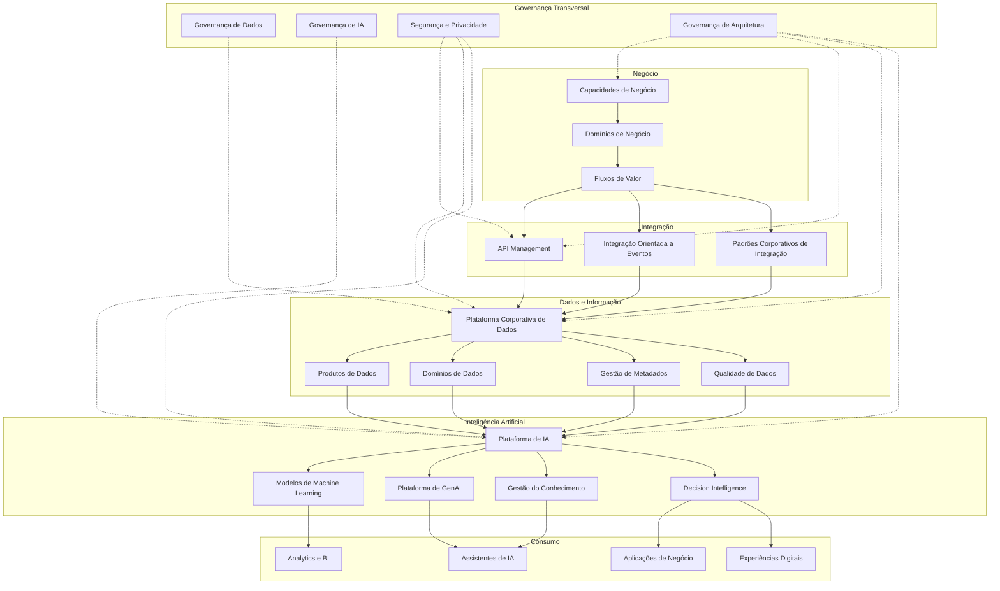

# Diagrama Executivo do Estado-Alvo

## Informações do Documento

| Item | Valor |
| --- | --- |
| Documento | Diagrama Executivo do Estado-Alvo |
| Programa Estratégico | Enterprise Data & Artificial Intelligence Platform |
| Domínio Arquitetural | Foundation |
| Responsável | Enterprise Architecture Practice |
| Versão | 1.0 |
| Status | Aprovado |

---

## Executive Summary

O diagrama apresenta a arquitetura executiva aprovada para a plataforma corporativa de dados e Inteligência Artificial. A visão conecta capacidades e domínios de negócio às camadas de integração, dados, IA e consumo, com governança transversal.

O estado-alvo permite que informação confiável seja convertida em analytics, automação e decisões inteligentes sem dissociar geração de valor, ownership, segurança, privacidade e controle arquitetural.

---

## Diagrama Executivo

```mermaid
flowchart TB
    subgraph NEG["Negócio"]
        B1["Capacidades de Negócio"]
        B2["Domínios de Negócio"]
        B3["Fluxos de Valor"]
        B1 --> B2 --> B3
    end

    subgraph INT["Integração"]
        I1["API Management"]
        I2["Integração Orientada a Eventos"]
        I3["Padrões Corporativos de Integração"]
    end

    subgraph DAT["Dados e Informação"]
        D1["Plataforma Corporativa de Dados"]
        D2["Produtos de Dados"]
        D3["Domínios de Dados"]
        D4["Gestão de Metadados"]
        D5["Qualidade de Dados"]
        D1 --> D2
        D1 --> D3
        D1 --> D4
        D1 --> D5
    end

    subgraph IAA["Inteligência Artificial"]
        A1["Plataforma de IA"]
        A2["Modelos de Machine Learning"]
        A3["Plataforma de GenAI"]
        A4["Gestão do Conhecimento"]
        A5["Decision Intelligence"]
        A1 --> A2
        A1 --> A3
        A1 --> A4
        A1 --> A5
    end

    subgraph CON["Consumo"]
        C1["Aplicações de Negócio"]
        C2["Analytics e BI"]
        C3["Assistentes de IA"]
        C4["Experiências Digitais"]
    end

    subgraph GOV["Governança Transversal"]
        G1["Governança de Dados"]
        G2["Governança de IA"]
        G3["Segurança e Privacidade"]
        G4["Governança de Arquitetura"]
    end

    B3 --> I1
    B3 --> I2
    B3 --> I3
    I1 --> D1
    I2 --> D1
    I3 --> D1
    D2 --> A1
    D3 --> A1
    D4 --> A1
    D5 --> A1
    A2 --> C2
    A3 --> C3
    A4 --> C3
    A5 --> C1
    A5 --> C4
    G1 -.-> D1
    G2 -.-> A1
    G3 -.-> I1
    G3 -.-> D1
    G3 -.-> A1
    G4 -.-> B1
    G4 -.-> I1
    G4 -.-> D1
    G4 -.-> A1
```

---

## Leitura Executiva das Camadas

| Camada | Papel estratégico | Capacidades principais |
| --- | --- | --- |
| Negócio | Direciona valor e accountability | Capacidades, domínios e fluxos de valor |
| Integração | Conecta produtores e consumidores | APIs, eventos e padrões de integração |
| Dados e Informação | Estabelece informação confiável | Produtos, domínios, metadados e qualidade |
| Inteligência Artificial | Transforma dados em inteligência | ML, GenAI, conhecimento e Decision Intelligence |
| Consumo | Materializa valor | Aplicações, analytics, assistentes e experiências |
| Governança | Controla evolução e riscos | Dados, IA, segurança, privacidade e arquitetura |

---

## Fluxo de Valor Arquitetural

1. capacidades e fluxos de valor definem as necessidades prioritárias;
2. APIs e eventos conectam os domínios com contratos governados;
3. a plataforma organiza dados em produtos confiáveis e reutilizáveis;
4. capacidades de analytics e IA transformam informação em insights e decisões;
5. aplicações e experiências digitais entregam valor aos consumidores;
6. governança, segurança e observabilidade atuam transversalmente.

---

## Business Outcomes

| Outcome | Impacto esperado |
| --- | --- |
| Adoção governada de IA | Automação responsável e riscos controlados |
| Dados corporativos confiáveis | Decisões baseadas em informação consistente |
| Decision Intelligence | Melhor qualidade e velocidade das decisões |
| Produtos de dados | Consumo escalável e menor duplicidade |
| Serviços reutilizáveis de IA | Menor tempo entre experimentação e valor |
| Governança transversal | Maior conformidade, transparência e confiança |

---

## Relação com Outros Artefatos

- [Architecture Vision](../docs/architecture-vision.md)
- [Business Context](../docs/business-context.md)
- [Company Profile](../docs/company-profile.md)
- [Landing Page Executiva do Programa](../README.md)

---

## Decisões Arquiteturais

### DA-FND-04 — Arquitetura executiva em camadas

O estado-alvo será comunicado por camadas com responsabilidades explícitas e fluxo orientado da estratégia ao consumo.

### DA-FND-05 — Governança transversal

Governança de arquitetura, dados, IA, segurança e privacidade não constituem etapa final; aplicam-se a todas as camadas.

### DA-FND-06 — Integração entre dados e IA

Capacidades de IA consumirão dados governados por meio de produtos, domínios, metadados e controles de qualidade.
