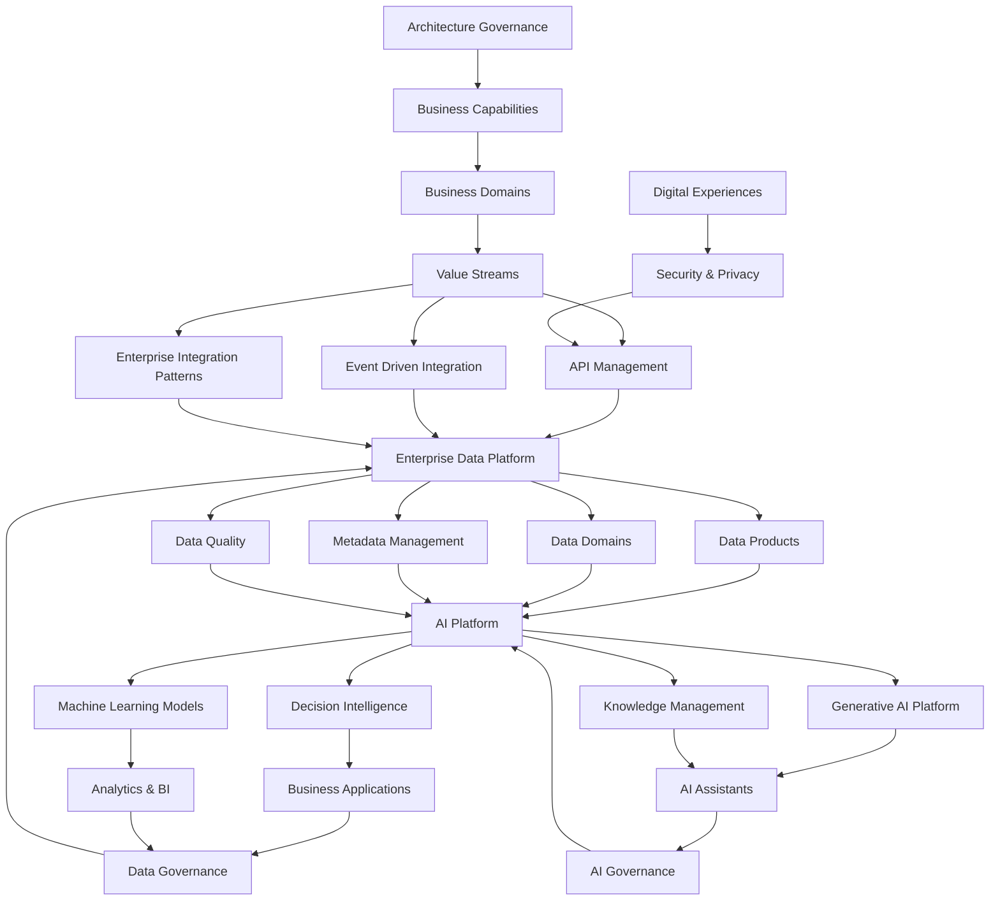

# Executive Target State Diagram

## Context

This diagram represents the executive target state architecture for the Enterprise Data & Artificial Intelligence Platform.

The objective is to provide a strategic view of how business capabilities, enterprise data, artificial intelligence, consumption channels, and governance capabilities integrate into a unified enterprise platform.

The architecture follows the enterprise layered pattern:

```text
Business
   |
Integration
   |
Data
   |
AI
   |
Consumption
   |
Governance
```

---

# Enterprise Data & AI Platform — Executive View


```mermaid
flowchart TB

    %% Business Layer

    B1[Business Capabilities]
    B2[Business Domains]
    B3[Value Streams]


    %% Integration Layer

    I1[API Management]
    I2[Event Driven Integration]
    I3[Enterprise Integration Patterns]


    %% Data Layer

    D1[Enterprise Data Platform]
    D2[Data Products]
    D3[Data Domains]
    D4[Metadata Management]
    D5[Data Quality]


    %% AI Layer

    A1[AI Platform]
    A2[Machine Learning Models]
    A3[Generative AI Platform]
    A4[Knowledge Management]
    A5[Decision Intelligence]


    %% Consumption Layer

    C1[Business Applications]
    C2[Analytics & BI]
    C3[AI Assistants]
    C4[Digital Experiences]


    %% Governance Layer

    G1[Data Governance]
    G2[AI Governance]
    G3[Security & Privacy]
    G4[Architecture Governance]


    B1 --> B2
    B2 --> B3

    B3 --> I1
    B3 --> I2
    B3 --> I3

    I1 --> D1
    I2 --> D1
    I3 --> D1

    D1 --> D2
    D1 --> D3
    D1 --> D4
    D1 --> D5

    D2 --> A1
    D3 --> A1
    D4 --> A1
    D5 --> A1

    A1 --> A2
    A1 --> A3
    A1 --> A4
    A1 --> A5

    A2 --> C2
    A3 --> C3
    A4 --> C3
    A5 --> C1

    C1 --> G1
    C2 --> G1
    C3 --> G2
    C4 --> G3

    G1 --> D1
    G2 --> A1
    G3 --> I1
    G4 --> B1
```

---

# Architecture Layers

## Business Layer

Represents the enterprise capabilities and value streams enabled by the platform.

Main capabilities:

- business domain management;
- operational decision support;
- customer and enterprise processes;
- data-driven business transformation.

Related artifacts:

```text
business-architecture/

├── business-domains.md
├── business-value-streams.md
└── capability-map.md
```

---

# Integration Layer

Provides enterprise connectivity and orchestration capabilities.

Core principles:

- API First;
- Event Driven Architecture;
- loosely coupled integration;
- reusable services.

Capabilities:

- API Management;
- event streaming;
- integration patterns;
- service orchestration.

Related artifacts:

```text
application-architecture/

├── api-strategy.md
├── event-driven-architecture.md
└── integration-patterns.md
```

---

# Data Layer

Provides the enterprise data foundation.

Core concepts:

## Data as a Product

Data is managed as an enterprise product with:

- ownership;
- quality;
- documentation;
- lifecycle management.

## Data Domains

Data ownership follows business domains.

## Metadata First

Metadata enables:

- discovery;
- lineage;
- governance;
- trust.

Capabilities:

- enterprise data platform;
- data products;
- metadata management;
- data quality.

Related artifacts:

```text
information-architecture/

├── data-domain-model.md
├── data-product-model.md
├── enterprise-information-model.md
└── metadata-strategy.md
```

---

# AI Layer

The AI layer transforms enterprise data into intelligence and automated decisions.

Capabilities:

## AI Platform

Provides:

- model lifecycle management;
- AI services;
- experimentation capabilities;
- operational AI capabilities.

## Machine Learning Models

Supports:

- predictive analytics;
- optimization;
- classification;
- forecasting.

## Generative AI Platform

Provides:

- enterprise language models;
- retrieval augmented generation;
- AI assistants;
- knowledge interaction.

## Knowledge Management

Enables:

- enterprise knowledge repositories;
- semantic search;
- contextual AI experiences.

## Decision Intelligence

Combines:

- data;
- analytics;
- AI models;
- business rules;

to improve enterprise decision-making.

Related artifacts:

```text
ai-architecture/

├── ai-platform-architecture.md
├── ai-lifecycle-management.md
├── genai-reference-architecture.md
└── model-governance.md
```

---

# Consumption Layer

Provides access to enterprise intelligence.

Channels:

- business applications;
- analytical platforms;
- AI assistants;
- digital experiences.

Examples:

- executive dashboards;
- operational intelligence;
- intelligent automation;
- customer experiences.

---

# Governance Layer

Provides enterprise control across all architecture layers.

Capabilities:

## Data Governance

Ensures:

- ownership;
- quality;
- lifecycle;
- compliance.

## AI Governance

Ensures:

- responsible AI;
- model control;
- transparency;
- risk management.

## Security and Privacy

Ensures:

- identity management;
- protection controls;
- privacy by design.

## Architecture Governance

Ensures:

- standards compliance;
- architecture decisions;
- technology alignment.

Related artifacts:

```text
governance/

├── ai-governance-framework.md
├── data-governance-framework.md
├── architecture-governance.md
└── reference-architecture-compliance.md
```

---

# Strategic Outcomes

The Enterprise Data & Artificial Intelligence Platform enables:

| Outcome | Business Impact |
|---|---|
| Trusted enterprise data | Better decisions |
| Governed AI adoption | Responsible automation |
| Reusable AI capabilities | Faster innovation |
| Data products | Scalable data consumption |
| Decision intelligence | Improved business outcomes |
| Enterprise governance | Reduced risk |

---

# Architecture Principles

The target state is guided by:

1. Data as a Product
2. AI by Design
3. API First
4. Event Driven Integration
5. Metadata First
6. Security and Privacy by Design
7. Cloud Native Platform
8. Observability by Default

---

# References

- Executive Target State
- Architecture Target State
- AI Platform Architecture
- AI Lifecycle Management
- Generative AI Reference Architecture
- Model Governance
- ADR-001 API First
- ADR-002 Event Driven Architecture
- ADR-003 Data as a Product
- ADR-004 Vendor Agnostic AI
- ADR-005 Metadata First
- ADR-006 Security by Design
- ADR-007 Cloud Native Platform