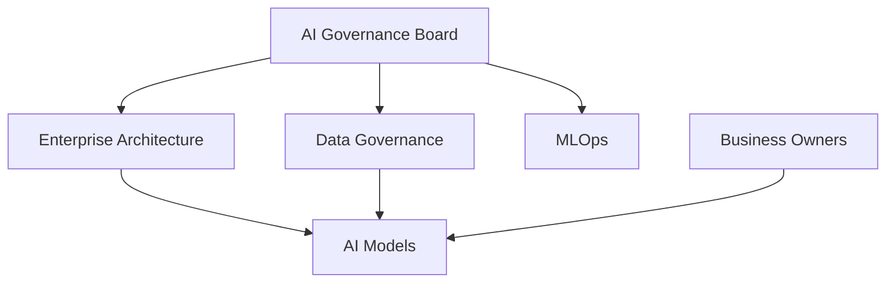

# AI Governance Framework

> Define o modelo de Governança de Inteligência Artificial da Enterprise Data & Artificial Intelligence Platform, estabelecendo princípios, responsabilidades e controles para utilização ética, segura e transparente de soluções de IA.

---

# Informações do Documento

| Item | Valor |
|------|-------|
| Documento | AI Governance Framework |
| Programa Estratégico | Enterprise Data & Artificial Intelligence Platform |
| Domínio Arquitetural | Governance |
| Tipo | Framework de Governança |
| Responsável | Enterprise Architecture Practice |
| Versão | 1.0 |
| Status | Aprovado |

---

## Contexto

Este documento faz parte do domínio de Governance da Enterprise Data & AI Platform. Seu objetivo é estabelecer o modelo de governança necessário para garantir que decisões arquiteturais, ativos de dados, aplicações, inteligência artificial e tecnologias corporativas evoluam de forma consistente, segura e alinhada à estratégia de negócio.

O conjunto de documentos de Governance define políticas, responsabilidades, processos de decisão, métricas e mecanismos de conformidade que sustentam a evolução contínua da arquitetura corporativa.

---

# Executive Summary

A Governança de Inteligência Artificial estabelece as diretrizes corporativas para desenvolvimento, implantação, operação e monitoramento de modelos analíticos e soluções de IA.

Seu objetivo é garantir utilização responsável da Inteligência Artificial, preservando transparência, segurança, rastreabilidade e conformidade regulatória.

---

# Objetivos

- Garantir uso responsável da IA.
- Reduzir riscos operacionais.
- Definir responsabilidades.
- Padronizar ciclo de vida dos modelos.
- Assegurar rastreabilidade.
- Suportar evolução contínua.

---

# Princípios

- Human in the Loop
- Responsible AI
- Explainability
- Transparency
- Fairness
- Security by Design
- Privacy by Design
- Vendor Independence

---

# Modelo de Governança

---

# Ciclo de Vida

1. Ideação
2. Aprovação
3. Desenvolvimento
4. Validação
5. Deploy
6. Monitoramento
7. Reavaliação
8. Descontinuação

---

# Responsabilidades

## AI Governance Board

- Aprovar políticas.
- Avaliar riscos.
- Definir diretrizes.

---

## Business Owner

- Aprovar uso do modelo.
- Avaliar resultados.
- Validar impactos.

---

## MLOps

- Deploy.
- Versionamento.
- Monitoramento.
- Observabilidade.

---

## Enterprise Architecture

- Garantir aderência arquitetural.
- Avaliar impactos tecnológicos.
- Aprovar padrões.

---

# Controles

- Versionamento de modelos.
- Auditoria das inferências.
- Monitoramento de Drift.
- Avaliação periódica.
- Gestão de Prompts.
- Registro de Decisões.

---

# Indicadores

- Model Accuracy
- Model Drift
- Tempo de Deploy
- Uso por domínio
- Incidentes de IA
- Disponibilidade dos modelos

---

# Benefícios Esperados

- adoção de IA com riscos, responsabilidades e controles explícitos;
- maior transparência, auditabilidade e supervisão de modelos;
- reutilização segura de capacidades corporativas de IA.

---

# Relação com Outros Artefatos

- [Data Governance Framework](./data-governance-framework.md)
- [Architecture Governance](./architecture-governance.md)
- [Technology Platform](../technology-architecture/technology-platform.md)
- [Security Architecture](../technology-architecture/security-architecture.md)
- [Observability Architecture](../technology-architecture/observability-architecture.md)
- [Application Architecture Principles](../application-architecture/application-architecture-principles.md)

---

# Decisões Arquiteturais

## DA-01 — IA como Serviço Corporativo

Modelos deverão ser disponibilizados como serviços reutilizáveis.

---

## DA-02 — Independência Tecnológica

A arquitetura deverá permanecer aderente ao ADR-004.

---

## DA-03 — Supervisão Humana

Modelos que suportam decisões críticas deverão possuir supervisão humana.

---

## DA-04 — Monitoramento Contínuo

Todos os modelos deverão possuir métricas operacionais e monitoramento de desempenho.
