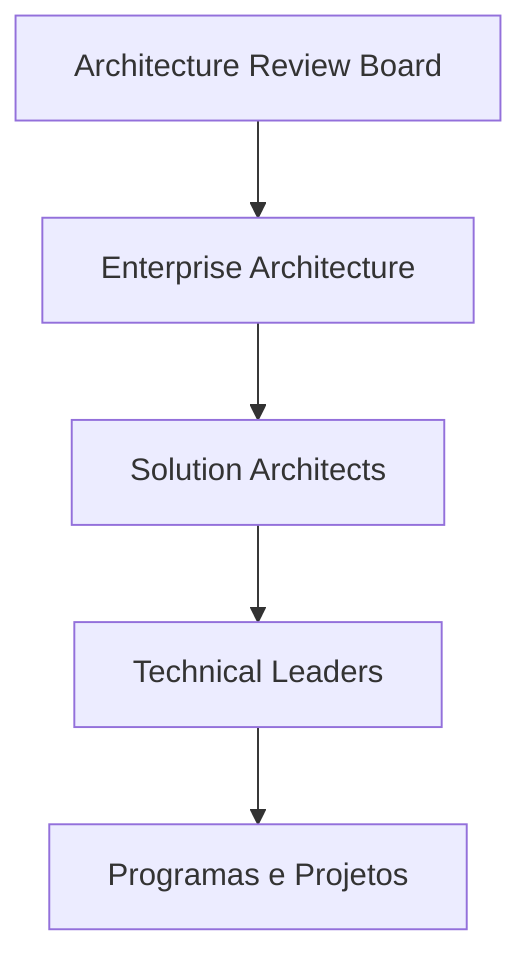

# Architecture Governance

> Define o modelo de Governança de Arquitetura da Enterprise Data & Artificial Intelligence Platform, estabelecendo processos, papéis e mecanismos de decisão para assegurar aderência aos princípios arquiteturais corporativos.

---

## Context

Este documento faz parte do domínio de Governance da Enterprise Data & AI Platform. Seu objetivo é estabelecer o modelo de governança necessário para garantir que decisões arquiteturais, ativos de dados, aplicações, inteligência artificial e tecnologias corporativas evoluam de forma consistente, segura e alinhada à estratégia de negócio.

O conjunto de documentos de Governance define políticas, responsabilidades, processos de decisão, métricas e mecanismos de conformidade que sustentam a evolução contínua da arquitetura corporativa.

---

# Informações do Documento

| Item | Valor |
|------|-------|
| Documento | Architecture Governance |
| Programa Estratégico | Enterprise Data & Artificial Intelligence Platform |
| Domínio Arquitetural | Governance |
| Tipo | Framework de Governança |
| Responsável | Enterprise Architecture Practice |
| Versão | 1.0 |
| Status | Aprovado |

---

# Executive Summary

A Governança de Arquitetura assegura que todas as iniciativas relacionadas à Enterprise Data & Artificial Intelligence Platform evoluam de maneira consistente, alinhadas às estratégias corporativas e aos princípios definidos pela Enterprise Architecture Practice.

O modelo estabelece processos claros para tomada de decisão arquitetural, revisão de soluções, gestão de desvios e evolução contínua da arquitetura.

---

# Objetivos

- Garantir aderência aos princípios arquiteturais.
- Padronizar decisões de arquitetura.
- Reduzir dívida técnica.
- Controlar desvios arquiteturais.
- Promover reutilização.
- Assegurar evolução sustentável da plataforma.

---

# Princípios

- Architecture First
- Business Driven
- Standardization
- Reuse Before Build
- Vendor Agnostic
- Security by Design
- Data by Design
- AI by Design

---

# Modelo de Governança

---

# Estrutura Organizacional

## Architecture Review Board (ARB)

Responsável por:

- Aprovação de arquiteturas.
- Avaliação de exceções.
- Definição de padrões.
- Revisão de tecnologias.

---

## Enterprise Architecture

Responsável por:

- Arquitetura alvo.
- Roadmaps.
- Padrões corporativos.
- Governança arquitetural.

---

## Solution Architecture

Responsável por:

- Arquitetura das soluções.
- Design técnico.
- Aderência aos padrões.

---

## Technical Leadership

Responsável por:

- Implementação técnica.
- Qualidade técnica.
- Evolução das aplicações.

---

# Processo de Governança

1. Identificação da demanda.
2. Definição da arquitetura.
3. Architecture Review.
4. Aprovação.
5. Implementação.
6. Acompanhamento.
7. Revisão pós-implantação.

---

# Architecture Reviews

Toda iniciativa deverá passar por Architecture Review quando:

- Introduzir nova tecnologia.
- Alterar arquitetura corporativa.
- Criar integração estratégica.
- Implantar capacidades de IA.
- Criar novos Data Products.

---

# Critérios de Avaliação

- Aderência aos princípios.
- Segurança.
- Escalabilidade.
- Reutilização.
- Governança.
- Operação.
- Custos.
- Riscos.

---

# Indicadores

- Projetos avaliados.
- Desvios arquiteturais.
- ADRs aprovados.
- Reutilização de componentes.
- Conformidade arquitetural.

---

# Benefícios Esperados

- decisões arquiteturais consistentes e rastreáveis;
- tratamento formal de desvios e riscos;
- maior aderência das iniciativas ao estado-alvo.

---

# Relação com Outros Artefatos

- [Architecture Metrics](./architecture-metrics.md)
- [Decision Governance](./decision-governance.md)
- [Reference Architecture Compliance](./reference-architecture-compliance.md)
- [Architecture Vision](../docs/architecture-vision.md)
- [Application Architecture Principles](../application-architecture/application-architecture-principles.md)
- [Technology Standards](../technology-architecture/technology-standards.md)

---

# Decisões Arquiteturais

## DA-01 — Architecture Review Obrigatório

Toda iniciativa estratégica deverá passar por revisão arquitetural.

---

## DA-02 — ADR Obrigatório

Toda decisão arquitetural relevante deverá ser registrada por meio de Architecture Decision Record.

---

## DA-03 — Desvios Controlados

Exceções arquiteturais deverão possuir justificativa formal, prazo e plano de mitigação.

---

## DA-04 — Evolução Contínua

Os padrões arquiteturais deverão ser revisados periodicamente pela Enterprise Architecture Practice.
