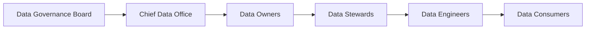

# Data Governance Framework

> Define o modelo de Governança de Dados da Enterprise Data & Artificial Intelligence Platform, estabelecendo papéis, responsabilidades, processos e princípios para garantir qualidade, segurança, disponibilidade e confiabilidade dos ativos de dados corporativos.

---

# Informações do Documento

| Item | Valor |
|------|-------|
| Documento | Data Governance Framework |
| Programa | Enterprise Data & Artificial Intelligence Platform |
| Domínio | Governance |
| Tipo | Governance Framework |
| Responsável | Enterprise Architecture Practice |
| Versão | 1.0 |
| Status | Approved |

---

# Executive Summary

A Governança de Dados estabelece o conjunto de políticas, processos, responsabilidades e controles necessários para tratar os dados corporativos como ativos estratégicos.

O framework busca assegurar que os dados sejam confiáveis, reutilizáveis, protegidos e utilizados de forma consistente em toda a organização.

---

# Objetivos

- Garantir qualidade dos dados.
- Definir responsabilidades.
- Padronizar gestão de metadados.
- Promover compartilhamento seguro.
- Assegurar conformidade regulatória.
- Suportar Analytics e Inteligência Artificial.

---

# Princípios

- Data as a Product
- Data Ownership
- Metadata First
- Security by Design
- Privacy by Design
- Data Quality by Default
- Accountability
- Transparência

---

# Modelo de Governança

---

# Papéis

## Data Governance Board

- Aprovar políticas.
- Definir diretrizes.
- Priorizar iniciativas.

---

## Data Owner

Responsável pelo domínio de negócio.

Atribuições:

- Aprovar Data Products.
- Definir regras de negócio.
- Classificar informações.

---

## Data Steward

Responsável pela qualidade operacional dos dados.

Atribuições:

- Monitorar qualidade.
- Gerenciar metadados.
- Resolver inconsistências.

---

## Data Engineer

Responsável pela implementação técnica.

---

## Data Consumer

Responsável pelo consumo adequado dos ativos de dados.

---

# Domínios de Governança

- Qualidade de Dados
- Catálogo Corporativo
- Metadados
- Data Lineage
- Segurança
- Privacidade
- Data Products
- Dados Mestres

---

# Indicadores

- Data Quality Score
- Cobertura de Metadados
- Data Lineage Completo
- Data Products Publicados
- Incidentes de Dados
- SLA dos Produtos de Dados

---

# Benefícios Esperados

## Negócio

- Maior confiança nos dados.
- Melhor tomada de decisão.
- Redução de riscos.

## Tecnologia

- Reutilização.
- Padronização.
- Governança centralizada.

---

# Relação com Outros Artefatos

- Data Ownership Model
- Business Domains
- Technology Platform
- Security Architecture
- Information Architecture

---

# Decisões Arquiteturais

## DA-01 — Dados como Ativos Corporativos

Todo dado deverá possuir responsável claramente definido.

---

## DA-02 — Data Products Governados

Todo produto de dados deverá possuir documentação, SLA e Owner.

---

## DA-03 — Metadados Obrigatórios

Nenhum Data Product poderá ser publicado sem metadados mínimos.

---

# Conclusão

A Governança de Dados estabelece os mecanismos necessários para transformar dados corporativos em ativos confiáveis, reutilizáveis e preparados para suportar decisões estratégicas e Inteligência Artificial.