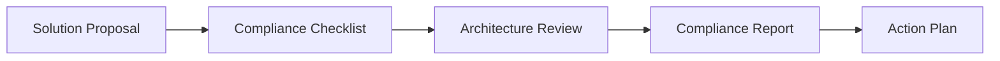

# Reference Architecture Compliance

> Define o processo de avaliação da conformidade das soluções em relação à Arquitetura de Referência da Enterprise Data & Artificial Intelligence Platform.

---

# Informações do Documento

| Item | Valor |
|------|-------|
| Documento | Reference Architecture Compliance |
| Programa Estratégico | Enterprise Data & Artificial Intelligence Platform |
| Domínio Arquitetural | Governance |
| Tipo | Framework de Conformidade |
| Responsável | Enterprise Architecture Practice |
| Versão | 1.0 |
| Status | Aprovado |

---

## Contexto

Este documento faz parte do domínio de Governance da Enterprise Data & AI Platform. Seu objetivo é estabelecer o modelo de governança necessário para garantir que decisões arquiteturais, ativos de dados, aplicações, inteligência artificial e tecnologias corporativas evoluam de forma consistente, segura e alinhada à estratégia de negócio.

O conjunto de documentos de Governance define políticas, responsabilidades, processos de decisão, métricas e mecanismos de conformidade que sustentam a evolução contínua da arquitetura corporativa.

---

# Executive Summary

A conformidade arquitetural assegura que todas as iniciativas da Enterprise Data & Artificial Intelligence Platform sejam desenvolvidas de acordo com os princípios, padrões e decisões arquiteturais corporativas.

Este processo reduz riscos tecnológicos, evita fragmentação da arquitetura e aumenta o reaproveitamento das capacidades existentes.

---

# Objetivos

- Garantir aderência à arquitetura alvo.
- Padronizar avaliações arquiteturais.
- Identificar desvios.
- Apoiar decisões do Architecture Review Board.
- Reduzir dívida técnica.
- Preservar consistência arquitetural.

---

# Escopo

São avaliados:

- Business Architecture
- Information Architecture
- Application Architecture
- Technology Architecture
- Security Architecture
- Data Governance
- AI Governance

---

# Processo de Avaliação

---

# Critérios de Avaliação

## Business Alignment

- Alinhamento aos objetivos estratégicos.
- Aderência ao Capability Map.
- Reutilização de capacidades.

---

## Dados

- Data Products.
- Ownership definido.
- Qualidade.
- Metadados.
- Lineage.

---

## Aplicações

- API First.
- Event Driven.
- Reutilização.
- Baixo acoplamento.

---

## Tecnologia

- Cloud Native.
- Containers.
- Infrastructure as Code.
- Observabilidade.

---

## Segurança

- Zero Trust.
- IAM.
- Criptografia.
- Auditoria.

---

## Inteligência Artificial

- Independência tecnológica.
- Governança.
- Observabilidade.
- Modelos reutilizáveis.

---

# Classificação

| Nível | Descrição |
|--------|-----------|
| Conforme | 100% aderente |
| Conforme com Ressalvas | Pequenos desvios |
| Não Conforme | Necessita revisão arquitetural |

---

# Tratamento de Desvios

Todo desvio deverá possuir:

- justificativa;
- impacto;
- plano de mitigação;
- responsável;
- prazo;
- aprovação do ARB.

---

# Indicadores

- Índice de Conformidade.
- Quantidade de desvios.
- ADRs gerados.
- Tempo médio de aprovação.
- Percentual de reutilização arquitetural.

---

# Benefícios Esperados

- redução de desvios e riscos arquiteturais;
- critérios uniformes para Architecture Reviews;
- evidências de conformidade e planos de regularização rastreáveis.

---

# Relação com Outros Artefatos

- [Architecture Governance](./architecture-governance.md)
- [Architecture Metrics](./architecture-metrics.md)
- [Decision Governance](./decision-governance.md)
- [Architecture Vision](../docs/architecture-vision.md)
- [Technology Standards](../technology-architecture/technology-standards.md)
- [ADRs](../adrs/README.md)

---

# Decisões Arquiteturais

## DA-01 — Compliance Obrigatório

Toda iniciativa deverá ser submetida à avaliação arquitetural.

---

## DA-02 — Desvios Registrados

Todo desvio deverá possuir registro formal.

---

## DA-03 — Revisão Periódica

Projetos estratégicos deverão ser reavaliados ao longo do ciclo de vida.
