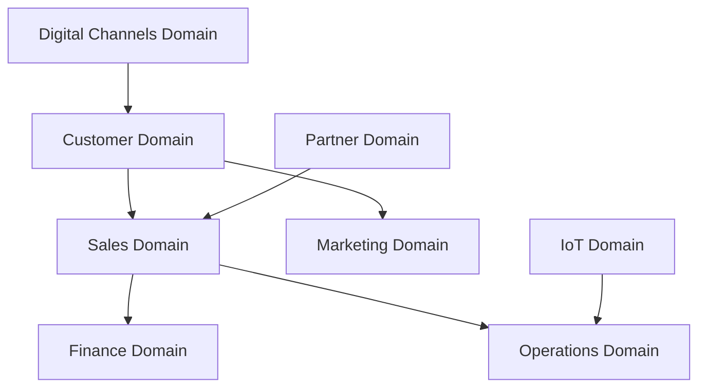
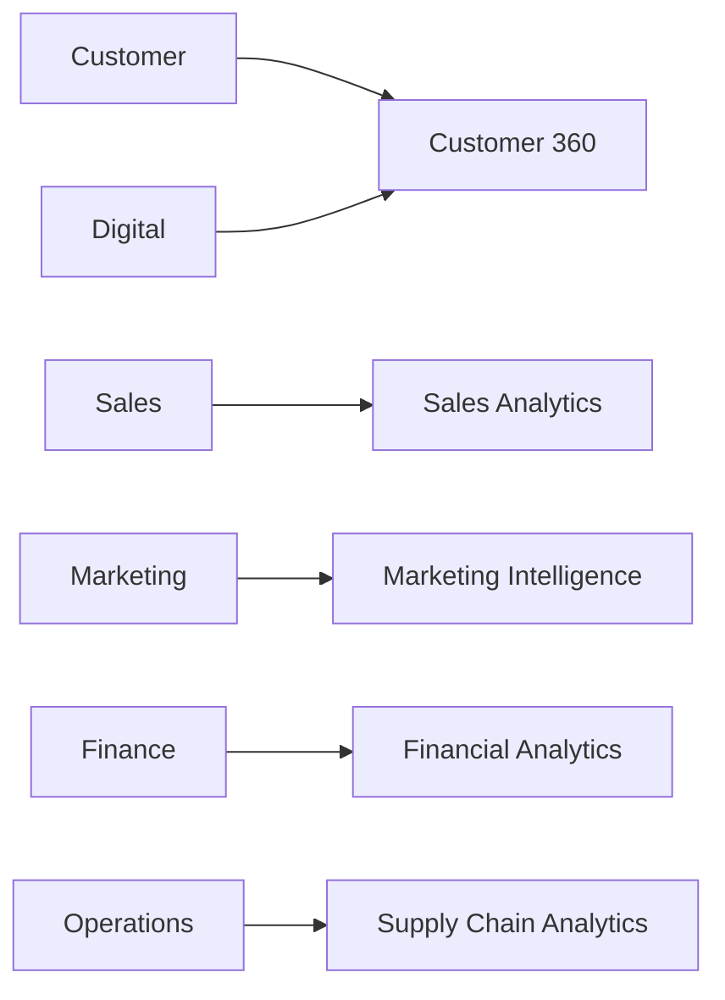

# Data Domain Model

## Informações do Documento

| Item | Valor |
|------|-------|
| Documento | Data Domain Model |
| Programa | Enterprise Data & Artificial Intelligence Platform |
| Domínio Arquitetural | Information Architecture |
| Tipo | Arquitetura de Domínios de Dados |
| Responsável | Enterprise Architecture Practice |
| Versão | 1.0 |
| Status | Approved |

---

# Executive Summary

O Data Domain Model organiza os ativos de informação da organização em domínios de dados orientados ao negócio, estabelecendo limites de responsabilidade, ownership e governança.

Cada domínio representa um agrupamento lógico de informações relacionadas a uma capacidade de negócio, permitindo evolução independente, melhor qualidade dos dados e maior reutilização entre programas estratégicos.

Este modelo constitui a base para a construção dos Produtos de Dados corporativos e para a definição das responsabilidades de Data Ownership.

---

# Objetivos

- Organizar os dados corporativos em domínios de negócio.
- Definir ownership para cada domínio.
- Reduzir silos de informação.
- Facilitar a criação de Produtos de Dados.
- Suportar iniciativas de Analytics e Inteligência Artificial.

---

# Princípios Arquiteturais

- Business Domains definem os Data Domains.
- Cada domínio possui um único responsável de negócio.
- Os dados pertencem ao domínio, não às aplicações.
- Compartilhamento ocorre por meio de Produtos de Dados.
- Governança é distribuída, mantendo padrões corporativos.

---

# Arquitetura dos Domínios

---

# Catálogo de Domínios

| Domínio | Objetivo | Owner |
|---------|----------|-------|
| Customer | Gerenciar informações de clientes e relacionamento. | Customer Management |
| Sales | Consolidar pedidos, vendas e receita. | Comercial |
| Marketing | Gerenciar campanhas, segmentações e jornadas. | Marketing |
| Finance | Controlar pagamentos, faturamento e indicadores financeiros. | Financeiro |
| Operations | Gerenciar operações e cadeia de suprimentos. | Operações |
| Digital Channels | Consolidar interações dos canais digitais. | Digital |
| Partner | Gerenciar parceiros e integrações externas. | Partnership Management |
| IoT | Consolidar eventos provenientes de dispositivos conectados. | Engenharia |

---

# Relacionamento entre Domínios

Os domínios colaboram entre si por meio de Produtos de Dados certificados, evitando integrações diretas entre aplicações e promovendo reutilização das informações.

---

# Critérios para Criação de Novos Domínios

Um novo domínio deverá ser criado quando:

- representar uma capacidade de negócio distinta;
- possuir ciclo de vida próprio;
- exigir governança específica;
- possuir ownership claramente definido;
- produzir informações reutilizáveis por outros domínios.

---

# Integração com os Demais Artefatos

| Documento | Relacionamento |
|-----------|----------------|
| Business Domains | Origem da organização dos Data Domains. |
| Data Ownership Model | Define responsabilidades sobre cada domínio. |
| Data Product Model | Publica os produtos derivados dos domínios. |
| Metadata Strategy | Cataloga os ativos pertencentes a cada domínio. |
| Data Lifecycle Model | Define o ciclo de vida das informações. |

---

# Benefícios Esperados

## Negócio

- Clareza sobre responsabilidades.
- Redução de conflitos entre áreas.
- Maior confiabilidade dos indicadores.

## Tecnologia

- Redução de integrações redundantes.
- Arquitetura mais modular.
- Maior reutilização de dados.

## Dados & IA

- Melhor organização dos datasets.
- Produtos de Dados mais consistentes.
- Facilidade na construção de modelos analíticos e de IA.

---

# Decisões Arquiteturais

## DA-01 — Domínios Orientados ao Negócio

**Decisão**

Os domínios de dados serão derivados das capacidades de negócio da organização e não da estrutura das aplicações.

**Motivação**

Garantir estabilidade da arquitetura mesmo diante da evolução tecnológica.

---

## DA-02 — Ownership Único por Domínio

**Decisão**

Cada domínio possuirá um único responsável de negócio (Data Owner), responsável pela qualidade, disponibilidade e evolução das informações.

**Motivação**

Assegurar accountability e governança distribuída.

---

## DA-03 — Compartilhamento por Produtos de Dados

**Decisão**

Os domínios compartilharão informações exclusivamente por meio de Produtos de Dados certificados.

**Motivação**

Reduzir acoplamento, promover reutilização e aumentar a confiabilidade das integrações.

---

# Conclusão

O Data Domain Model estabelece a organização lógica dos ativos de informação da Enterprise Data & Artificial Intelligence Platform.

Ao alinhar os domínios de dados às capacidades de negócio, a organização fortalece sua governança, reduz a complexidade das integrações e cria uma base sólida para o desenvolvimento de Produtos de Dados, Analytics e Inteligência Artificial em escala.