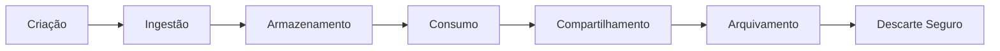

# Data Lifecycle Model

## Informações do Documento

| Item | Valor |
|------|-------|
| Documento | Data Lifecycle Model |
| Programa | Enterprise Data & Artificial Intelligence Platform |
| Domínio Arquitetural | Information Architecture |
| Tipo | Modelo de Ciclo de Vida dos Dados |
| Responsável | Enterprise Architecture Practice |
| Versão | 1.0 |
| Status | Approved |

---

# Executive Summary

O Data Lifecycle Model estabelece o ciclo de vida dos ativos de dados corporativos, desde sua criação até o descarte, garantindo que todas as informações sejam gerenciadas de forma consistente, segura e alinhada às políticas de governança da organização.

A gestão do ciclo de vida é essencial para assegurar qualidade, conformidade regulatória, otimização de custos e utilização responsável dos dados, permitindo que a Enterprise Data Platform evolua de forma sustentável.

Este modelo aplica-se a todos os dados corporativos, independentemente da tecnologia utilizada para armazenamento ou processamento.

---

# Objetivos

- Definir o ciclo de vida dos ativos de dados.
- Garantir qualidade durante toda a existência das informações.
- Atender requisitos regulatórios e de compliance.
- Otimizar custos de armazenamento.
- Suportar estratégias de Analytics e Inteligência Artificial.

---

# Princípios Arquiteturais

- Dados possuem ciclo de vida definido.
- Retenção baseada em requisitos legais e de negócio.
- Descarte controlado e auditável.
- Classificação desde a criação do ativo.
- Automação sempre que possível.
- Governança aplicada em todas as fases.

---

# Modelo de Ciclo de Vida

---

# Etapas do Ciclo de Vida

| Etapa | Objetivo |
|--------|----------|
| Criação | Produção inicial do dado pelas aplicações de negócio. |
| Ingestão | Captura e integração na Enterprise Data Platform. |
| Armazenamento | Persistência dos dados em ambiente corporativo. |
| Consumo | Utilização por aplicações, Analytics e IA. |
| Compartilhamento | Disponibilização por meio de Produtos de Dados. |
| Arquivamento | Preservação para requisitos legais ou históricos. |
| Descarte | Eliminação segura conforme políticas corporativas. |

---

# Classificação por Criticidade

| Classificação | Características |
|---------------|-----------------|
| Crítico | Dados essenciais para operação ou obrigações legais. |
| Sensível | Dados pessoais, financeiros ou confidenciais. |
| Interno | Uso exclusivo da organização. |
| Público | Informações autorizadas para divulgação externa. |

A classificação determina políticas de retenção, criptografia, acesso e descarte.

---

# Política de Retenção

| Categoria | Retenção Recomendada |
|-----------|----------------------|
| Dados Operacionais | Conforme necessidade do negócio. |
| Dados Financeiros | Conforme legislação vigente. |
| Logs Técnicos | Conforme política de observabilidade. |
| Dados Analíticos | Conforme estratégia de Analytics. |
| Modelos de IA | Durante todo o ciclo de vida do modelo. |
| Metadados | Enquanto o ativo existir. |

---

# Controles de Governança

Durante todas as fases do ciclo de vida deverão ser aplicados os seguintes controles:

- Classificação da informação.
- Gestão de acessos.
- Criptografia em repouso e em trânsito.
- Monitoramento de qualidade.
- Linhagem de dados.
- Auditoria de operações.
- Políticas de retenção.
- Registro de descarte.

---

# Papéis e Responsabilidades

| Papel | Responsabilidade |
|--------|------------------|
| Data Owner | Aprovar retenção e descarte. |
| Data Steward | Monitorar qualidade e conformidade. |
| Data Engineer | Implementar pipelines e políticas técnicas. |
| Data Governance | Definir normas corporativas. |
| Security Office | Garantir conformidade de segurança e privacidade. |

---

# Integração com os Demais Artefatos

| Documento | Relacionamento |
|-----------|----------------|
| Enterprise Information Model | Define os ativos gerenciados. |
| Data Domain Model | Organiza os ativos por domínio. |
| Data Product Model | Define os ativos compartilhados. |
| Metadata Strategy | Mantém informações sobre todo o ciclo de vida. |
| Data Ownership Model | Define responsabilidades sobre cada fase. |

---

# Benefícios Esperados

## Negócio

- Maior confiabilidade das informações.
- Atendimento a requisitos regulatórios.
- Melhor gestão dos ativos corporativos.

## Tecnologia

- Redução de custos de armazenamento.
- Automatização das políticas de retenção.
- Padronização da gestão dos dados.

## Governança

- Conformidade com políticas corporativas.
- Auditoria completa do ciclo de vida.
- Maior transparência sobre os ativos de informação.

---

# Decisões Arquiteturais

## DA-01 — Gestão Corporativa do Ciclo de Vida

**Decisão**

Todos os ativos de dados deverão seguir o ciclo de vida definido neste documento.

**Motivação**

Padronizar a gestão dos ativos de informação e reduzir riscos operacionais.

---

## DA-02 — Retenção Baseada em Requisitos de Negócio e Compliance

**Decisão**

As políticas de retenção deverão considerar requisitos regulatórios, legais e necessidades do negócio.

**Motivação**

Equilibrar conformidade, disponibilidade da informação e otimização de custos.

---

## DA-03 — Descarte Seguro e Auditável

**Decisão**

O descarte de dados deverá ocorrer de forma controlada, registrada e auditável.

**Motivação**

Garantir conformidade regulatória, reduzir riscos de segurança e proteger informações sensíveis.

---

# Conclusão

O Data Lifecycle Model define a abordagem corporativa para gerenciamento dos ativos de dados ao longo de todo o seu ciclo de vida.

Ao estabelecer processos padronizados para criação, utilização, retenção, arquivamento e descarte, a organização fortalece sua Governança de Dados, reduz riscos regulatórios e garante que a Enterprise Data Platform permaneça sustentável, escalável e preparada para suportar iniciativas de Analytics e Inteligência Artificial.