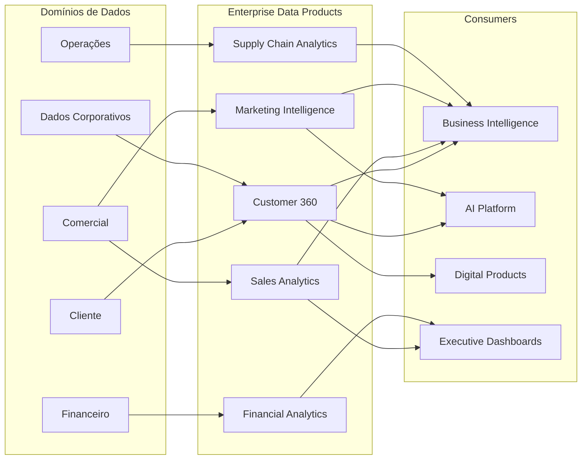
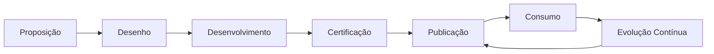

# Data Product Model

## Informações do Documento

| Item | Valor |
|------|-------|
| Documento | Data Product Model |
| Programa Estratégico | Enterprise Data & Artificial Intelligence Platform |
| Domínio Arquitetural | Information Architecture |
| Tipo | Arquitetura de Produtos de Dados |
| Responsável | Enterprise Architecture Practice |
| Versão | 1.0 |
| Status | Aprovado |

---

## Contexto

Este documento faz parte da Information Architecture da Enterprise Data & AI Platform. Seu objetivo é definir os princípios, modelos e padrões necessários para garantir consistência, interoperabilidade, governança e escalabilidade dos ativos de informação da plataforma corporativa.

A Information Architecture estabelece a estrutura necessária para que dados sejam tratados como produtos estratégicos, suportando analytics, inteligência artificial, integração corporativa e tomada de decisão baseada em dados.

---

# Executive Summary

O Data Product Model estabelece como os dados corporativos são disponibilizados para consumo na organização por meio de Produtos de Dados governados, reutilizáveis e orientados ao negócio.

Cada Produto de Dados representa um ativo corporativo, desenvolvido para atender múltiplos consumidores, eliminando integrações específicas entre aplicações e promovendo um modelo de compartilhamento padronizado.

Esta abordagem está alinhada aos princípios de Data as a Product e Data Mesh, permitindo escalabilidade, autonomia dos domínios de negócio e maior confiabilidade das informações utilizadas em Analytics, Inteligência Artificial e produtos digitais.

---

# Objetivos

- Transformar dados em ativos reutilizáveis.
- Padronizar a disponibilização de informações corporativas.
- Reduzir integrações ponto a ponto.
- Aumentar a confiabilidade dos dados consumidos.
- Estabelecer ownership e ciclo de vida para cada Produto de Dados.

---

# Princípios Arquiteturais

- Data as a Product.
- Produtos possuem owner claramente definido.
- Produtos são independentes das aplicações produtoras.
- Todo produto possui documentação e metadados.
- Produtos devem ser reutilizáveis por múltiplos consumidores.
- A qualidade do produto é responsabilidade do domínio proprietário.

---

# Arquitetura de Produtos de Dados

---

# Catálogo Inicial de Produtos de Dados

| Produto | Domínio | Consumidores |
|----------|----------|--------------|
| Customer 360 | Customer | CRM, BI, IA, Aplicações Digitais |
| Sales Analytics | Sales | BI, Comercial, Diretoria |
| Marketing Intelligence | Marketing | Marketing, IA, Analytics |
| Financial Analytics | Finance | Financeiro, Executivos |
| Supply Chain Analytics | Operations | Operações, Logística |
| Digital Interaction History | Digital Channels | IA, Marketing, Customer Experience |

---

# Estrutura de um Produto de Dados

Todo Produto de Dados deverá possuir os seguintes componentes:

| Componente | Descrição |
|------------|-----------|
| Nome | Identificação corporativa. |
| Objetivo | Problema de negócio resolvido. |
| Owner | Responsável pelo produto. |
| Consumidores | Sistemas e áreas consumidoras. |
| SLA | Disponibilidade e atualização. |
| Indicadores de Qualidade | Métricas de qualidade do produto. |
| Metadados | Classificação, catálogo e linhagem. |
| Políticas de Acesso | Perfis autorizados. |
| Versão | Controle de evolução do produto. |

---

# Ciclo de Vida

---

# Critérios de Qualidade

Um Produto de Dados somente poderá ser publicado quando atender aos seguintes requisitos mínimos:

- Ownership definido.
- Metadados completos.
- Linhagem documentada.
- Regras de qualidade implementadas.
- SLA estabelecido.
- Políticas de acesso configuradas.
- Aprovação da Governança de Dados.

---

# Integração com os Demais Artefatos

| Documento | Relacionamento |
|-----------|----------------|
| Enterprise Information Model | Define as entidades utilizadas pelos produtos. |
| Data Domain Model | Identifica o domínio responsável por cada produto. |
| Metadata Strategy | Mantém catálogo e metadados. |
| Data Lifecycle Model | Define retenção e descarte. |
| Data Ownership Model | Define accountability sobre cada produto. |

---

# Benefícios Esperados

## Negócio

- Informações padronizadas.
- Maior velocidade na tomada de decisão.
- Redução de indicadores conflitantes.
- Reutilização entre áreas.

## Tecnologia

- Redução de integrações customizadas.
- Menor acoplamento entre aplicações.
- Arquitetura orientada a produtos.
- Evolução independente dos domínios.

## Dados & IA

- Datasets confiáveis para Machine Learning.
- Reutilização em múltiplos casos de uso.
- Maior rastreabilidade dos ativos de dados.
- Escalabilidade para aplicações de IA Generativa.

---

## Relação com Outros Artefatos

- [Architecture Vision](../docs/architecture-vision.md)
- [Data Ownership Model](../business-architecture/data-ownership-model.md)
- [Data Domain Model](./data-domain-model.md)
- [Data Lifecycle Model](./data-lifecycle-model.md)
- [Enterprise Information Model](./enterprise-information-model.md)
- [Metadata Strategy](./metadata-strategy.md)

---

# Decisões Arquiteturais

## DA-01 — Produtos de Dados como Unidade Oficial de Compartilhamento

**Decisão**

O compartilhamento de informações corporativas ocorrerá por meio de Produtos de Dados certificados.

**Motivação**

Eliminar integrações específicas entre aplicações e aumentar a reutilização dos ativos de informação.

---

## DA-02 — Ownership Obrigatório

**Decisão**

Todo Produto de Dados deverá possuir um Owner responsável por sua evolução, qualidade e disponibilidade.

**Motivação**

Garantir accountability e governança distribuída.

---

## DA-03 — Publicação Governada

**Decisão**

Produtos somente poderão ser disponibilizados após validação dos critérios de qualidade definidos pela Governança de Dados.

**Motivação**

Assegurar confiança, rastreabilidade e conformidade dos ativos disponibilizados para consumo corporativo.
