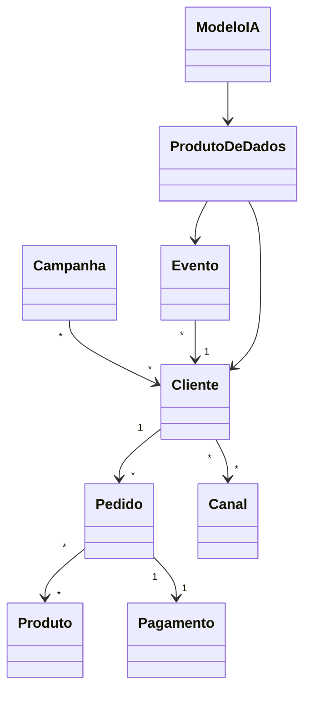
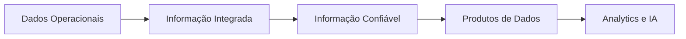

# Enterprise Information Model

## Informações do Documento

| Item | Valor |
|------|-------|
| Documento | Enterprise Information Model |
| Programa Estratégico | Enterprise Data & Artificial Intelligence Platform |
| Domínio Arquitetural | Information Architecture |
| Tipo | Modelo Conceitual Corporativo |
| Responsável | Enterprise Architecture Practice |
| Versão | 1.0 |
| Status | Aprovado |

---

## Contexto

Este documento faz parte da Information Architecture da Enterprise Data & AI Platform. Seu objetivo é definir os princípios, modelos e padrões necessários para garantir consistência, interoperabilidade, governança e escalabilidade dos ativos de informação da plataforma corporativa.

A Information Architecture estabelece a estrutura necessária para que dados sejam tratados como produtos estratégicos, suportando analytics, inteligência artificial, integração corporativa e tomada de decisão baseada em dados.

---

# Executive Summary

O Enterprise Information Model estabelece a visão conceitual dos principais ativos de informação da organização, definindo uma linguagem corporativa comum para representar entidades de negócio, seus relacionamentos e responsabilidades.

Este modelo serve como base para todos os artefatos da Arquitetura da Informação, permitindo que iniciativas de Analytics, Inteligência Artificial, Integração e Governança de Dados compartilhem o mesmo entendimento sobre os dados corporativos.

Por ser independente de tecnologias, aplicações e modelos físicos de armazenamento, este documento representa a referência conceitual para toda a plataforma de dados corporativa.

---

# Objetivos

- Estabelecer um modelo conceitual único para os ativos de informação.
- Padronizar a terminologia corporativa.
- Eliminar ambiguidades entre áreas de negócio.
- Suportar a construção de Produtos de Dados.
- Servir como referência para Analytics, IA e Governança de Dados.

---

# Princípios Arquiteturais

O Enterprise Information Model segue os princípios definidos pela Enterprise Architecture Practice.

- Business Driven Architecture
- Data as a Product
- Metadata First
- Shared Business Vocabulary
- Single Source of Truth
- Information Independent from Technology

---

# Modelo Conceitual

---

# Principais Entidades Corporativas

| Entidade | Descrição | Domínio Responsável |
|----------|-----------|---------------------|
| Cliente | Consumidores e organizações que se relacionam com a empresa. | Gestão de Clientes |
| Produto | Produtos e serviços comercializados. | Gestão Comercial |
| Pedido | Transações comerciais realizadas pelos clientes. | Gestão Comercial |
| Pagamento | Eventos financeiros associados aos pedidos. | Gestão Financeira |
| Canal | Pontos de contato físicos e digitais. | Gestão de Clientes |
| Campanha | Iniciativas de marketing, oferta e relacionamento. | Gestão Comercial |
| Evento | Fatos de negócio publicados por domínios produtores. | Domínio produtor do evento |
| Produto de Dados | Ativos informacionais disponibilizados para consumo corporativo. | Gestão de Dados e domínio proprietário |
| Modelo de IA | Modelos analíticos e generativos utilizados pela organização. | Inteligência Artificial |

---

# Camadas da Informação

| Camada | Objetivo |
|----------|----------|
| Dados Operacionais | Dados produzidos pelas aplicações transacionais. |
| Informação Integrada | Consolidação e padronização corporativa. |
| Informação Confiável | Dados governados e certificados. |
| Produtos de Dados | Dados preparados para reutilização. |
| Analytics e IA | Consumo analítico e Inteligência Artificial. |

---

# Relacionamento com os Demais Artefatos

Este documento estabelece a base conceitual para:

- Business Domains
- Data Ownership Model
- Data Domain Model
- Data Product Model
- Metadata Strategy
- Data Lifecycle Model
- AI Platform
- Data Governance

Todos os artefatos da Arquitetura da Informação deverão manter aderência às entidades aqui definidas.

---

# Benefícios Esperados

## Negócio

- Linguagem corporativa padronizada.
- Maior entendimento entre áreas.
- Redução de inconsistências conceituais.
- Melhor tomada de decisão.

## Tecnologia

- Padronização dos modelos de dados.
- Integrações mais consistentes.
- Redução de redundâncias.
- Reutilização de ativos de informação.

## Dados & IA

- Base consistente para Produtos de Dados.
- Melhor qualidade dos datasets.
- Maior confiabilidade dos modelos de IA.
- Evolução estruturada da Governança de Dados.

---

## Relação com Outros Artefatos

- [Architecture Vision](../docs/architecture-vision.md)
- [Business Domains](../business-architecture/business-domains.md)
- [Data Ownership Model](../business-architecture/data-ownership-model.md)
- [Data Domain Model](./data-domain-model.md)
- [Data Lifecycle Model](./data-lifecycle-model.md)
- [Data Product Model](./data-product-model.md)
- [Metadata Strategy](./metadata-strategy.md)

---

# Decisões Arquiteturais

## DA-01 — Modelo Conceitual Independente de Tecnologia

**Decisão**

O Enterprise Information Model deverá permanecer independente de plataformas tecnológicas, bancos de dados e aplicações específicas.

**Motivação**

Garantir estabilidade arquitetural e longevidade do modelo corporativo.

---

## DA-02 — Vocabulário Corporativo Compartilhado

**Decisão**

As entidades definidas neste documento representam o vocabulário oficial da organização e deverão ser reutilizadas por todos os programas estratégicos.

**Motivação**

Promover consistência semântica entre negócio, dados e tecnologia.

---

## DA-03 — Base para Arquitetura da Informação

**Decisão**

Todos os modelos conceituais, lógicos e físicos derivados deverão manter alinhamento com este documento.

**Motivação**

Assegurar rastreabilidade arquitetural e coerência entre os diferentes níveis de abstração.
