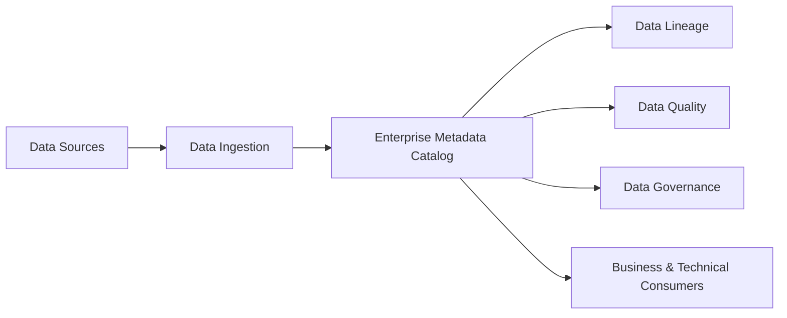
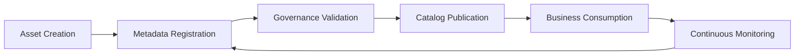

# Metadata Strategy

## Informações do Documento

| Item | Valor |
|------|-------|
| Documento | Metadata Strategy |
| Programa | Enterprise Data & Artificial Intelligence Platform |
| Domínio Arquitetural | Information Architecture |
| Tipo | Estratégia de Metadados |
| Responsável | Enterprise Architecture Practice |
| Versão | 1.0 |
| Status | Approved |

---

# Executive Summary

A Metadata Strategy define como os metadados serão gerenciados ao longo do ciclo de vida dos ativos de dados corporativos, garantindo descoberta, entendimento, governança e reutilização das informações.

Os metadados representam um dos pilares da Enterprise Data Platform, permitindo que consumidores de negócio, analistas, engenheiros de dados e soluções de Inteligência Artificial compreendam a origem, significado, qualidade e utilização dos ativos de informação.

Esta estratégia estabelece uma abordagem corporativa baseada no princípio **Metadata First**, assegurando que todo ativo de dados seja catalogado, documentado e rastreável desde sua criação.

---

# Objetivos

- Estabelecer um catálogo corporativo de metadados.
- Garantir descoberta e reutilização dos ativos de dados.
- Aumentar transparência e rastreabilidade.
- Suportar Governança de Dados e IA.
- Automatizar a documentação dos ativos sempre que possível.

---

# Princípios Arquiteturais

- Metadata First.
- Todo ativo deve possuir metadados.
- Metadados são ativos corporativos.
- Catálogo único corporativo.
- Atualização automática sempre que possível.
- Integração com Governança, Qualidade e Linhagem.

---

# Arquitetura de Metadados

---

# Classificação dos Metadados

| Categoria | Descrição |
|------------|-----------|
| Business Metadata | Definições de negócio, glossário corporativo e ownership. |
| Technical Metadata | Estruturas físicas, formatos, schemas e tecnologias. |
| Operational Metadata | Frequência de atualização, volumes e execução de pipelines. |
| Governance Metadata | Classificação, sensibilidade, políticas de acesso e compliance. |
| Quality Metadata | Indicadores de qualidade, completude, consistência e confiabilidade. |
| Lineage Metadata | Origem, transformações e destino dos dados. |

---

# Metadados Obrigatórios

Todo Produto de Dados deverá possuir, no mínimo:

| Campo | Obrigatório |
|--------|-------------|
| Nome | Sim |
| Descrição | Sim |
| Domínio | Sim |
| Data Owner | Sim |
| Data Steward | Sim |
| Classificação | Sim |
| Sensibilidade | Sim |
| Frequência de Atualização | Sim |
| SLA | Sim |
| Fonte de Origem | Sim |
| Linhagem | Sim |
| Consumidores | Sim |
| Política de Retenção | Sim |
| Versão | Sim |

---

# Processo de Gestão de Metadados

---

# Papéis e Responsabilidades

| Papel | Responsabilidade |
|--------|------------------|
| Data Owner | Aprovar definições de negócio. |
| Data Steward | Manter metadados atualizados. |
| Data Engineer | Publicar metadados técnicos. |
| Data Governance | Definir padrões corporativos. |
| Enterprise Architecture | Definir diretrizes e arquitetura de metadados. |

---

# Integração com os Demais Artefatos

| Documento | Relacionamento |
|-----------|----------------|
| Enterprise Information Model | Origem dos conceitos corporativos. |
| Data Domain Model | Organização dos ativos por domínio. |
| Data Product Model | Catálogo dos Produtos de Dados. |
| Data Lifecycle Model | Atualização e retenção dos metadados. |
| Data Ownership Model | Responsáveis pelos ativos catalogados. |

---

# Benefícios Esperados

## Negócio

- Facilidade para localizar informações.
- Linguagem corporativa padronizada.
- Maior transparência sobre os ativos de dados.

## Tecnologia

- Documentação automática dos ativos.
- Redução do esforço operacional.
- Melhor integração entre plataformas.

## Governança

- Rastreabilidade completa.
- Maior aderência regulatória.
- Suporte à auditoria.
- Evolução consistente do catálogo corporativo.

---

# Decisões Arquiteturais

## DA-01 — Catálogo Corporativo Único

**Decisão**

Todos os ativos de dados deverão ser registrados em um único catálogo corporativo.

**Motivação**

Garantir descoberta, padronização e governança centralizada.

---

## DA-02 — Metadata First

**Decisão**

Nenhum Produto de Dados poderá ser publicado sem seus metadados obrigatórios.

**Motivação**

Assegurar entendimento, reutilização e rastreabilidade dos ativos.

---

## DA-03 — Automação da Catalogação

**Decisão**

Sempre que tecnicamente viável, a captura e atualização de metadados deverá ocorrer automaticamente durante os pipelines de dados.

**Motivação**

Reduzir esforço manual e manter o catálogo sempre atualizado.

---

# Conclusão

A Metadata Strategy estabelece os princípios, processos e responsabilidades para a gestão dos metadados corporativos, transformando o catálogo de dados em um componente estratégico da Enterprise Data Platform.

Ao adotar uma abordagem **Metadata First**, a organização fortalece sua Governança de Dados, aumenta a confiança nos ativos de informação e cria uma base sólida para Analytics, Inteligência Artificial e tomada de decisão baseada em dados.