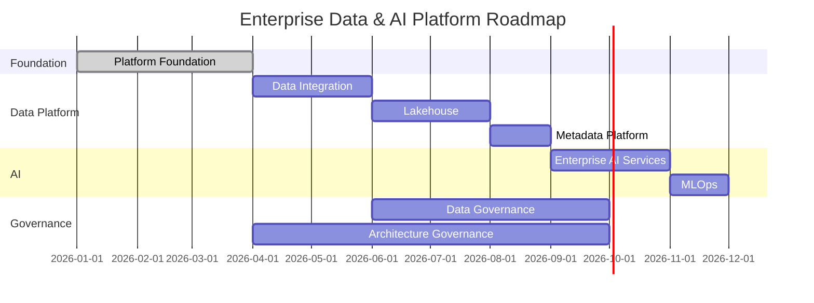

# Implementation Roadmap

> Define o roadmap de implementação da Enterprise Data & Artificial Intelligence Platform, organizando a evolução da arquitetura em fases incrementais para maximizar valor de negócio e reduzir riscos de implantação.

---

# Informações do Documento

| Item | Valor |
|------|-------|
| Documento | Implementation Roadmap |
| Programa | Enterprise Data & Artificial Intelligence Platform |
| Domínio | Roadmap |
| Tipo | Roadmap |
| Responsável | Enterprise Architecture Practice |
| Versão | 1.0 |
| Status | Approved |

---

# Executive Summary

A implementação da Enterprise Data & Artificial Intelligence Platform deverá ocorrer de forma incremental, priorizando capacidades habilitadoras, reduzindo riscos técnicos e permitindo geração contínua de valor ao negócio.

Cada fase representa um conjunto coerente de capacidades arquiteturais, permitindo evolução controlada da plataforma.

---

# Princípios

- Business Value First
- Incremental Delivery
- API First
- Data as a Product
- AI by Design
- Cloud Native
- Vendor Agnostic

---

# Roadmap Executivo

---

# Fase 1 — Foundation

Objetivos:

- Plataforma base.
- Infraestrutura.
- APIs corporativas.
- Observabilidade.
- Segurança.
- Automação.

Entregas:

- Technology Platform
- Infrastructure Architecture
- Security Architecture
- Observability Architecture

---

# Fase 2 — Data Platform

Objetivos:

- Integração corporativa.
- Lakehouse.
- Data Products.
- Catálogo.
- Lineage.

Entregas:

- Information Architecture
- Data Ownership
- Data Governance

---

# Fase 3 — Enterprise AI

Objetivos:

- Serviços corporativos de IA.
- Model Serving.
- MLOps.
- AI Governance.

---

# Fase 4 — Evolução Contínua

Objetivos:

- Expansão de domínios.
- Novos casos de uso.
- Evolução tecnológica.
- Otimização operacional.

---

# Dependências

| Capacidade | Dependência |
|------------|-------------|
| Data Products | Lakehouse |
| IA Corporativa | Data Platform |
| Analytics | Governança de Dados |
| MLOps | Observabilidade |
| APIs | Plataforma Base |

---

# Indicadores

- Roadmap Progress
- Capabilities Delivered
- Architecture Compliance
- Platform Adoption
- Business Value Delivered

---

# Relação com Outros Artefatos

- Executive Target State
- Technology Platform
- Architecture Governance
- Architecture Vision

---

# Decisões Arquiteturais

## DA-01 — Evolução Incremental

A implementação ocorrerá por capacidades arquiteturais.

---

## DA-02 — Governança Contínua

Todas as fases deverão ser acompanhadas pela Enterprise Architecture Practice.

---

## DA-03 — Valor Contínuo

Cada fase deverá entregar valor mensurável ao negócio.

---

# Conclusão

O roadmap estabelece uma evolução incremental da Enterprise Data & Artificial Intelligence Platform, reduzindo riscos de implantação e garantindo alinhamento contínuo entre estratégia, arquitetura e execução.