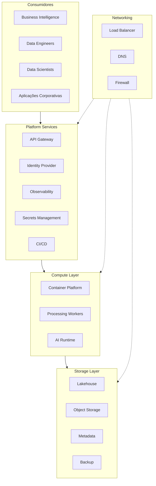

# Infrastructure Architecture

> Define a arquitetura de infraestrutura da Enterprise Data & Artificial Intelligence Platform, estabelecendo as capacidades tecnológicas necessárias para suportar processamento de dados, Inteligência Artificial, integração corporativa e operação contínua da plataforma.

---

## Contexto

Este documento faz parte da Technology Architecture da Enterprise Data & AI Platform. Seu objetivo é definir os componentes tecnológicos, padrões de infraestrutura, serviços compartilhados e capacidades técnicas que sustentam a plataforma corporativa de dados e inteligência artificial.

A Technology Architecture estabelece as diretrizes para garantir escalabilidade, disponibilidade, segurança, observabilidade, automação e padronização tecnológica, permitindo que as demais camadas da arquitetura evoluam de forma consistente e sustentável.

---

# Informações do Documento

| Item | Valor |
|------|-------|
| Documento | Infrastructure Architecture |
| Programa Estratégico | Enterprise Data & Artificial Intelligence Platform |
| Domínio Arquitetural | Technology Architecture |
| Tipo | Infrastructure Architecture |
| Responsável | Enterprise Architecture Practice |
| Versão | 1.0 |
| Status | Aprovado |

---

# Executive Summary

A infraestrutura da Enterprise Data & Artificial Intelligence Platform foi concebida para suportar cargas analíticas, processamento distribuído, aplicações corporativas e workloads de Inteligência Artificial de forma escalável, resiliente e altamente disponível.

Esta arquitetura estabelece uma fundação tecnológica desacoplada de fornecedores específicos, permitindo evolução contínua da plataforma sem dependência tecnológica.

---

# Objetivos

- Disponibilizar infraestrutura escalável.
- Garantir alta disponibilidade.
- Automatizar provisionamento.
- Padronizar ambientes.
- Suportar Analytics e IA.
- Garantir segurança operacional.

---

# Princípios Arquiteturais

- Cloud Native
- Infrastructure as Code
- Immutable Infrastructure
- Elastic Scalability
- High Availability
- Security by Design
- Automation First
- Vendor Agnostic

---

# Arquitetura de Referência

---

# Camadas da Infraestrutura

## Networking

Responsável pela comunicação entre todos os componentes da plataforma.

Capacidades:

- DNS.
- Balanceamento de carga.
- Segmentação de rede.
- Firewall.
- Comunicação segura.

---

## Compute

Executa as cargas computacionais da plataforma.

Capacidades:

- Containers.
- Processamento distribuído.
- Serviços de APIs.
- Processamento analítico.
- Workloads de IA.

---

## Storage

Responsável pela persistência dos ativos corporativos.

Inclui:

- Object Storage.
- Lakehouse.
- Metadata Repository.
- Backup.
- Arquivamento.

---

## Platform Services

Serviços compartilhados utilizados por toda a plataforma.

Capacidades:

- API Gateway.
- Gestão de Identidade.
- Gestão de Segredos.
- Observabilidade.
- CI/CD.

---

# Ambientes

A plataforma deverá possuir ambientes independentes.

| Ambiente | Finalidade |
|-----------|------------|
| Development | Desenvolvimento |
| Integration | Integração |
| Homologation | Validação |
| Production | Produção |

Cada ambiente deverá possuir isolamento lógico e operacional.

---

# Escalabilidade

A infraestrutura deverá permitir:

- Escalabilidade horizontal.
- Auto Scaling.
- Balanceamento automático.
- Processamento paralelo.
- Expansão independente por componente.

---

# Alta Disponibilidade

Diretrizes:

- Eliminação de pontos únicos de falha.
- Redundância de componentes críticos.
- Recuperação automática.
- Failover transparente.

---

# Segurança

Capacidades mínimas:

- Gestão de identidade.
- Controle de acesso.
- Gestão de segredos.
- Criptografia em trânsito.
- Criptografia em repouso.
- Auditoria.

---

# Observabilidade

Toda infraestrutura deverá disponibilizar:

- Logs.
- Métricas.
- Traces.
- Dashboards.
- Alertas.
- Health Checks.

---

# Continuidade

A infraestrutura deverá suportar:

- Backup automatizado.
- Disaster Recovery.
- Recuperação operacional.
- Testes periódicos de restauração.

---

# Benefícios Esperados

## Negócio

- Disponibilidade contínua.
- Escalabilidade para crescimento.
- Redução do risco operacional.

---

## Tecnologia

- Infraestrutura padronizada.
- Automação.
- Facilidade de evolução.
- Maior confiabilidade.

---

## Operação

- Provisionamento rápido.
- Recuperação automatizada.
- Monitoramento centralizado.

---

# Relação com Outros Artefatos

Este documento complementa:

- [Observability Architecture](./observability-architecture.md)
- [Security Architecture](./security-architecture.md)
- [Technology Platform](./technology-platform.md)
- [Technology Standards](./technology-standards.md)
- [Application Landscape](../application-architecture/application-landscape.md)
- [Integration Patterns](../application-architecture/integration-patterns.md)

---

# Decisões Arquiteturais

## DA-01 — Infraestrutura Cloud Native

**Decisão**

Toda infraestrutura será projetada segundo princípios Cloud Native.

**Motivação**

Garantir elasticidade, automação e alta disponibilidade.

---

## DA-02 — Infrastructure as Code

**Decisão**

Todo provisionamento deverá ser realizado por código.

**Motivação**

Garantir repetibilidade, padronização e rastreabilidade.

---

## DA-03 — Componentes Stateless

**Decisão**

Os serviços deverão ser preferencialmente stateless.

**Motivação**

Facilitar escalabilidade horizontal.

---

## DA-04 — Independência Tecnológica

**Decisão**

A infraestrutura deverá permanecer desacoplada de tecnologias proprietárias específicas.

**Motivação**

Garantir flexibilidade arquitetural e aderência ao ADR-004.
