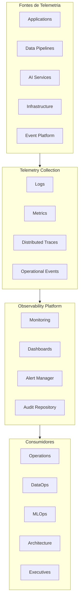

# Observability Architecture

> Define a arquitetura corporativa de Observabilidade da Enterprise Data & Artificial Intelligence Platform, estabelecendo os padrões para monitoramento, rastreabilidade, telemetria, auditoria e operação da plataforma.

---

# Informações do Documento

| Item | Valor |
|------|-------|
| Documento | Observability Architecture |
| Programa Estratégico | Enterprise Data & Artificial Intelligence Platform |
| Domínio Arquitetural | Technology Architecture |
| Tipo | Definição Arquitetural |
| Responsável | Enterprise Architecture Practice |
| Versão | 1.0 |
| Status | Aprovado |

---

## Contexto

Este documento faz parte da Technology Architecture da Enterprise Data & AI Platform. Seu objetivo é definir os componentes tecnológicos, padrões de infraestrutura, serviços compartilhados e capacidades técnicas que sustentam a plataforma corporativa de dados e inteligência artificial.

A Technology Architecture estabelece as diretrizes para garantir escalabilidade, disponibilidade, segurança, observabilidade, automação e padronização tecnológica, permitindo que as demais camadas da arquitetura evoluam de forma consistente e sustentável.

---

# Executive Summary

A Observability Architecture estabelece as capacidades necessárias para monitorar continuamente aplicações, infraestrutura, pipelines de dados, integrações e serviços de Inteligência Artificial.

O objetivo é permitir rápida identificação de problemas, redução do tempo de resolução de incidentes (MTTR), melhoria da confiabilidade da plataforma e suporte à tomada de decisão operacional baseada em evidências.

A observabilidade é considerada uma capacidade nativa da plataforma e deverá ser incorporada desde o desenvolvimento até a operação em produção.

---

# Objetivos

- Garantir visibilidade ponta a ponta da plataforma.
- Detectar falhas antes do impacto ao negócio.
- Reduzir MTTR.
- Facilitar troubleshooting.
- Apoiar operações DataOps, MLOps e Platform Engineering.
- Disponibilizar indicadores operacionais em tempo real.

---

# Princípios Arquiteturais

- Observability by Default
- Telemetry First
- End-to-End Traceability
- Centralized Monitoring
- Automated Alerting
- Metrics as a Product
- Proactive Operations
- Continuous Improvement

---

# Arquitetura de Referência

---

# Pilares da Observabilidade

## Logs

Todos os componentes deverão produzir logs estruturados.

Características:

- Formato padronizado.
- Correlação entre serviços.
- Classificação por severidade.
- Pesquisa centralizada.
- Retenção conforme políticas corporativas.

---

## Métricas

As aplicações deverão expor métricas operacionais.

Exemplos:

- Disponibilidade.
- Latência.
- Throughput.
- Consumo de recursos.
- Taxa de erros.
- Utilização de APIs.

---

## Traces Distribuídos

As transações deverão ser rastreadas ponta a ponta.

Cada requisição deverá possuir:

- Correlation ID.
- Trace ID.
- Span ID.
- Tempo de processamento.
- Origem e destino.

---

## Eventos Operacionais

Eventos relevantes deverão ser registrados para:

- Falhas.
- Mudanças.
- Deploys.
- Incidentes.
- Reprocessamentos.
- Escalonamentos.

---

# Monitoramento

A plataforma deverá monitorar continuamente:

## Aplicações

- Disponibilidade.
- Tempo de resposta.
- Erros.
- Consumo de recursos.

---

## Plataforma de Dados

- Ingestão.
- Pipelines.
- Jobs.
- Qualidade dos dados.
- Latência.
- Processamento.

---

## Plataforma de IA

- Inferências.
- Tempo de resposta.
- Drift de modelos.
- Utilização.
- Falhas.
- Consumo computacional.

---

## Infraestrutura

- CPU.
- Memória.
- Disco.
- Rede.
- Containers.
- Armazenamento.

---

# Dashboards Corporativos

A arquitetura deverá disponibilizar dashboards para:

- Operações.
- DataOps.
- MLOps.
- Segurança.
- Arquitetura.
- Executivos.

---

# Alertas

Os alertas deverão possuir classificação por criticidade.

| Nível | Descrição |
|--------|-----------|
| Informativo | Eventos sem impacto operacional |
| Baixo | Necessita acompanhamento |
| Médio | Impacto limitado |
| Alto | Risco operacional significativo |
| Crítico | Impacto direto ao negócio |

---

# Auditoria

Todos os componentes deverão registrar:

- Autenticações.
- Alterações administrativas.
- Deploys.
- Execuções críticas.
- Alterações de configuração.
- Operações de IA.

---

# Indicadores Operacionais

Indicadores mínimos:

- Disponibilidade.
- SLA.
- SLO.
- Erros por serviço.
- Latência média.
- Tempo de processamento.
- Tempo médio de recuperação.
- Sucesso dos pipelines.
- Consumo dos modelos de IA.

---

# Benefícios Esperados

## Negócio

- Maior disponibilidade dos serviços.
- Melhor experiência dos usuários.
- Redução de impactos operacionais.

---

## Tecnologia

- Diagnóstico mais rápido.
- Operação baseada em dados.
- Evolução contínua da plataforma.

---

## Operação

- Redução do MTTR.
- Monitoramento centralizado.
- Resposta proativa a incidentes.

---

# Limites e Dependências

Este documento define telemetria, indicadores e requisitos de observabilidade específicos da plataforma de dados e IA. A coleta, correlação, retenção e visualização corporativa da telemetria serão providas pelo **Programa Estratégico 05 — Enterprise Observability Platform**.

---

# Relação com Outros Artefatos

Este documento complementa:

- [Infrastructure Architecture](./infrastructure-architecture.md)
- [Security Architecture](./security-architecture.md)
- [Technology Platform](./technology-platform.md)
- [Technology Standards](./technology-standards.md)
- [Application Landscape](../application-architecture/application-landscape.md)
- [Event-Driven Architecture](../application-architecture/event-driven-architecture.md)

---

# Decisões Arquiteturais

## DA-01 — Observabilidade Nativa

**Decisão**

Todos os componentes deverão disponibilizar logs, métricas e traces desde sua implementação.

**Motivação**

Garantir monitoramento completo da plataforma.

---

## DA-02 — Telemetria Padronizada

**Decisão**

Toda telemetria deverá seguir um padrão corporativo.

**Motivação**

Facilitar consolidação, análise e operação.

---

## DA-03 — Dashboards Corporativos

**Decisão**

Todos os indicadores operacionais deverão ser disponibilizados em dashboards padronizados.

**Motivação**

Proporcionar visão única da operação.

---

## DA-04 — Alertas Automatizados

**Decisão**

Eventos críticos deverão gerar alertas automáticos.

**Motivação**

Reduzir tempo de detecção e resposta a incidentes.
