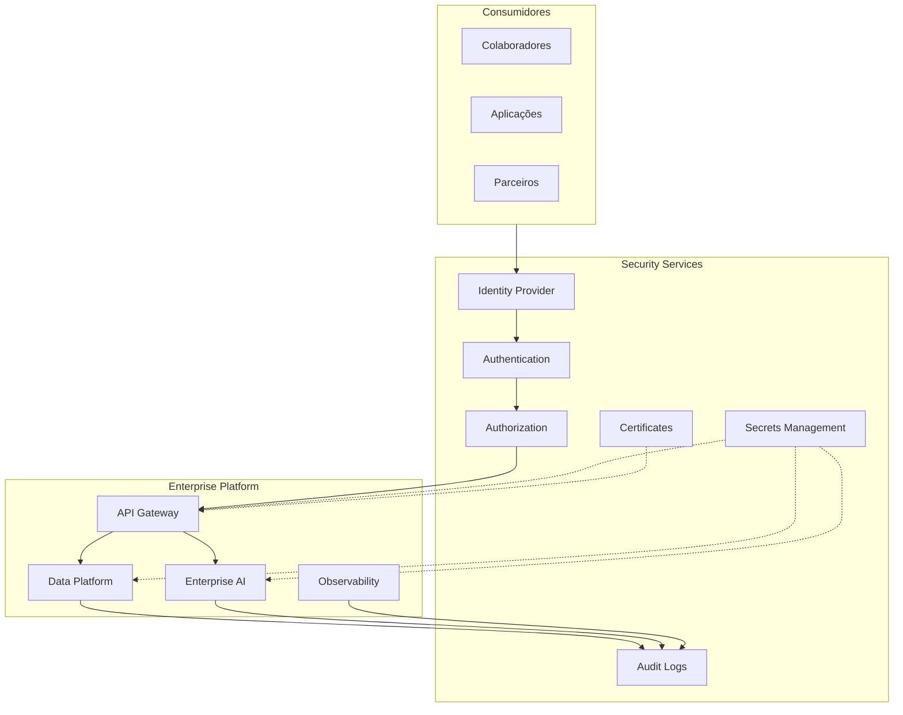

# Security Architecture

> Define a arquitetura de segurança da Enterprise Data & Artificial Intelligence Platform, estabelecendo os princípios, capacidades e controles necessários para garantir confidencialidade, integridade, disponibilidade e conformidade dos ativos corporativos.

---

# Informações do Documento

| Item | Valor |
|------|-------|
| Documento | Security Architecture |
| Programa Estratégico | Enterprise Data & Artificial Intelligence Platform |
| Domínio Arquitetural | Technology Architecture |
| Tipo | Security Architecture |
| Responsável | Enterprise Architecture Practice |
| Versão | 1.0 |
| Status | Aprovado |

---

## Contexto

Este documento faz parte da Technology Architecture da Enterprise Data & AI Platform. Seu objetivo é definir os componentes tecnológicos, padrões de infraestrutura, serviços compartilhados e capacidades técnicas que sustentam a plataforma corporativa de dados e inteligência artificial.

A Technology Architecture estabelece as diretrizes para garantir escalabilidade, disponibilidade, segurança, observabilidade, automação e padronização tecnológica, permitindo que as demais camadas da arquitetura evoluam de forma consistente e sustentável.

---

# Executive Summary

A segurança constitui uma capacidade transversal da Enterprise Data & Artificial Intelligence Platform.

Este documento estabelece uma arquitetura baseada no princípio **Security by Design**, incorporando controles de identidade, autenticação, autorização, proteção de dados, observabilidade e auditoria desde a concepção da solução.

A estratégia adota um modelo **Zero Trust**, garantindo que nenhuma comunicação seja considerada confiável por padrão.

---

# Objetivos

- Proteger ativos corporativos.
- Garantir conformidade regulatória.
- Reduzir riscos operacionais.
- Proteger dados sensíveis.
- Padronizar controles de segurança.
- Assegurar rastreabilidade das operações.

---

# Princípios Arquiteturais

- Security by Design
- Zero Trust
- Least Privilege
- Defense in Depth
- Secure by Default
- Privacy by Design
- Identity First
- Continuous Monitoring

---

# Arquitetura de Referência

---

# Domínios de Segurança

## Gestão de Identidade

Responsável pela autenticação e identificação dos usuários e aplicações.

Capacidades:

- Single Sign-On.
- Federação de Identidade.
- MFA.
- Gestão de Contas.
- Integração com Diretório Corporativo.

---

## Controle de Acesso

Todo acesso deverá seguir o princípio do menor privilégio.

Modelos suportados:

- RBAC.
- ABAC.
- Políticas Corporativas.
- Autorização baseada em escopo.

---

## Gestão de Segredos

Credenciais não poderão ser armazenadas em código.

Diretrizes:

- Secrets centralizados.
- Rotação automática.
- Criptografia.
- Auditoria de acesso.

---

## Criptografia

Todos os dados deverão ser protegidos.

Aplicações:

- Dados em trânsito.
- Dados em repouso.
- Backups.
- Credenciais.
- Tokens.

---

## Segurança das APIs

Toda API corporativa deverá implementar:

- OAuth2.
- OpenID Connect.
- TLS.
- Rate Limiting.
- API Keys quando aplicável.
- Auditoria.

---

## Segurança de Eventos

Os eventos corporativos deverão garantir:

- Autenticação do produtor.
- Autorização do consumidor.
- Integridade da mensagem.
- Rastreabilidade.
- Versionamento.

---

## Segurança da Inteligência Artificial

Os serviços de IA deverão implementar:

- Controle de acesso aos modelos.
- Auditoria das inferências.
- Proteção contra uso indevido.
- Isolamento entre workloads.
- Governança dos prompts.

---

# Compliance

A arquitetura deverá suportar requisitos de conformidade relacionados a:

- LGPD.
- Políticas Corporativas.
- Auditoria.
- Gestão de Riscos.
- Retenção de Dados.

---

# Observabilidade de Segurança

Todos os componentes deverão produzir:

- Logs de autenticação.
- Logs de autorização.
- Logs administrativos.
- Eventos de segurança.
- Alertas automáticos.
- Dashboards operacionais.

---

# Benefícios Esperados

## Negócio

- Redução de riscos.
- Maior confiança dos consumidores.
- Conformidade regulatória.

---

## Tecnologia

- Segurança padronizada.
- Menor superfície de ataque.
- Maior governança.

---

## Operação

- Monitoramento contínuo.
- Auditoria completa.
- Resposta rápida a incidentes.

---

# Relação com Outros Artefatos

Este documento complementa:

- [Infrastructure Architecture](./infrastructure-architecture.md)
- [Technology Platform](./technology-platform.md)
- [Technology Standards](./technology-standards.md)
- [Application Architecture Principles](../application-architecture/application-architecture-principles.md)
- [API Strategy](../application-architecture/api-strategy.md)
- [Event-Driven Architecture](../application-architecture/event-driven-architecture.md)
- [Data Lifecycle Model](../information-architecture/data-lifecycle-model.md)

---

# Decisões Arquiteturais

## DA-01 — Zero Trust

**Decisão**

Toda comunicação deverá ser autenticada e autorizada.

**Motivação**

Eliminar confiança implícita entre componentes.

---

## DA-02 — Identity First

**Decisão**

Toda identidade deverá ser validada antes da autorização.

**Motivação**

Centralizar políticas de acesso.

---

## DA-03 — Segredos Centralizados

**Decisão**

Credenciais deverão ser armazenadas exclusivamente em solução corporativa de gestão de segredos.

**Motivação**

Reduzir riscos de exposição de informações sensíveis.

---

## DA-04 — Auditoria Obrigatória

**Decisão**

Toda ação relevante deverá gerar registros auditáveis.

**Motivação**

Garantir rastreabilidade e conformidade.
