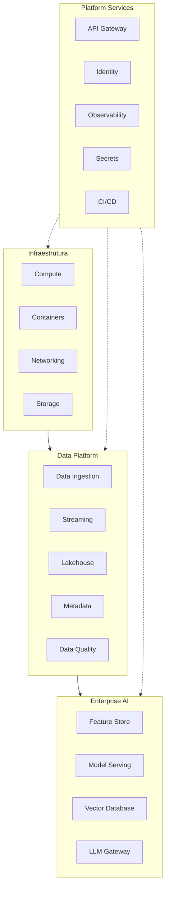

# Technology Platform

> Define a arquitetura tecnológica da Enterprise Data & Artificial Intelligence Platform, estabelecendo as capacidades de infraestrutura, processamento, armazenamento, observabilidade, segurança e Inteligência Artificial que suportam a plataforma corporativa.

---

# Informações do Documento

| Item | Valor |
|------|-------|
| Documento | Technology Platform |
| Programa Estratégico | Enterprise Data & Artificial Intelligence Platform |
| Domínio Arquitetural | Technology Architecture |
| Tipo | Definição Arquitetural |
| Responsável | Enterprise Architecture Practice |
| Versão | 1.0 |
| Status | Aprovado |

---

## Contexto

Este documento faz parte da Technology Architecture da Enterprise Data & AI Platform. Seu objetivo é definir os componentes tecnológicos, padrões de infraestrutura, serviços compartilhados e capacidades técnicas que sustentam a plataforma corporativa de dados e inteligência artificial.

A Technology Architecture estabelece as diretrizes para garantir escalabilidade, disponibilidade, segurança, observabilidade, automação e padronização tecnológica, permitindo que as demais camadas da arquitetura evoluam de forma consistente e sustentável.

---

# Executive Summary

A Technology Platform representa a fundação tecnológica da Enterprise Data & Artificial Intelligence Platform.

Sua responsabilidade é disponibilizar uma infraestrutura moderna, escalável e resiliente para suportar ingestão de dados, processamento analítico, Inteligência Artificial, APIs, eventos corporativos e produtos de dados.

A arquitetura foi concebida para permanecer independente de fornecedores específicos, permitindo evolução tecnológica contínua sem comprometer a arquitetura corporativa.

---

# Objetivos

- Disponibilizar uma plataforma tecnológica escalável.
- Suportar processamento batch e streaming.
- Garantir alta disponibilidade.
- Permitir evolução independente da infraestrutura.
- Sustentar iniciativas de Analytics e Inteligência Artificial.
- Padronizar os componentes tecnológicos corporativos.

---

# Princípios Arquiteturais

- Cloud Native
- Infrastructure as Code
- Immutable Infrastructure
- Platform Engineering
- Vendor Agnostic
- Security by Design
- Observability by Default
- Automation First

---

# Visão Geral da Plataforma

---

# Capacidades Tecnológicas

## Infraestrutura

Responsável pela execução das cargas de trabalho corporativas.

Capacidades:

- Computação.
- Armazenamento.
- Rede.
- Balanceamento.
- Alta disponibilidade.

---

## Plataforma de Dados

Responsável pelo processamento dos ativos de dados.

Capacidades:

- Ingestão.
- Streaming.
- Processamento.
- Persistência.
- Catálogo.
- Qualidade.

---

## Plataforma de Inteligência Artificial

Responsável pela disponibilização das capacidades corporativas de IA.

Capacidades:

- Model Serving.
- Feature Store.
- Vetores.
- IA Generativa.
- AI Agents.

---

## Serviços Compartilhados

Disponibilizam capacidades comuns para toda a plataforma.

Incluem:

- API Gateway.
- Identity Provider.
- Secrets Management.
- Monitoramento.
- Observabilidade.
- Pipeline CI/CD.

---

# Requisitos Não Funcionais

| Requisito | Objetivo |
|-----------|----------|
| Escalabilidade | Crescimento horizontal |
| Disponibilidade | Alta disponibilidade |
| Performance | Baixa latência |
| Segurança | Proteção ponta a ponta |
| Observabilidade | Logs, métricas e traces |
| Resiliência | Recuperação automática |

---

# Independência Tecnológica

A plataforma deverá manter independência em relação a fornecedores específicos.

Todo componente tecnológico deverá poder ser substituído sem impacto na arquitetura lógica da solução.

Esse princípio está alinhado ao ADR-004, que estabelece independência em relação aos fornecedores de Inteligência Artificial.

---

# Benefícios Esperados

## Negócio

- Maior velocidade para entrega de capacidades digitais.
- Redução do tempo de disponibilização de novas soluções.
- Escalabilidade para crescimento do negócio.

---

## Tecnologia

- Plataforma moderna.
- Baixo acoplamento.
- Automação.
- Facilidade de evolução.

---

## Operação

- Monitoramento centralizado.
- Recuperação automática.
- Maior disponibilidade.

---

# Relação com Outros Artefatos

Este documento complementa:

- [Infrastructure Architecture](./infrastructure-architecture.md)
- [Observability Architecture](./observability-architecture.md)
- [Security Architecture](./security-architecture.md)
- [Technology Standards](./technology-standards.md)
- [Application Interaction Model](../application-architecture/application-interaction-model.md)
- [Application Landscape](../application-architecture/application-landscape.md)
- [Data Product Model](../information-architecture/data-product-model.md)

---

# Decisões Arquiteturais

## DA-01 — Plataforma Cloud Native

**Decisão**

Toda a plataforma será concebida segundo princípios Cloud Native.

**Motivação**

Garantir escalabilidade, resiliência e automação.

---

## DA-02 — Independência de Fornecedores

**Decisão**

A arquitetura tecnológica permanecerá desacoplada de tecnologias proprietárias.

**Motivação**

Preservar flexibilidade arquitetural e aderência ao ADR-004.

---

## DA-03 — Observabilidade como Capacidade Nativa

**Decisão**

Todos os componentes deverão disponibilizar métricas, logs e traces.

**Motivação**

Melhorar operação, monitoramento e diagnóstico.

---

## DA-04 — Infraestrutura Automatizada

**Decisão**

Provisionamento e configuração deverão ser realizados preferencialmente por Infrastructure as Code.

**Motivação**

Garantir padronização, repetibilidade e redução de erros operacionais.
