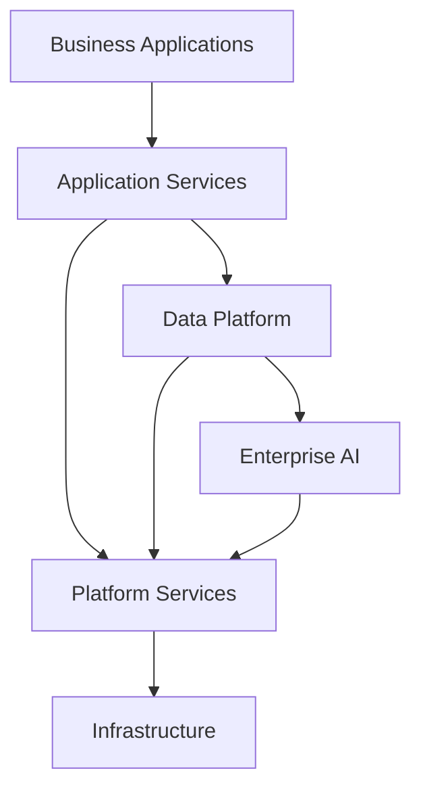

# Technology Standards

> Define os padrões tecnológicos adotados pela Enterprise Data & Artificial Intelligence Platform para garantir padronização, interoperabilidade, governança e evolução sustentável da arquitetura corporativa.

---

# Informações do Documento

| Item | Valor |
|------|-------|
| Documento | Technology Standards |
| Programa | Enterprise Data & Artificial Intelligence Platform |
| Domínio Arquitetural | Technology Architecture |
| Tipo | Technology Standard |
| Responsável | Enterprise Architecture Practice |
| Versão | 1.0 |
| Status | Approved |

---

# Executive Summary

A Enterprise Data & Artificial Intelligence Platform adota um conjunto de padrões tecnológicos corporativos para assegurar consistência entre soluções, reduzir complexidade operacional e facilitar a evolução contínua da plataforma.

Este documento define padrões arquiteturais e tecnológicos sem estabelecer dependência de fornecedores específicos, preservando a flexibilidade tecnológica da organização.

---

# Objetivos

- Padronizar tecnologias corporativas.
- Reduzir diversidade tecnológica desnecessária.
- Facilitar manutenção e operação.
- Garantir interoperabilidade.
- Suportar evolução contínua da plataforma.
- Preservar independência tecnológica.

---

# Princípios

- Vendor Agnostic.
- Open Standards First.
- API First.
- Cloud Native.
- Security by Design.
- Infrastructure as Code.
- Automation First.
- Observability by Default.

---

# Camadas Tecnológicas

---

# Padrões Corporativos

## Linguagens de Programação

As tecnologias deverão priorizar linguagens amplamente adotadas pelo mercado e com forte ecossistema corporativo.

Critérios:

- Alto nível de maturidade.
- Comunidade ativa.
- Suporte de longo prazo.
- Ecossistema consolidado.

---

## APIs

Padrões mínimos:

- REST.
- OpenAPI.
- JSON.
- HTTPS.
- Versionamento Semântico.

---

## Eventos

Padrões mínimos:

- Publish / Subscribe.
- Eventos Imutáveis.
- Versionamento.
- Contratos publicados.
- Schema Registry.

---

## Dados

Padrões mínimos:

- Data Products.
- Metadados obrigatórios.
- Catálogo corporativo.
- Data Lineage.
- Data Quality.

---

## Inteligência Artificial

Os serviços de IA deverão respeitar:

- Interfaces desacopladas.
- Model Serving independente.
- Feature Store compartilhada.
- IA Generativa desacoplada do fornecedor.
- Observabilidade completa.

---

## Containers

As aplicações deverão ser distribuídas em formato containerizado.

Diretrizes:

- Imagens imutáveis.
- Build automatizado.
- Versionamento.
- Escalabilidade horizontal.

---

## Infraestrutura

A infraestrutura deverá seguir:

- Infrastructure as Code.
- Provisionamento automatizado.
- Configuração externa.
- Ambientes reproduzíveis.

---

## Observabilidade

Todos os componentes deverão disponibilizar:

- Logs.
- Métricas.
- Traces.
- Health Checks.
- Dashboards.

---

## Segurança

Padrões mínimos:

- OAuth2.
- OpenID Connect.
- TLS.
- Gestão de Segredos.
- Criptografia em trânsito.
- Criptografia em repouso.

---

# Critérios para Adoção de Novas Tecnologias

Toda nova tecnologia deverá ser avaliada considerando:

| Critério | Objetivo |
|----------|----------|
| Aderência Arquitetural | Compatibilidade com a arquitetura corporativa |
| Maturidade | Estabilidade da tecnologia |
| Comunidade | Ecossistema ativo |
| Segurança | Atendimento aos requisitos corporativos |
| Escalabilidade | Crescimento sustentável |
| Operação | Facilidade de suporte |
| Custos | Sustentabilidade financeira |
| Portabilidade | Independência tecnológica |

---

# Tecnologias Desencorajadas

Não deverão ser adotadas soluções que:

- criem forte dependência de fornecedor;
- utilizem protocolos proprietários sem necessidade;
- dificultem portabilidade;
- não possuam comunidade ativa;
- não permitam automação operacional.

---

# Benefícios Esperados

## Negócio

- Maior velocidade para entrega de soluções.
- Redução de riscos tecnológicos.
- Evolução sustentável.

---

## Tecnologia

- Arquitetura consistente.
- Redução da dívida técnica.
- Melhor interoperabilidade.
- Facilidade de manutenção.

---

## Operação

- Menor esforço operacional.
- Monitoramento padronizado.
- Automação de ambientes.

---

# Relação com Outros Artefatos

Este documento complementa:

- Technology Platform
- Infrastructure Architecture
- Security Architecture
- Application Architecture Principles
- Integration Patterns
- API Strategy

---

# Decisões Arquiteturais

## DA-01 — Open Standards como Padrão

**Decisão**

Priorizar padrões abertos sempre que disponíveis.

**Motivação**

Reduzir dependência tecnológica e facilitar interoperabilidade.

---

## DA-02 — Vendor Agnostic

**Decisão**

Nenhuma tecnologia deverá comprometer a independência arquitetural da plataforma.

**Motivação**

Preservar flexibilidade e aderência ao ADR-004.

---

## DA-03 — Automação Obrigatória

**Decisão**

Provisionamento, build e deploy deverão ser automatizados.

**Motivação**

Reduzir erros operacionais e aumentar produtividade.

---

## DA-04 — Observabilidade Nativa

**Decisão**

Todos os componentes tecnológicos deverão disponibilizar métricas, logs e traces.

**Motivação**

Garantir operação eficiente e diagnóstico rápido.

---

# Conclusão

Os padrões tecnológicos definidos neste documento estabelecem uma base consistente para evolução da Enterprise Data & Artificial Intelligence Platform, garantindo interoperabilidade, governança, escalabilidade e independência tecnológica, alinhadas às diretrizes da Enterprise Architecture Practice.