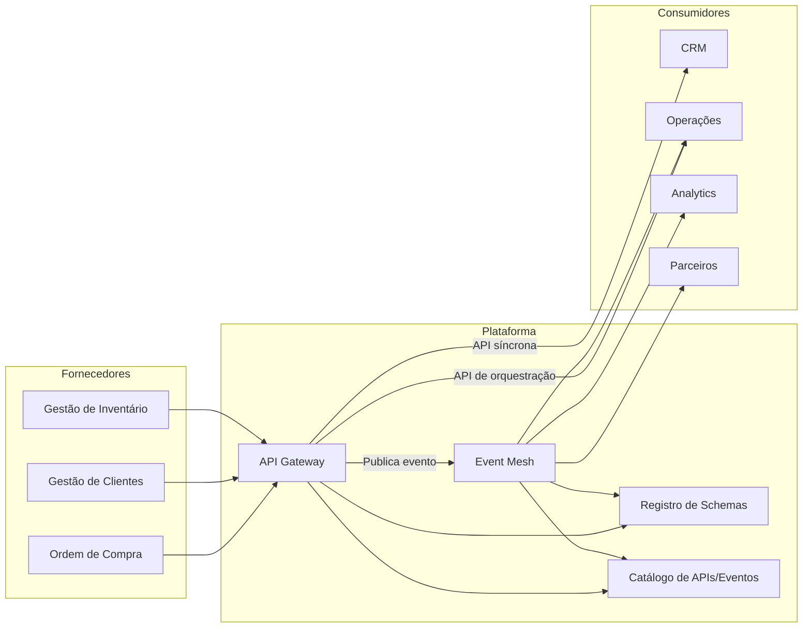

# Panorama de APIs e Eventos

## Informações do Documento

| Item | Valor |
| --- | --- |
| Domínio Arquitetural | Application Architecture |
| Versão | 1.0 |
| Status | Aprovado |

## Contexto

O panorama de APIs e eventos mostra a relação entre interfaces síncronas e fluxos assíncronos na plataforma de integração.

## Objetivo

Visualizar o ecossistema de APIs, eventos e consumidores para orientar design, governança e operação.

## Critérios de Leitura

- fronteiras de domínio e plataforma devem permanecer explícitas;
- fluxos síncronos e assíncronos devem ser diferenciados;
- controles de segurança e observabilidade aplicam-se transversalmente;
- componentes representam capacidades lógicas, não produtos selecionados.

## Referências

- Programa 03 README
- Integration Architecture
- Event Governance
- API Governance
