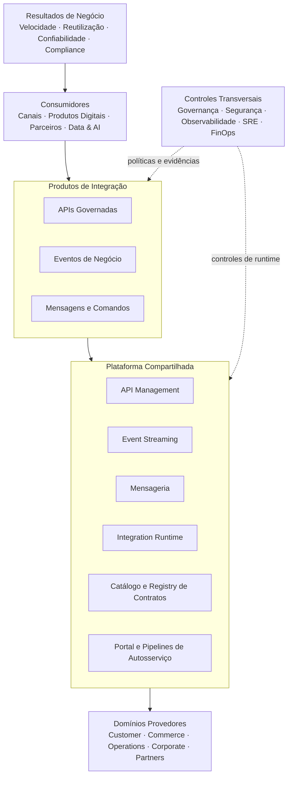

# Diagrama Executivo do Estado-Alvo

## Informações do Documento

| Item | Valor |
| --- | --- |
| Programa Estratégico | Enterprise Integration Platform |
| Domínio Arquitetural | Foundation |
| Versão | 1.0 |
| Status | Aprovado |

## Executive Summary

O estado-alvo organiza a integração em camadas que separam consumidores e provedores das capacidades compartilhadas. APIs, eventos e mensagens utilizam contratos catalogados e controles transversais, evitando que a plataforma concentre ownership de processos ou dados dos domínios.

## Diagrama Executivo

## Leitura Executiva das Camadas

| Camada | Responsabilidade |
| --- | --- |
| Resultados | Direcionar investimento e medir valor |
| Consumidores | Utilizar contratos sem dependência da implementação interna |
| Produtos de integração | Expressar interfaces com owner, versão e SLO |
| Plataforma | Prover execução, descoberta e automação compartilhadas |
| Domínios provedores | Manter semântica, regras e dados sob seu ownership |
| Controles transversais | Aplicar políticas e produzir evidências ponta a ponta |

## Fluxo de Valor Arquitetural

Necessidades de negócio são traduzidas em contratos; pipelines validam políticas; a plataforma publica e opera as interações; telemetria realimenta produto, risco e capacidade.

## Relação com Outros Programas

- Programa 02: produtos de dados e IA consomem APIs e eventos governados;
- Programa 04: jornadas e dados de cliente utilizam contratos corporativos;
- Programa 05: padrões de telemetria e correlação sustentam observabilidade ponta a ponta.

## Relação com Outros Artefatos

- [Architecture Vision](../docs/architecture-vision.md)
- [Business Context](../docs/business-context.md)
- [Landing Page do Programa](../README.md)

## Decisões Arquiteturais

### DA-FND-08 — Arquitetura executiva em camadas

A visão separa outcomes, consumo, produtos de integração, plataforma, provedores e controles para tornar responsabilidades explícitas.

### DA-FND-09 — Plataforma sem ownership do domínio

A plataforma executa e governa interações, mas não assume semântica, dados ou regras de negócio dos provedores.
