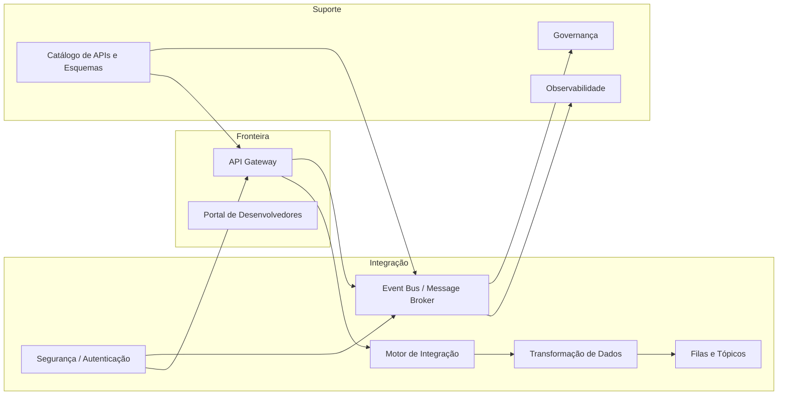

# Arquitetura de Referência de Integração

## Informações do Documento

| Item | Valor |
| --- | --- |
| Domínio Arquitetural | Application Architecture |
| Versão | 1.0 |
| Status | Aprovado |

## Contexto

A arquitetura de referência de integração define os componentes, padrões e fluxos que sustentam a conectividade entre sistemas na plataforma do Programa 03.

## Objetivo

Representar visualmente a arquitetura de referência para APIs, eventos, mensageria e runtime de integração.

## Critérios de Leitura

- fronteiras de domínio e plataforma devem permanecer explícitas;
- fluxos síncronos e assíncronos devem ser diferenciados;
- controles de segurança e observabilidade aplicam-se transversalmente;
- componentes representam capacidades lógicas, não produtos selecionados.

## Referências

- Programa 03 README
- Integration Architecture
- Governance Framework
- Princípios de Arquitetura Empresarial
