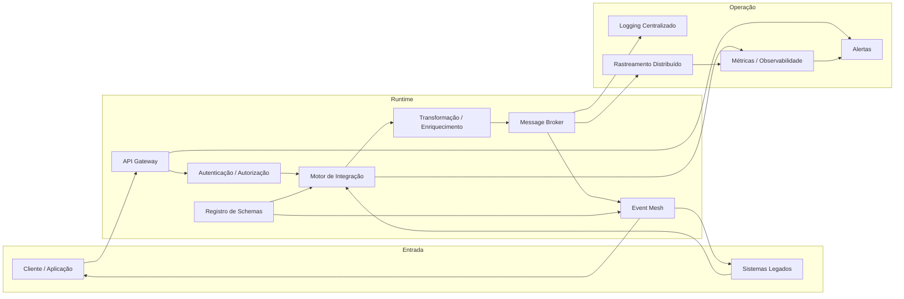

# Visão de Runtime da Integração

## Informações do Documento

| Item | Valor |
| --- | --- |
| Domínio Arquitetural | Application Architecture |
| Versão | 1.0 |
| Status | Aprovado |

## Contexto

A visão de runtime descreve como o ambiente de execução processa APIs, mensagens e eventos na plataforma de integração.

## Objetivo

Mostrar a topologia de runtime, incluindo gateways, brokers, motores de integração e subsistemas de observabilidade.

## Critérios de Leitura

- fronteiras de domínio e plataforma devem permanecer explícitas;
- fluxos síncronos e assíncronos devem ser diferenciados;
- controles de segurança e observabilidade aplicam-se transversalmente;
- componentes representam capacidades lógicas, não produtos selecionados.

## Referências

- Programa 03 README
- Technology Architecture
- Observability Architecture
- Runtime Architecture
