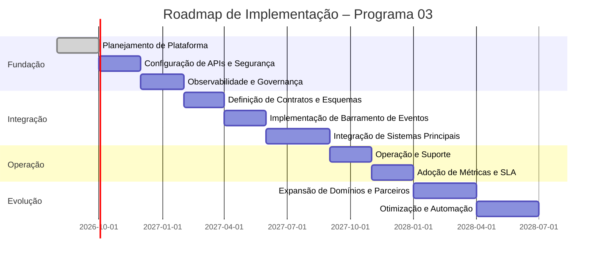

# Roadmap de Implementação

## Informações do Documento

| Item | Valor |
| --- | --- |
| Domínio Arquitetural | Roadmap |
| Versão | 1.0 |
| Status | Aprovado |

## Contexto

O roadmap de implementação descreve o cronograma, dependências e entregas necessárias para o Programa 03.

## Objetivo

Apresentar a sequência de iniciativas e o planejamento de implantação para a plataforma de integração empresarial.

## Dependências e Critérios

O sequenciamento depende de funding, Platform Team, identidade corporativa, observabilidade e participação dos domínios. Datas são hipóteses de planejamento; passagem entre fases depende de evidências dos stage gates.

## Governança de Execução

O Integration Product Owner acompanha outcomes e dependências; a Enterprise Architecture Practice valida os gates; riscos e desvios possuem owner, mitigação e prazo.

## Referências

- Programa 03 README
- Architecture Evolution Plan
- Implementation Phases
- Success Metrics
