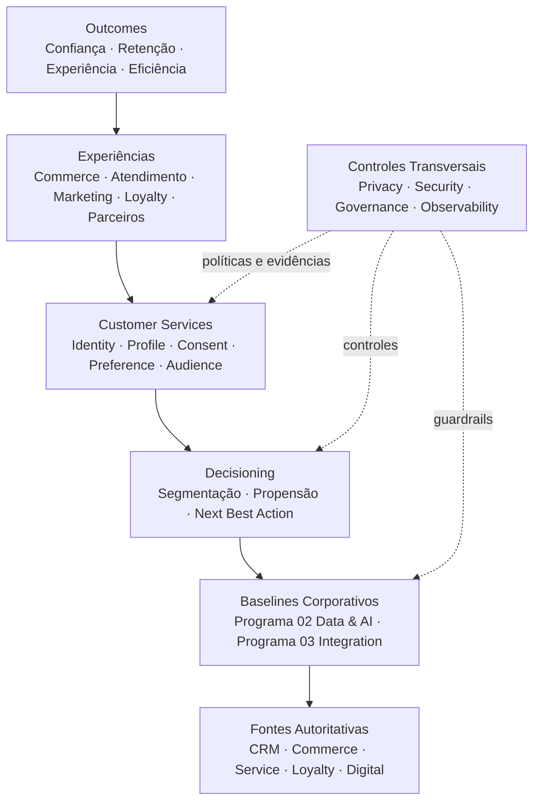

# Diagrama Executivo do Estado-Alvo

## Informações do Documento

| Item | Valor |
| --- | --- |
| Domínio Arquitetural | Foundation |
| Versão | 1.0 |
| Status | Aprovado |

## Executive Summary

A visão em camadas separa jornadas, serviços Customer e baselines corporativos, tornando ownership e controles explícitos.

## Diagrama Executivo

## Leitura Executiva

A plataforma coordena contexto Customer e decisões de experiência. Data & AI mantém produtos de dados e modelos; Integration transporta contratos; fontes continuam responsáveis pelos registros de origem.

## Relação com Outros Artefatos

- [Architecture Vision](../docs/architecture-vision.md)
- [Architecture Target State](../architecture-target-state.md)
- [Landing Page](../README.md)

## Decisões Arquiteturais

A arquitetura executiva preserva separação entre experiência, domínio Customer e capacidades corporativas compartilhadas.
