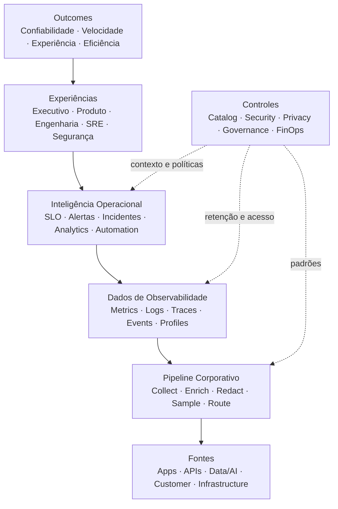

# Diagrama Executivo do Estado-Alvo

## Informações do Documento

| Item | Valor |
| --- | --- |
| Domínio Arquitetural | Foundation |
| Versão | 1.0 |
| Status | Aprovado |

## Contexto

O diagrama apresenta a relação entre outcomes, experiências operacionais, intelligence, dados de observabilidade, pipeline e fontes.

## Diagrama Executivo

## Leitura Executiva

Produtos emitem sinais padronizados; a plataforma processa e serve telemetria; times usam SLOs e contexto para decidir e operar.

## Relação com Outros Artefatos

- [Architecture Vision](../docs/architecture-vision.md)
- [Target State](../architecture-target-state.md)
- [Landing Page](../README.md)
